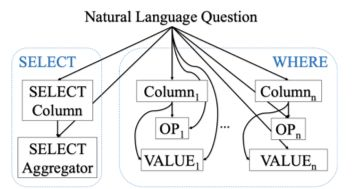

[TOC]

# SQLova

SQLova 是韩国 Naver 提出的一种模型，全名为 Search & QLova，是作者们所在部门的名称。此方案是于 SQLNet 的基础上，在模型结构方面做了一些改进而得到的，并没有提出一些创新性的解决方案。

## 1. SQLNet

论文：SQLNet: Generating Structured Queries From Natural Language Without Reinforcement Learning

SQLNet把SQL生成任务分解为6个子任务：

- 选择哪一列的Select-Column
- 选择聚合函数的Select-Aggregation
- 有几个Where条件的Where-Number
- 筛选条件针对哪几列的Where-Column
- 各个条件操作符的Where-Operator
- 各个条件的条件值Where-Value。

每个子任务按照各自的目标设计不同的输出层，例如：Select-Column的输出层是对所有列进行单分类的任务，Select-Aggregation的输出层对包含Max、Min、Avg、Sum、Count和空函数进行单分类任务。

同时，根据数据集中的数据特征以及编写SQL时的先后顺序，各个任务之间设计一种依赖关系，这样的依赖关系可以一定程度上利用已经预测好的任务来帮助下游任务更好的预测。

## 2. SQLova

SQLova继承了SQLNet的任务分解思路，同样使用6个子任务来预测SQL，不同之处是SQLova使用Bert来作为模型的输入表达层，代替了词向量。

另外，SQLova优化了子模型之间的结构。比如SQLNet预测Where-Value时，只采用了Where-Column特征作为额外输入，而SQLova还采用了Where-Operator特征一并作为输入。

