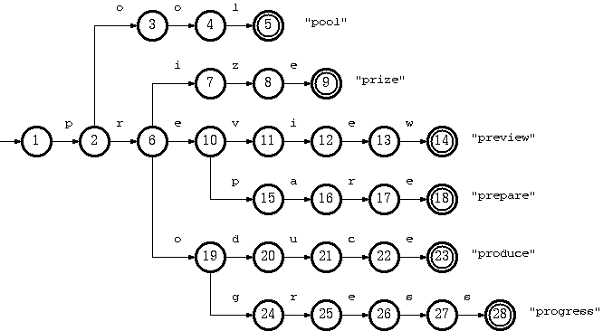
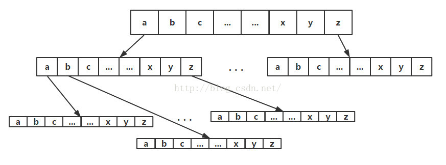

[TOC]

# Trie

Trie树，也叫字典树、前缀树，是英文单词Retrieval的简写。Trie树适合于字符串查找、分词、前缀匹配等应用场景。

Trie常见的两种图示形式：

图一：

图二：

Trie本质是一个DFA，也就是deterministic finite automaton。状态就是某种形式的字符串，变量就是新的输入字符，根据输入字符的不同，状态发生变化。就如上图所示，根据进来字符的不同，决定了下一个状态。

传统上的DFA需要通过**转换表**(状态转换矩阵)来表示状态和变量之间的关系，列表示转换状态，行表示输入变量。这种做法查询效率很高，因为这是直接将变量映射为数组的索引直接查找接下来的状态。但是，这种做法空间利用率太低，转换表过于稀疏。

转换表过于稀疏，一种从存储角度优化的方式就是使用链表。但是相比通过索引就可以直接获取下一个状态，通过链表就需要遍历，显然查询性能要低很多。

有学者提出了一种用四个数组来表示DFA的方式，用于Trie时，可以优化为三个数组来表示。随后，有被优化为用两个数组来表示Trie，即Double Array Trie。

## 1. DoubleArrayTrie

双数组Trie，它的表示有两个数组：base数组和check数组。base负责记录状态，用于状态转移；check负责检查各个字符串是否是从同一个状态转移而来，check数组的元素表示的某个状态的前驱状态。初始状态是两个数组的元素都为0，0表示的是相应状态是空闲的。如果到达一个状态时，构成了一个完整的词，那么base值设为负值。如果某个状态为一个完整的词且该词不为其它词的前缀，其base值可以取其状态位置的负数。**注意**：也有的实现是将check值设为负来表示是一个完整的单词。

base和check的元素满足如下条件：
$base[s] + c = t$
$check[t] = s$

从上面的两个条件公式可以知道，$base[s]$的取值要保证s状态下面的所有子结点都有位置。

## 参考

1. [An Implementation of Double-Array Trie](https://linux.thai.net/~thep/datrie/datrie.html)
2. [双数组Trie树(DoubleArrayTrie)Java实现](https://www.hankcs.com/program/java/%E5%8F%8C%E6%95%B0%E7%BB%84trie%E6%A0%91doublearraytriejava%E5%AE%9E%E7%8E%B0.html)
3. [Aho-Corasick算法的Java实现与分析](https://www.hankcs.com/program/algorithm/implementation-and-analysis-of-aho-corasick-algorithm-in-java.html)
4. [Aho Corasick自动机结合DoubleArrayTrie极速多模式匹配](https://www.hankcs.com/program/algorithm/aho-corasick-double-array-trie.html)
5. [Trie树进阶：Double-Array Trie原理及状态转移过程详解](https://blog.csdn.net/lemon_tree12138/article/details/49281865)
6. [基于双数组Trie树算法的字典改进和实现](http://www.doc88.com/p-0601666272874.html)
