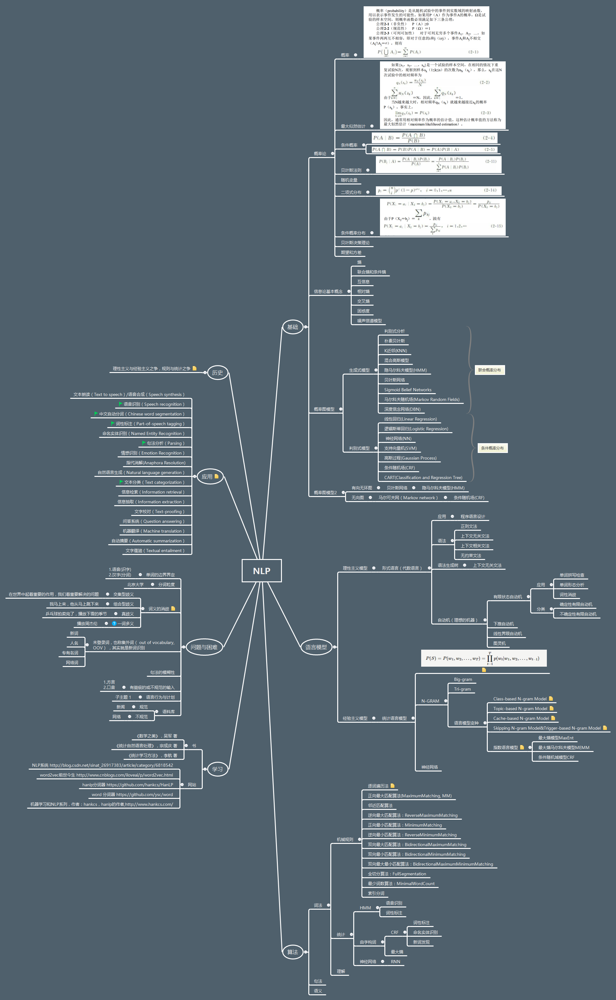
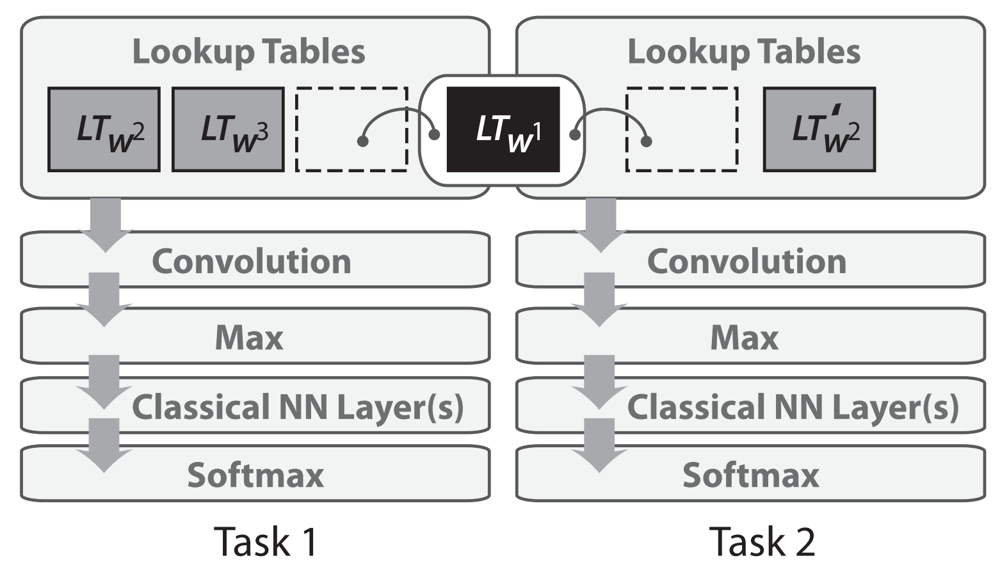
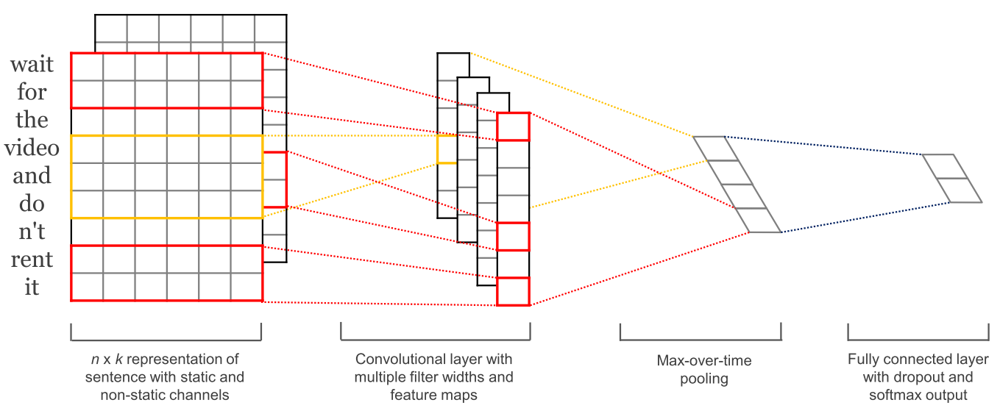
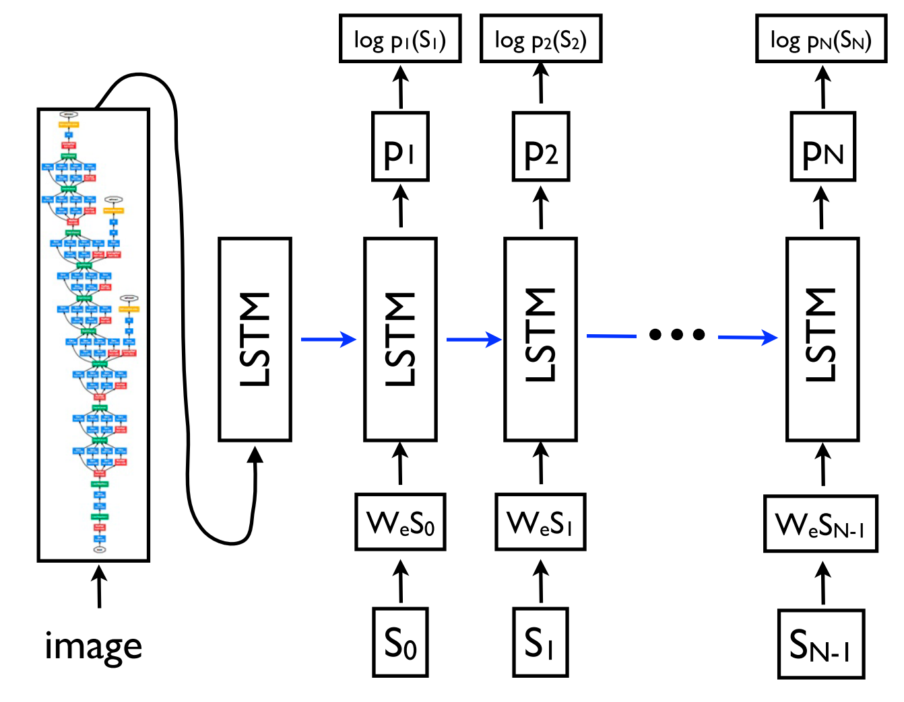
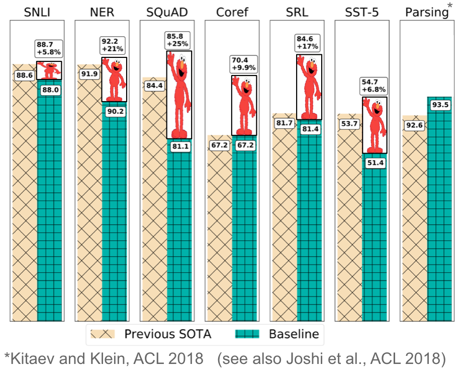

[TOC]

# NLP概况

## NLP中的难点

- 理解语言中的真正含义需要知识，而不是简单字面上的逻辑规则
- 人类语言具有很强的灵活性和开放性，同一个词在不同的时间可能表达不同的含义，语言也是随着时间不断在变化

## 神经网络模型在NLP中的应用历史

[A Review of the Neural History of Natural Language Processing](http://blog.aylien.com/a-review-of-the-recent-history-of-natural-language-processing)
([对应的中文翻译版](http://m.elecfans.com/article/808397.html))

本文是来自自然语言处理领域从业人员、知名博主 Sebatian Ruder的一篇文章，主要从神经网络技术方法的角度，讨论自然语言处理领域近 15 年来的重大进展，并总结出与当下息息相关的 8 大里程碑事件。文章内容难免会省略了一些其它重要的相关工作，同时，这份总结偏向于神经网络相关技术，这并不意味着在这段时间内其它技术领域就没有重要的进展。值得注意的是，文中提及的很多神经网络模型都是建立在同一时期非神经网络技术的里程碑之上的，在文章的最后，我们强调了这些打下坚实基础的重要成果。

### 2001年——神经语言模型（Neurallanguage models）

语言模型解决的是在给定已出现词语的文本中，预测下一个单词的任务。这可以算是最简单的语言处理任务，但却有许多具体的实际应用，例如智能键盘、电子邮件回复建议等。当然，语言模型的历史由来已久。经典的方法基于 n-grams 模型（利用前面 n 个词语预测下一个单词），并利用平滑操作处理不可见的 n-grams。

第一个神经语言模型，前馈神经网络（feed-forward neuralnetwork），是 Bengio 等人于 2001 年提出的。如图 1 所示。

这个模型以某词语之前出现的 n 个词语作为输入向量。今天，这样的向量被称为大家熟知的词嵌入（word embeddings）。这些词嵌入在级联后进入一个隐藏层，该层的输出然后通过一个 softmax 层。

近年来，用于构建语言模型的前馈神经网络已经被循环神经网络（RNNs）和长短期记忆神经网络（LSTMs）取代。虽然后来提出的许多新模型在经典的 LSTM 上进行了扩展，但它仍然是强有力的基础模型。甚至 Bengio 等人的经典前馈神经网络在某些设定下也和更复杂的模型效果相当，因为这些任务只需要考虑邻近的词语。更好地理解语言模型究竟捕捉了哪些信息也是当今一个活跃的研究领域。

语言模型的建立是一种无监督学习（unsupervised learning），Yann LeCun 也将其称之为预测学习（predictive learning），是获得世界如何运作常识的先决条件。关于语言模型最引人注目的是，尽管它很简单，但却与后文许多核心进展息息相关。

反过来，这也意味着自然语言处理领域的许多重要进展都可以简化为某种形式的语言模型构建。但要实现对自然语言真正意义上的理解，仅仅从原始文本中进行学习是不够的，我们需要新的方法和模型。

### 2008年——多任务学习（Multi-tasklearning）

多任务学习是在多个任务下训练的模型之间共享参数的方法，在神经网络中可以通过捆绑不同层的权重轻松实现。多任务学习的思想在 1993 年由 Rich Caruana 首次提出，并应用于道路追踪和肺炎预测。多任务学习鼓励模型学习对多个任务有效的表征描述。这对于学习一般的、低级的描述形式、集中模型的注意力或在训练数据有限的环境中特别有用。

多任务学习于 2008 年被Collobert 和 Weston 等人首次在自然语言处理领域应用于神经网络。在他们的模型中，词嵌入矩阵被两个在不同任务下训练的模型共享，如图 2 所示。

共享的词嵌入矩阵使模型可以相互协作，共享矩阵中的低层级信息，而词嵌入矩阵往往构成了模型中需要训练的绝大部分参数。Collobert 和 Weston 发表于 2008 年的论文，影响远远超过了它在多任务学习中的应用。它开创的诸如预训练词嵌入和使用卷积神经网络处理文本的方法，在接下来的几年被广泛应用。他们也因此获得了 2018 年机器学习国际会议（ICML）的 test-of-time 奖。

如今，多任务学习在自然语言处理领域广泛使用，而利用现有或“人工”任务已经成为 NLP 指令库中的一个有用工具。虽然参数的共享是预先定义好的，但在优化的过程中却可以学习不同的共享模式。当模型越来越多地在多个任务上进行测评以评估其泛化能力时，多任务学习就变得愈加重要，近年来也涌现出更多针对多任务学习的评估基准。

### 2013年——词嵌入

通过稀疏向量对文本进行表示的词袋模型，在自然语言处理领域已经有很长的历史了。而用稠密的向量对词语进行描述，也就是词嵌入，则在 2001 年首次出现。2013 年Mikolov 等人工作的主要创新之处在于，通过去除隐藏层和近似计算目标使词嵌入模型的训练更为高效。尽管这些改变在本质上是十分简单的，但它们与高效的 word2vec（word to vector，用来产生词向量的相关模型）组合在一起，使得大规模的词嵌入模型训练成为可能。

Word2vec 有两种不同的实现方法：CBOW（continuous bag-of-words）和 skip-gram。它们在预测目标上有所不同：一个是根据周围的词语预测中心词语，另一个则恰恰相反。如图 3 所示。

虽然这些嵌入与使用前馈神经网络学习的嵌入在概念上没有区别，但是在一个非常大语料库上的训练使它们能够获取诸如性别、动词时态和国际事务等单词之间的特定关系。如下图 4 所示。

这些关系和它们背后的意义激起了人们对词嵌入的兴趣，许多研究都在关注这些线性关系的来源。然而，使词嵌入成为目前自然语言处理领域中流砥柱的，是将预训练的词嵌入矩阵用于初始化可以提高大量下游任务性能的事实。

虽然 word2vec 捕捉到的关系具有直观且几乎不可思议的特性，但后来的研究表明，word2vec 本身并没有什么特殊之处：词嵌入也可以通过矩阵分解来学习，经过适当的调试，经典的矩阵分解方法 SVD 和 LSA 都可以获得相似的结果。

从那时起，大量的工作开始探索词嵌入的不同方面。尽管有很多发展，word2vec 仍然是目前应用最为广泛的选择。Word2vec 的应用范围也超出了词语级别：带有负采样的 skip-gram——一个基于上下文学习词嵌入的方便目标，已经被用于学习句子的表征。它甚至超越了自然语言处理的范围，被应用于网络和生物序列等领域。

一个激动人心的研究方向是在同一空间中构建不同语言的词嵌入模型，以达到（零样本）跨语言转换的目的。通过无监督学习构建这样的映射变得越来越有希望（至少对于相似的语言来说），这也为语料资源较少的语言和无监督机器翻译的应用程序创造可能。

### 2013年——用于自然语言处理的神经网络

2013年 和 2014 年是自然语言处理领域神经网络时代的开始。其中三种类型的神经网络应用最为广泛：循环神经网络（recurrent neural networks）、卷积神经网络（convolutionalneural networks）和结构递归神经网络（recursive neural networks）。

循环神经网络是 NLP 领域处理动态输入序列最自然的选择。Vanilla 循环神经网络很快被经典的长短期记忆网络（long-shortterm memory networks，LSTM）代替，该模型能更好地解决梯度消失和梯度爆炸问题。在 2013 年之前，人们仍认为循环神经网络很难训练，直到 Ilya Sutskever 博士的论文改变了循环神经网络这一名声。双向的长短期记忆记忆网络通常被用于同时处理出现在左侧和右侧的文本内容。LSTM 结构如图 5 所示。

应用于文本的卷积神经网络只在两个维度上进行操作，卷积层只需要在时序维度上移动即可。图6 展示了应用于自然语言处理的卷积神经网络的典型结构。

与循环神经网络相比，卷积神经网络的一个优点是具有更好的并行性。因为卷积操作中每个时间步的状态只依赖于局部上下文，而不是循环神经网络中那样依赖于所有过去的状态。卷积神经网络可以使用更大的卷积层涵盖更广泛的上下文内容。卷积神经网络也可以和长短期记忆网络进行组合和堆叠，还可以用来加速长短期记忆网络的训练。

循环神经网络和卷积神经网络都将语言视为一个序列。但从语言学的角度来看，语言是具有层级结构的：词语组成高阶的短语和小句，它们本身可以根据一定的产生规则递归地组合。这激发了利用结构递归神经网络，以树形结构取代序列来表示语言的想法，如图 7 所示。

结构递归神经网络自下而上构建序列的表示，与从左至右或从右至左对序列进行处理的循环神经网络形成鲜明的对比。树中的每个节点是通过子节点的表征计算得到的。一个树也可以视为在循环神经网络上施加不同的处理顺序，所以长短期记忆网络则可以很容易地被扩展为一棵树。

不只是循环神经网络和长短期记忆网络可以扩展到使用层次结构，词嵌入也可以在语法语境中学习，语言模型可以基于句法堆栈生成词汇，图形卷积神经网络可以树状结构运行。

### 2014年——序列到序列模型（Sequence-to-sequencemodels）

2014 年，Sutskever 等人提出了序列到序列学习，即使用神经网络将一个序列映射到另一个序列的一般化框架。在这个框架中，一个作为编码器的神经网络对句子符号进行处理，并将其压缩成向量表示；然后，一个作为解码器的神经网络根据编码器的状态逐个预测输出符号，并将前一个预测得到的输出符号作为预测下一个输出符号的输入。如图 8 所示。

机器翻译是这一框架的杀手级应用。2016 年，谷歌宣布他们将用神经机器翻译模型取代基于短语的整句机器翻译模型。谷歌大脑负责人 Jeff Dean 表示，这意味着用 500 行神经网络模型代码取代 50 万行基于短语的机器翻译代码。

由于其灵活性，该框架在自然语言生成任务上被广泛应用，其编码器和解码器分别由不同的模型来担任。更重要的是，解码器不仅可以适用于序列，在任意表示上均可以应用。比如基于图片生成描述（如图 9）、基于表格生成文本、根据源代码改变生成描述，以及众多其他应用。

序列到序列的学习甚至可以应用到自然语言处理领域常见的结构化预测任务中，也就是输出具有特定的结构。为简单起见，输出就像选区解析一样被线性化（如图 10）。在给定足够多训练数据用于语法解析的情况下，神经网络已经被证明具有产生线性输出和识别命名实体的能力。

序列的编码器和解码器通常都是基于循环神经网络，但也可以使用其他模型。新的结构主要都从机器翻译的工作中诞生，它已经成了序列到序列模型的培养基。近期提出的模型有深度长短期记忆网络、卷积编码器、Transformer（一个基于自注意力机制的全新神经网络架构）以及长短期记忆依赖网络和的 Transformer 结合体等。

### 2015年——注意力机制

注意力机制是神经网络机器翻译 (NMT) 的核心创新之一，也是使神经网络机器翻译优于经典的基于短语的机器翻译的关键。序列到序列学习的主要瓶颈是，需要将源序列的全部内容压缩为固定大小的向量。注意力机制通过让解码器回顾源序列的隐藏状态，以此为解码器提供加权平均值的输入来缓解这一问题，如图 11 所示。

之后，各种形式的注意力机制涌现而出。注意力机制被广泛接受，在各种需要根据输入的特定部分做出决策的任务上都有潜在的应用。它已经被应用于句法分析、阅读理解、单样本学习等任务中。它的输入甚至不需要是一个序列，而可以包含其他表示，比如图像的描述（图 12）。

注意力机制一个有用的附带作用是它通过注意力权重来检测输入的哪一部分与特定的输出相关，从而提供了一种罕见的虽然还是比较浅层次的，对模型内部运作机制的窥探。

注意力机制也不仅仅局限于输入序列。自注意力机制可以用来观察句子或文档中周围的单词，获得包含更多上下文信息的词语表示。多层的自注意力机制是神经机器翻译前沿模型 Transformer 的核心。

### 2015年——基于记忆的神经网络

注意力机制可以视为模糊记忆的一种形式，其记忆的内容包括模型之前的隐藏状态，由模型选择从记忆中检索哪些内容。与此同时，更多具有明确记忆单元的模型被提出。他们有很多不同的变化形式，比如神经图灵机（Neural Turing Machines）、记忆网络（Memory Network）、端到端的记忆网络（End-to-end Memory Newtorks）、动态记忆网络（DynamicMemory Networks）、神经可微计算机（Neural Differentiable Computer）、循环实体网络（RecurrentEntity Network）。

记忆的存取通常与注意力机制相似，基于与当前状态且可以读取和写入。这些模型之间的差异体现在它们如何实现和利用存储模块。比如说，端到端的记忆网络对输入进行多次处理并更新内存，以实行多次推理。神经图灵机也有一个基于位置的寻址方式，使它们可以学习简单的计算机程序，比如排序。基于记忆的模型通常用于需要长时间保留信息的任务中，例如语言模型构建和阅读理解。记忆模块的概念非常通用，知识库和表格都可以作为记忆模块，记忆模块也可以基于输入的全部或部分内容进行填充。

### 2018——预训练的语言模型

预训练的词嵌入与上下文无关，仅用于初始化模型中的第一层。近几个月以来，许多有监督的任务被用来预训练神经网络。相比之下，语言模型只需要未标记的文本，因此其训练可以扩展到数十亿单词的语料、新的领域、新的语言。预训练的语言模型于 2015 年被首次提出，但直到最近它才被证明在大量不同类型的任务中均十分有效。语言模型嵌入可以作为目标模型中的特征，或者根据具体任务进行调整。如下图所示，语言模型嵌入为许多任务的效果带来了巨大的改进。

## NLP基本历史概况

### 1. 初创期（1947~1970）

计算机问世(1946年)的第二年，英国工程师A.D.Booth和美国工程师W.Weaver最早提出利用计算机进行自动翻译。由于第一代机器翻译系统翻译质量低劣，导致一些人对机器翻译失去信心。甚至有些人认为无法实现机器高质量的翻译。

### 2. 复苏期（1970~1976）

尽管机器翻译的研究困难重重，但是日本、法国、加拿大等国仍然坚持机器翻译的研究。在20世纪70年代初期，机器翻译又出现了复苏的局面。机器翻译的研究者逐渐认识到了翻译的过程中必须保持原语和译语语义上的一致性。于是，语义分析在机器翻译中越来越受到重视。

### 3. 繁荣期（1976~至今）

繁荣期最突出的特点是机器翻译研究走上了实用化的道路，出现了一大批实用化的机器翻译系统，机器翻译相关的产品开始进入市场，由实用化进入商业化。第二代机器翻译系统以基于转换的方法为代表，普遍采用以句法分析为主、语义分析为辅的基于规则的方法，采用由抽象的转换表示的分层次实现策略。

## NLP相关的任务

### 1. 句法语义分析

针对目标句子，进行分词、词性标注、命名实体识别及链接、句法分析、语义角色识别和多义词消歧等。

### 2. 关键字提取

抽取目标文本中的关键信息。涉及实体识别、时间抽取、因果关系抽取等技术。

### 3. 文本挖掘

包括文本聚类、分类、信息抽取、摘要、情感分析以及挖掘的信息和知识的可视化、交互式的呈现界面。

### 4. 机器翻译

从最早的基于规则到后来的基于统计的方法，再到今天的基于深度学习的方法。

### 5. 信息检索

对大规模文档进行索引时，对文档中的词汇，赋予不同的权重来构建索引。

### 6. 问答系统

针对某个自然语言表达的问题，由问答系统给出一个精确的答案。需要对自然语言查询语句进行语义分析，包括实体链接、关系识别，形成逻辑表达式，然后到知识库中查找可能的候选答案，并通过排序机制输出最佳答案。

### 7. 对话系统

系统通过与用户的多回合对话，跟用户进行聊天、回答、完成某项任务，主要涉及用户意图识别、通用聊天引擎、问答引擎、对话管理系统等技术。此外，为了体现上下文相关，要具备多轮对话能力。同时，为了体现个性化，对话系统还要基于用户画像做个性化回复。