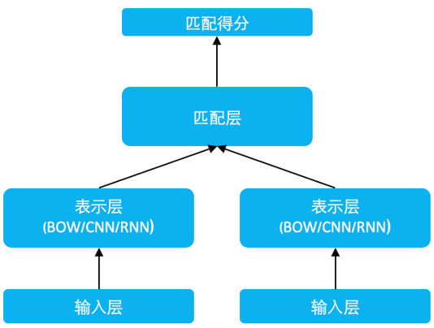
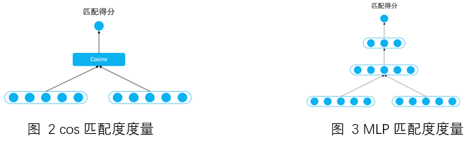
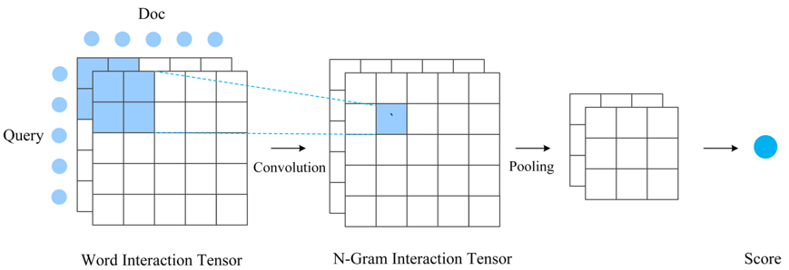
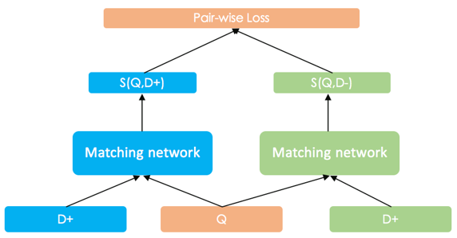
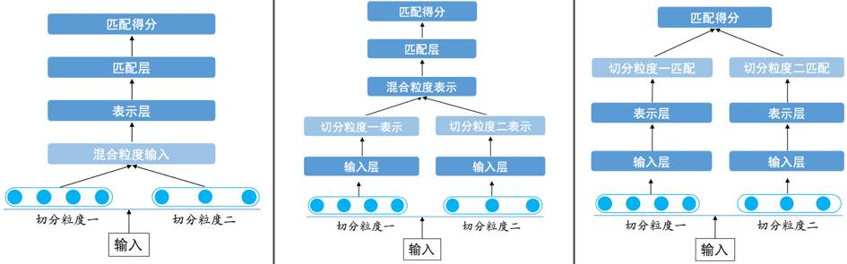
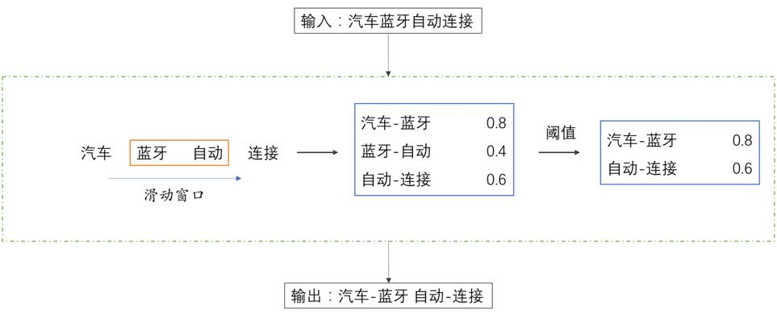
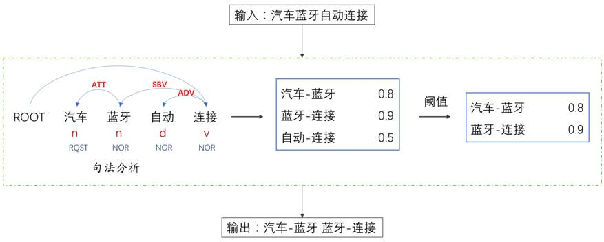

[TOC]

# SimNet

## 1. SimNet简介

SimNet是百度2013年设计研发的一种有监督的神经网络语义匹配模型。在语义表示上，SimNet沿用了隐式连续向量的表示方式，但对语义匹配问题则是在End2End的深度学习框架下建模。将词的Embedding表示与句篇的语义表示、语义的向量表示与匹配度计算、文本对的匹配度计算与pair-wise的有监督学习全部统一到一个框架中。

在实际应用场景下，海量的用户点击行为可以转化为弱标记数据，搭配高效的并行训练算法，可以显著取得超过主题模型的效果。

SimNet被应用于网页搜索产品、广告、新闻推荐、机器翻译、深度问答等多个应用系统中，并取得了显著的效果。

## 2. SimNet框架

### 2.1 输入层

通过lookup table将词序列转换为word embedding序列。

### 2.2 表示层

这一层的作用就是构建词到句的表示。将孤立的word embedding转换为一个有全局信息的一个或者多个低维稠密的语义向量。

最简单的就是Bag of Words方法，除此之外，SimNet使用CNN、RNN等多种表示技术。

### 2.3 匹配层

这一层利用的文本的表示向量进行交互计算，根据应用场景的不同，提供了两种匹配算法。

#### 2.3.1 Representation-based Match

这种方式，尽可能充分地将待匹配的两端都转换到等长的语义表示向量里。然后对这两个向量进行匹配度计算。

SimNet设计了两种计算方法：一种就是通过固定的度量函数计算，最常用的是cosine函数。另一种方法，将两个向量再通过一个多层感知机网络，通过数据训练得到一个匹配度函数，这种方式更为灵活，但是对训练的要求要求更高。

#### 2.3.2 Interaction-based Match

这种方式强调待匹配两端更充分的交互，以及交互基础上的匹配。所以不会在表示层将文本转换成唯一的一个整体表示向量，而一般会保留和词位置相对应的一组表示向量。下面介绍该方式下我们实际应用的一种的 SimNet 模型变体。首先基于表示层采用双向 RNN 得到的文本中间位置表示，和词位置对应的每个向量体现了以本词语为核心的一定的全局信息；然后对两段文本按词对应交互，由此构建两段文本之间的 matching matrix（当然也可以构建多组 matrix，形成 tensor），这里面包括了更细致更局部的文本交互信息；基于该局部匹配特征矩阵，我们进一步使用卷积来提取高级的从单词到 N-Gram 多层次的匹配特征，再经过 pooling 和 MLP 得到最终匹配得分。

Interaction-based Match 匹配方法匹配建模更加细致、充分，一般来说效果更好一些，但计算成本会增加非常多，适合一些效果精度要求高但对计算性能要求不高的应用场景。大部分场景下我们都会选择更加简洁高效的 Representation-based 匹配方式。

### 2.4 训练框架

我们采用了 pair-wise Ranking Loss 来进行 SimNet 的训练。以网页搜索任务为例，假设搜索查询文本为 Q，相关的一篇文档为 D+，不相关的一篇文档为 D-，二者经过 SimNet 网络得到的和 Q 的匹配度得分分别为 S(Q,D+) 和 S(Q,D-)，而训练的优化目标就是使得 S(Q,D+)>S(Q,D-)。实际中，我们一般采用 Max-Margin 的 Hinge Loss：

max⁡{0,margin-(S(Q,D+)-S(Q,D-))}

这种 loss 简洁、高效，还可以通过 margin 的不同设定，来调节模型得分的区分度。

## 3. 文本任务下的特色改进

SimNet框架对于分析相关性具有普适性。特别是Representation-based模式，其实很早就在图像中有类似的应用。九十年代即有利用 Siamese Networks 来进行签名真伪匹配的工作。但对于文本任务来讲，语言的一些特殊性还是需要我们有一些更多针对性的考虑。

针对文本的一维序列的特性，在表示层需要有更针对性的建模。比如我们实现的一维序列卷积网络和长短时记忆网络 LSTM，都充分考虑到了文本的特性。

此外，从输入信号角度我们也充分考虑到文本的特点。SimNet 作为一种 End-to-End 的语义匹配框架，极大地降低了特征设计的代价，直接输入文本的词序列即可。但对中文而言，由于基本语言单位是字，所以仍需要切词这个步骤，但切词本身就是个难题，而且词语的粒度本身也没有严格的定义，所以 SimNet 框架下需要降低对精准切词的依赖，或者说要考虑如何从切词角度来进一步提升匹配效果。另一方面，虽然不再需要进一步的复杂的特征设计，但一些基本的 NLP 技术的产出，如高频共现片段和句法结构信息，能否作为先验知识融入 SimNet 框架发挥作用，也是值得探索的方向。

### 3.1 中文字粒度匹配和多切分粒度融合

我们首先验证了字粒度的匹配。由于中文字的数量远小于词的数量（可达百万量级），即使将 embedding 的维度适当扩充，整个模型的大小也会大大降低。我们在 SimNet-RNN 模式下，经过精致设计，字粒度输入是可以比较接近词粒度下的匹配效果的。当然在大部分 SimNet 变体下，字粒度较词粒度效果上有一定的差距，但是差距并不太大。这就使得，在一些内存紧张或者没有切词模块的场景下，可以直接使用字粒度模型，也可以达到较好的效果。

此外，我们还发现字粒度下有很好的泛化性，能很好的弥补词粒度输入的不足，如切词的错误和未登录词 OOV 问题。这也提示我们可以将字粒度和词粒度进行融合互补。另一方面，由于切词自身不存在唯一客观标准，实际上不同的切分方式也可以实现互补，比如可以同时使用大粒度切词和细粒度切词。这样一来，我们对单一切词的精度要求就可以不那么高了。这也从某种意义上降低了语义匹配任务对切词的高度依赖。

从最终结果上来看，多切分粒度的融合带来了实际应用中的显著效果提升。但是，多切分粒度如何融合，并没有一个唯一模式。在 SimNet 框架下，多切分粒度融合在输入层、表示层和匹配层都可以设计实现。

输入层的融合要考虑到表示层网络的特点。对于 BOW 这种无序的表示结构，我们可以把多种切分粒度直接当输入灌入模型。而对于 CNN/RNN 这些有序的表示结构，输入层的融合则需要一些「技巧」，比如说需要考虑粒度在字层面对齐的问题。

表示层的融合会更加灵活方便些。神经网络有非常多有效的方式能把多个定长向量融合为一个，简单的如拼接或者逐位相加，复杂的也可以加入 Gate 机制。那么，我们可以容易地把多切分粒度生成的多表示向量进行融合，再通过融合后的语义表示层得到最终的匹配相似度。

匹配层的融合可以用最简单直观的方式实现，即不同表示粒度的匹配得分上做加权和。这样有些像不同粒度的匹配模型的 Ensemble，区别是这里所有粒度是同时训练的。此种模式下参数量和计算量也是最大的。

经验表明，越早进行粒度融合，最终的效果会越好。这也应该是因为使得粒度之间的互补性能更早更充分地发挥作用。

### 3.2 高频 Bigram 和 Collocation 片段引入

比基本切词更大的短语片段粒度会不会进一步提升效果？理论上越大的文本片段，表义越精确，但也越稀疏。词语粒度下的词表已可达百万量级，再增加更大片段压力太大，而且还会面临训练不充分问题。我们设计了一种巧妙的统计量度量方式，基于大数据只挑选少量对匹配任务有很好信息量的高频共现 Term 组合，作为 Bigram 词加入字典，进一步显著提升了模型效果。

举个例子，我们输入语料「汽车蓝牙自动连接」，利用基本分词工具，可以把序列分割为「汽车 蓝牙 自动 连接」四个 Term。此时，我们依据大数据下的统计分析，可以发现「汽车-蓝牙」的统计量得分最高，「自动-连接」次之，「蓝牙-自动」最小，那么依照设定的统计量阈值，我们就得到了基于 Bigram 粒度的输出。

以上方式比较适合于连续 Term 共现组合，而对文本语义来讲，有时候一些跨词的 Collocation 搭配也非常重要。我们使用依存句法分析工具来获得相应的 Collocation 片段。还是上面的例子，输入语料「汽车蓝牙自动连接」。此时，我们对输入语料构建依存分析树，统计父节点和子节点共现频率，最终认为「蓝牙-连接」显得比「自动-连接」重要，因此最终输出就成了「汽车-蓝牙 蓝牙-连接」。

不论是 Bigram 还是 Collocation，都相当于使用 NLP 基础技术，用简洁地方式引入了一些先验信息到模型里面，降低了模型学习的难度，在很多场景下都较明显地提升了语义匹配的效果。

以上探索表明，针对文本任务的特点、语言本身特色，我们除了从神经网络模型更好地设计选型之外，也可以将一些基础 NLP 分析技术更好地和模型融合，以更高效地获取更好的效果。

## 4. 实际应用中的考量因素

在实际应用中，除了模型算法之外，还有很多因素会对最终效果产生很大的影响。其中最重要的就是数据，还有就是应用场景的特点。

对深度学习模型来讲，数据的规模是非常关键的。在网页搜索应用上的成功，有个很重要的因素就是有海量的用户点击数据。但是光有数量还不够，还要看数据如何筛选，正例负例如何设定，特别是负例如何选择的问题。例如在网页搜索应用中，如果不考虑频次问题，可能训练数据的绝大部分构成都是高频 Query 数据，但高频 Query 的搜索效果一般是比较好的了。另外，有的 Query 有点击的网页很多，有的很少，能组成的正负 pair 数差别会很大，这时候如何处理？而对于负例，数量和质量上还应该考虑哪些因素？这些问题都至关重要，不同的数据设计方式会极大地影响最后效果。

应用场景同样很重要。比如最终匹配度得分就是最终的结果，还是作为下一层模型的特征输入？如果作为下一层输入的话，对得分的可比性有没有要求？最终的任务是分类还是排序，是排序的话排序的优化目标和训练中的优化目标如何可以做的更一致？这其中有一些会影响到对数据的组织方式，有一些需要针对性的对一些模型超参数做调整。例如前文 loss 中 margin 的具体设定，会影响到准确率指标和得分区分性之间的一些折中变化。

当然，训练中诸如学习率等因素对任务成败也有很大影响，但这些设定和调整的难易也取决于具体的训练程序和平台。
