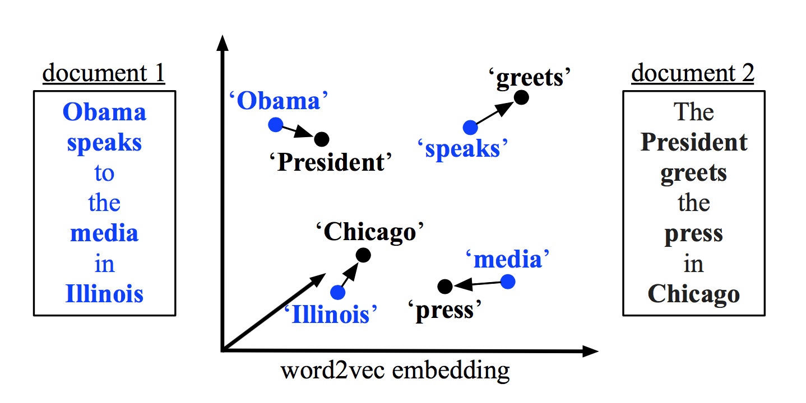
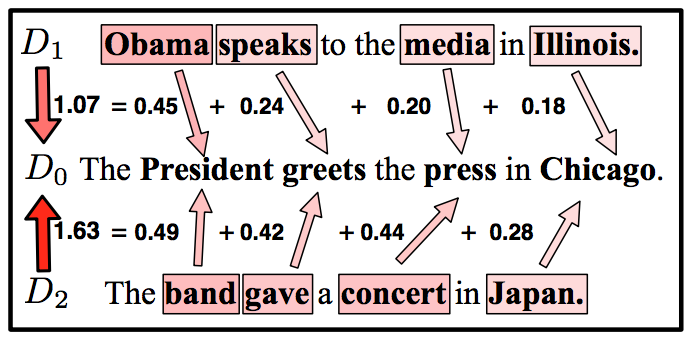
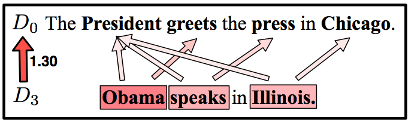
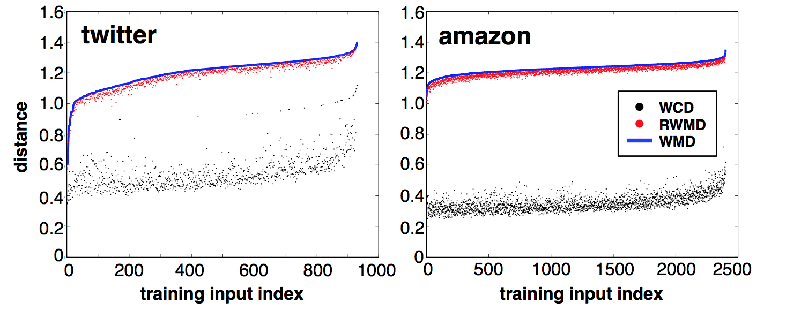
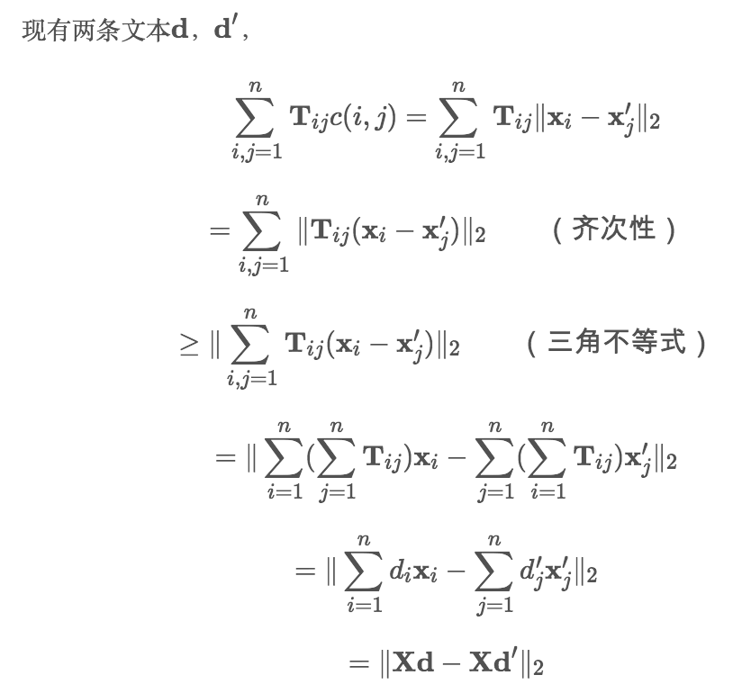
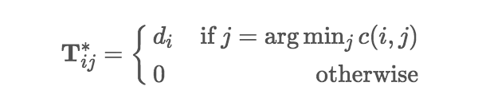

[TOC]

# WMD

需要回答的问题：

1. WMD用于解决什么问题？
2. WMD算法的计算过程？
3. WMD算法的优点和缺点？有哪些改进算法？

## 1. WMD算法

WMD，Word Mover's Distance. 2015年提出的一种度量文本相似度的方法。

## 2. WMD算法的形象描述

为了更为直观的理解WMD的算法，我们先从一个简单的类比说起：

我们把两个要进行相似性比较的文档看做两个仓库，仓库中的内容就是文档中的单词。度量相似的过程看做把一个仓库$A$中的单词移到另一个仓库$B$的每个词身上。最优的移动成本就是两个文档的距离。

这个问题其实就是一个线性规划问题。

这个过程需要确定两个问题：

1. 每个词的分量是多少，需要一种方式度量；这里包括仓库A中每个词的能够输出的分量，和仓库B中每个词能够接受的分量；
2. 仓库A中的词转移到仓库B中的某个词身上的多少；

第一个问题WMD算法是通过词频来表示的，计算公式如下：
$$d_i = \frac{c_i}{\sum_{j=1}^{n}c_j},其中c_i表示词出现次数$$

第二个问题是通过计算两个词的词向量之间的欧式距离得到的：
$$c_{ij} = ||X_i - X_j||_2$$

论文给出了两个例子：

第一个例子是分别计算$D_1$和$D_2$与$D_0$的距离，比较哪条文本与$D_0$相似度更高。$D_1$有四个词，对于每一个词，都能找到在$D_0$中与之最相近的一个词，并计算出转移代价。与我们直观的理解相符，$D_1$与$D_0$的距离比$D_2$与$D_0$的距离更近，相似度更高。

在第二个例子中，两条文本的词数并不一致，$D_0$中每个词的词频是1/4，而$D_3$中每个词的词频是1/3，因此$D_3$的每个词将对应到$D_0$多个词上。

## 3. WMD算法的数学形式

假设我们的总词典有$N$个词汇，每个词汇已经训练好了一个$d$维词向量表示$V_i$。第i个词和第j个词之间的距离为：
$$c_{ij} = ||V_i - V_j||_2$$

现在有两个文档$d$和$d'$，文档d中每个词汇的词频由下面公式计算得到：
$$d_i = \frac{c_i}{\sum_{j=1}^n c_j}$$
其中，$c_i$表示文档d中词i出现的次数，分母表示文档d中的总的词汇数。

文档$d'$每个词汇的词频用$d'_i$来表示。

文档d到文档d'之间的转移矩阵用$T$来表示，$T_{ij}$表示文档d中的词汇 $i$ 到文档d'中的词汇 $j$ 的转移量。所以文档d到d'的总的转移量为$\sum_{ij}T_{ij}$。

求解最小化转移代价的问题是如下线性规划问题：

$$\underset{T\geq0}{min} \sum_{i,j=1}T_{ij}c_{ij}$$
$s.t.$
$$\sum_{j=1}^n T_{ij} = d_i, \forall i \in 1,2,...,n$$
$$\sum_{i=1}^n T_{ij} = d'_j, \forall j \in 1,2,...,n$$

## 4. 时间复杂度

上文的线性规划的解法论文中并没有给出描述，因为在计算机视觉学科已经有类似的研究成果了，就是EMD（Earth Mover’s Distance）2，WMD算法也是来源于EMD的思路。
这里我们对具体解法不做详细介绍，只给出几种常见解法的时间复杂度：

单纯形法：指数级时间复杂度
内点法：多项式级时间复杂度
Fast EMD：$O(p^3logp)$（其中，p代表两篇文本分词去重后词表的大小）
更多细节可以参考EMD3和Fast EMD2的论文对时间复杂度的解释。

## 5. 算法改进

由于WMD的时间复杂度较高，论文中给出了两种提升速度方法：WCD和RWMD，为WMD的公式计算一个下界，当做最小值。这种方法在加快了计算速度的同时，也产生了精度损失。
下图是一个实验，对于twitter/amazon的两个数据集，随机抽取一些文本组成句对，将这些句对按WMD分数由小到大排列，横坐标是句对的编号，纵坐标是WMD、WCD和RWMD的值。从图中可以看出，WCD是非常宽松的下界，RWMD非常接近最优解。

时间复杂度：WCD < RWMD < WMD
精度：WCD < RWMD < WMD

### 5.1 WCD

WCD（Word centroid distance）主要利用三角不等式，找到WMD的最优化目标的一个宽松下界，用来替代WMD的结果。其实这种算法的本质上就是我们最快能够想到的计算两条文本相似度的方法：分别把每条文本的词向量加起来取平均，再计算得到的两个向量的欧氏距离。
WCD极大的加快了运行速度，将时间复杂度减小到O(dp)。其中d代表词向量维度，p代表两篇文本分词去重后词表的大小。

### 5.2 RWMD

尽管WCD很大程度上提升了运行速度，但由于边界过于宽松，效果并不是很好。因此，作者又提出了一种新的优化方法：RWMD（Relaxed word moving distance）。RWMD会计算两次，每次计算时会从WMD两个约束中去掉一个约束，得出两个比WMD宽松的结果，然后取其中的最大值。
如果去掉的是第二个约束，那么最优化目标变成了：
$$\underset{T\geq0}{min} \sum_{i,j=1}T_{ij}c_{ij}$$
$s.t.$
$$\sum_{j=1}^n T_{ij} = d_i, \forall i \in 1,2,...,n$$

这个问题的最优解是，对于一条文本中的一个词，找到另一条文本中与之最相近的一个词，全部转移到这个词。即：

去掉WMD的限制条件分别计算两次，会得到两个RWMD的距离l1(d,d′)和l2(d,d′)。两者的最大值是一个更紧的下界：
$$l_r(d,d') = max(l_1(d,d'), l2(d,d'))$$
这个值比WCD更紧。时间复杂度是O(p2)。

## 6. 工程化

Fast EMD达到$O(p^3logp)$的时间复杂度，WMD计算的速度仍然很慢，在在线服务中产生了难以忍受的性能损耗。 目前开源的WMD实现有：

- gensim（python）调用[pyemd的c扩展](https://github.com/wmayner/pyemd)，使用fast EMD算法。重构之前用的是这个版本，由于是python封装的wmd，计算非常慢。
- [作者Matthew J Kusner实现的wmd](https://github.com/mkusner/wmd)，使用单纯形法3计算emd。而单纯形法的时间复杂度不稳定，最大为指数级，大多数情况是超立方级，可能会给线上TP99带来毛刺。
- [Fast WMD](https://github.com/src-d/wmd-relax)，同样是python封装c。另外，这个项目给出了RWMD的实现。

## 参考

1. [论文：From Word Embeddings To Document Distances](http://www.cs.cornell.edu/~kilian/papers/wmd_metric.pdf)
2. [深入理解WMD算法](https://supernan1994.github.io/nlp/wmd1.html)
3. [Fast EMD论文](http://www.cs.huji.ac.il/~werman/Papers/ICCV2009.pdf)
4. [EMD论文](https://www.cs.cmu.edu/~efros/courses/AP06/Papers/rubner-jcviu-00.pdf)
