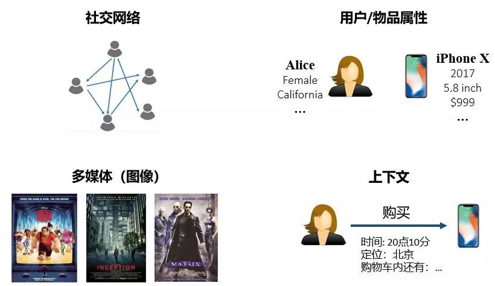

[TOC]

# 推荐系统

互联网技术高速发展的今天，用户面对的信息量程爆炸式的增长。信息爆炸反而导致了信息的利用率降低，这种现象称为information overload，中文叫做信息过载。用户需要一种方式能够帮助其获取感兴趣的信息，减少无关信息的干扰，这就是推荐系统要做的事情。

推荐系统就是一种帮助用户过滤信息，发现感兴趣信息的一种手段，也是一个优秀的面向用户的互联网产品所必须具备的底层支撑技术之一。

## 推荐系统的简单分类

按照预测结果的不同，推荐系统可以分为两类：评分预测和点击预测。

**评分预测**，rating predication, 比如电影评分场景，用户通过对不同的电影打不同的分来表明喜好程度，在这种场景下我们拥有的信息称为显式反馈。这种场景下的推荐系统就是要进行评分预测。

**点击率预测**，click-through rate predication, 有些应用场景，我们能够获取的用户喜好信息只有点击或者不点击这种0-1信息，这种0-1信息称为隐式反馈。我们无法通过是否点击确定喜好程度。这种情况下，推荐系统的任务就是点击率预测，评估点击的可能性大小。

## 传统推荐系统存在的问题

传统的推荐系统只使用用户和对象的交互信息作为输入，这存在两个问题：

1. **数据稀疏**，用户的交互信息提供的不论是显式反馈或者隐式反馈都是数量很少的。我们如果只借助于这稀少的信息，那么很容易出现过拟合风险。

2. **冷启动**，cold start problem，如果用户第一次使用对应的功能，那么就没有用户与其交互信息，模型就无法进行有效的推荐。

## 克服推荐系统问题的方法

上面提到的数据稀疏和冷启动问题，本质上还是由于从用户的交互行为反馈得到的**信息不足**，无法更为准确评估用户的行为和喜好。解决办法就是**引入辅助信息**。

辅助信息提供了关于用户和推荐对象相关的更多知识，为推荐算法提供了更多的决策依据，一定程度上弥补了数据稀疏和冷启动问题。

常用的辅助信息有：

1. **社交网络**：一个用户对某个物品感兴趣，那么他的朋友也可能对该类物品感兴趣；
2. **用户或者物品属性**：相同属性的用户可能会对相同属性的物品感兴趣。
3. **图像/视频/音频/文本等多媒体信息**：如商品图片、电影预告片、新闻等；
4. **上下文**：用户与物品交互的时间、地点、当前会话信息等；
5. **知识图谱**。

推荐系统面对的一个核心困难就是如何将这些辅助信息表示成有效的特征，整合进推荐算法。