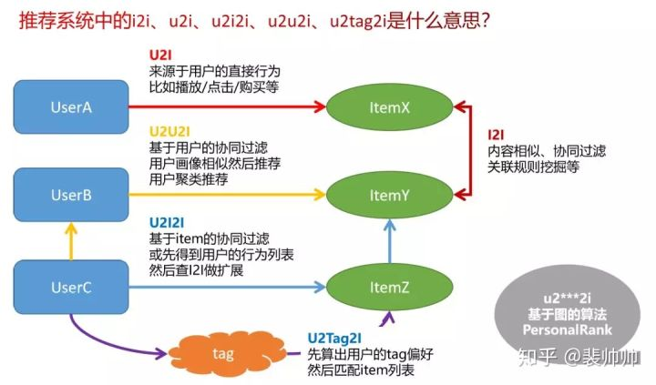

[TOC]

# 推荐系统中的召回

推荐系统面对的两类对象是：用户和物品，推荐系统通过分析这两类对象，来把物品推荐给用户。但是，通常而言，物品的**数量都很庞大**，所以通常的推荐系统都会分为两个阶段：**召回阶段**和**排序阶段**。

召回阶段就是从总的“物品库”中选出一小部分用户感兴趣的候选集，排序阶段则是对候选集进行更为精准的排序，最后把得分高的结果推荐给用户。

召回阶段常用的方法有：**协同过滤**、**向量化召回**、**深度树匹配模型**。

## 1. 协同过滤

这一部分由单独的文档介绍：[CF算法](./CF算法.md)。

## 2. 向量化召回

由文档[向量化召回](./向量化召回.md)介绍。

## 3. 深度树匹配

由文档[深度树匹配](./深度树匹配.md)介绍。

## 4. 召回路径

i对应于item，物品。
u对应于user，用户。

将i、u、tag放到图结构中，不同的路径，对应于不同的召回策略。

- i2i: 计算iterm-item相似度
- u2i：基于矩阵分解、协同过滤的结果，直接给u推荐i。
- u2u2i：基于用户的协同过滤，先找相似用户，再推荐相似用户喜好的东西；
- u2i2i：基于物品的协同过滤，推荐用户搜索的物品相似的物品；
- u2tag2i：基于标签的泛化推荐。先统计出用户的tag偏好向量；然后在依据这个tag向量，选出最接近的item。所谓tag，就是item的标签、分类、关键词等。

## 参考

1. [推荐系统遇上深度学习(三十九)-推荐系统中召回策略演进！](https://blog.csdn.net/leadai/article/details/89391366)