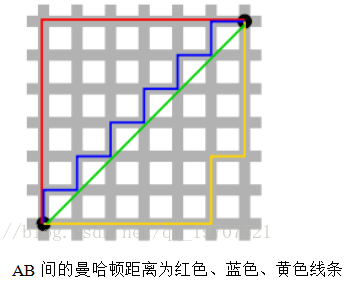
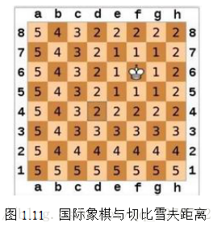

[TOC]

# 机器学习中的不同距离计算公式

1. 欧氏距离
2. 曼哈顿距离
3. 切比雪夫距离
4. 闵可夫斯基距离
5. 夹角余弦
6. 标准化欧氏距离
7. 马氏距离
8. 汉明距离
9. 杰卡德距离 & 杰卡德相似系数
10. 相关系数 & 相关距离
11. 相对熵(KL距离)
12. EMD & WMD & WCD & RWMD(单独文件来介绍)

n维向量：
$A = (x_1,x_2,...,x_n)$，
$B = (y_1,y_2,...,y_n)$，
后面的距离公式都是用来度量这两个n维向量的距离的。

## 1. 欧式距离

距离公式：
$$d_{A,B} = \sqrt{\sum_{i=1}^{n}(x_i-y_i)^2}$$

```python
import numpy as np

A = np.array([1,3,5])
B = np.array([2,4,6])

# 计算距离的两种写法
dis = np.sqrt(np.sum(np.square(A-B)))

dis = np.linalg.norm(A-B)
```

## 2. 曼哈顿距离

想象你在曼哈顿要从一个十字路口开车到另外一个十字路口，驾驶距离是两点间的直线距离吗？显然不是，除非你能穿越大楼。实际驾驶距离就是这个“曼哈顿距离”(L1范数)。而这也是曼哈顿距离名称的来源，曼哈顿距离也称为城市街区距离(City Block distance)。



距离公式：
$$d_{A,B} = \sum_{i=1}^{n}|x_i - y_i|$$

```python
# 这里也有两种写法
dis = np.sum(np.abs(A-B))

dis = np.linalg.norm(A-B,ord=1)
```

## 3. 切比雪夫距离

国际象棋玩过么？国王走一步能够移动到相邻的8个方格中的任意一个。那么国王从格子(x1,y1)走到格子(x2,y2)最少需要多少步？自己走走试试。你会发现最少步数总是max(| x2-x1| , |y2-y1| ) 步。有一种类似的一种距离度量方法叫切比雪夫距离(L∞范数)。



距离公式：
$$d_{A,B} = max(|x_i - y_i|)$$

```python
# 两种写法
dis = np.abs(A-B).max()

dis = np.linalg.norm(A-B, ord=np.inf)
```

## 4. 闵可夫斯基距离

距离公式：
$$d_{A,B} = \sqrt[p]{\sum_{i=1}^{n}|x_i - y_i|^p}$$

```python
# 对应于numpy的如下函数：
np.linalg.norm(A-B,p)
```

## 5. 余弦夹角距离

距离公式：
$$d_{A,B} = cos{\frac{AB}{|A||B|}}$$

```python
dis = np.dot(A,B)/(np.linalg.norm(A) * np.linalg.norm(B))
```

## 6. 标准化欧氏距离

就是对向量不同维度进行标准化之后的距离，解决量纲不一致的问题。

标准化做法是：
$$standardization = \frac{x_i - \bar{x}}{\sqrt{(x_i-\bar{x})^2}}$$

## 7. 马氏距离

[欧式距离与马氏距离](https://blog.csdn.net/u010167269/article/details/51627338)

## 8. 汉明距离

两个等长字符串s1与s2之间的汉明距离定义为将其中一个变为另外一个所需要作的最小替换次数。例如字符串“1111”与“1001”之间的汉明距离为2。

应用：信息编码（为了增强容错性，应使得编码间的最小汉明距离尽可能大）。

## 9. 杰卡德距离

杰卡德相似系数：
A，B两个集合：
$$J(A,B) = \frac{A \cap B}{A \cup B}$$

距离公式就是：$1 - J(A,B)$

```python
import scipy.spatial.distance as dist

A=np.array([1,1,0,1,0,1,0,0,1])
B=np.array([0,1,1,0,0,0,1,1,1])

matv=np.array([A,B])
print(matv)
ds=dist.pdist(matv,'jaccard')
print(ds)

#输出
#[[1 1 0 1 0 1 0 0 1] [0 1 1 0 0 0 1 1 1]]
# [ 0.75]
```

## 11. 相对熵(KL距离)

[KL距离](https://www.cnblogs.com/ywl925/p/3554502.html)

KL距离，是Kullback-Leibler差异（Kullback-Leibler Divergence）的简称，也叫做相对熵（Relative Entropy）。它衡量的是相同事件空间里的两个概率分布的差异情况。其物理意义是：在相同事件空间里，概率分布$P(x)$的事件空间，若用概率分布$Q(x)$编码时，平均每个基本事件（符号）编码长度增加了多少比特。我们用$D(P||Q)$表示KL距离，计算公式如下：

$$D(P||Q) = \sum_{x \in X}{P(x)log\frac{P(x)}{D(x)}}$$

思考：熵度量的是一个随机变量的不确定性。相对熵则是描述两个不同分布的随机变量之间的差异性，是对不同概率分布之间差异性的度量。
