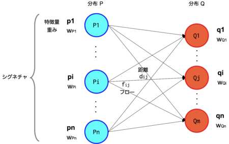
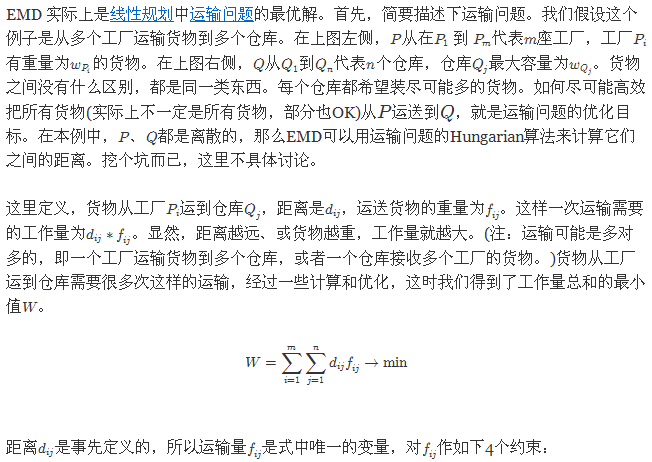
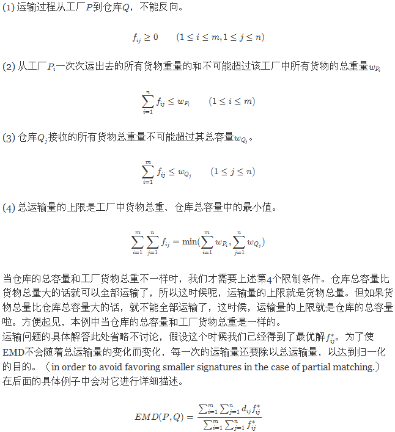

[TOC]

# EMD & WMD & WCD & RWMD

之所以把EMD这个距离计算算法单独放到一个笔记中介绍，是因为相比其他的举例公式，这个距离计算算法相对复杂一些，也更为陌生一些。

## 1. EMD

Earth Mover's Distance.EMD是一种距离度量的定义，和其他距离定义类似，常用于图像和语音处理领域。

EMD是由 2000年YOSSI RUBNER在《The Earth Mover's Distance as a Metric for Image Retrival》论文中提出的，从论文的标题我们也能知道，这个距离最初是用在图像之间的距离度量的。

### 1.1 Signature

论文中提到“We introduce a distance between two signatures that we call the Earth Mover's Distance(EMD)”。

这里要简单说明一下论文中什么是signature，因为它能一定程度反映算法的作用原理。后面我们用EMD或者其变型来度量新的对象的距离时，也要构造不同对象的signature。

论文中的signature就是指图像的直方图，就是把图像的像素量化，然后分到一定数量的bin中，然后bin中像素的个数就作为这个bin的权重。

从数学的角度来讲，signature其实就是一系列的特征，加上这些特征的权重，这些就构成了一个图像的signature。总结一句就是：特征+特征权重，构成signature。

### 1.2 EMD模型

要度量距离的两个对象有如下两个signature：
$P = \{ (p_1,w_{p1}),(p_2,w_{p2}),(p_3,w_{p3}),...,(p_m,w_{pm}) \}$
$Q = \{ (q_1,w_{q1}),(q_2,w_{q2}),(q_3,w_{q3}),...,(q_n,w_{qn}) \}$

其中：$p_i,q_i$是特征，$w_{p1},w_{q1}$等分别是特征的权重。

另外，定义如下关系矩阵$[d_{ij}]_{m*n}$，它表示$p_i$与$q_j$之间的距离大小，这个距离可以是任何距离定义。

定义如下流动量矩阵$F = [f_{ij}]$，它表示特征$p_i$与$q_j$之间流动的权重数量。$f_{ij}$有如下约束：$\sum_{i=1}^{n}f_{ij} = 1, j = 1,2,3,...,m$

那么EMD模型的目标就是：$$min \sum_{i=1}^{m}\sum_{j=1}^{n}d_{ij}f_{ij} $$

EMD距离就是上面最小化值的归一化，即：
$$EMD(P,Q) = \frac{min \sum_{i=1}^{m}\sum_{j=1}^{n}d_{ij}f_{ij}}{\sum_{i=1}^{m}\sum_{j=1}^{n}f_{ij}}$$

### 1.3 EMD模型对应的运输问题

## 参考

1. [EMD算法及其简介](http://ir.dlut.edu.cn/news/detail/362)
2. From word embeddings to document distances, Matt J. kusner et al.
3. Fast and robust earth mover’s distance, Pele et al.
4. [深入理解WMD算法](https://supernan1994.github.io/nlp/wmd1.html)
