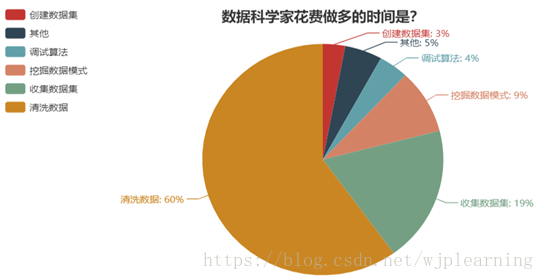
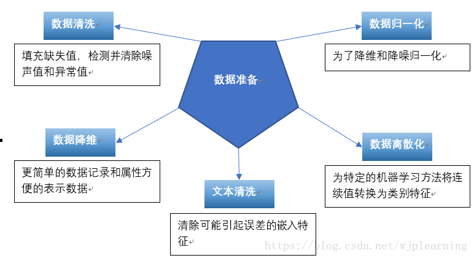
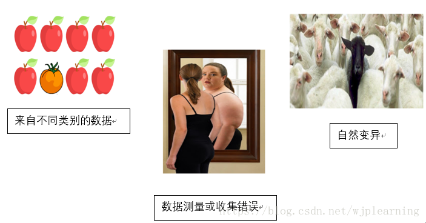
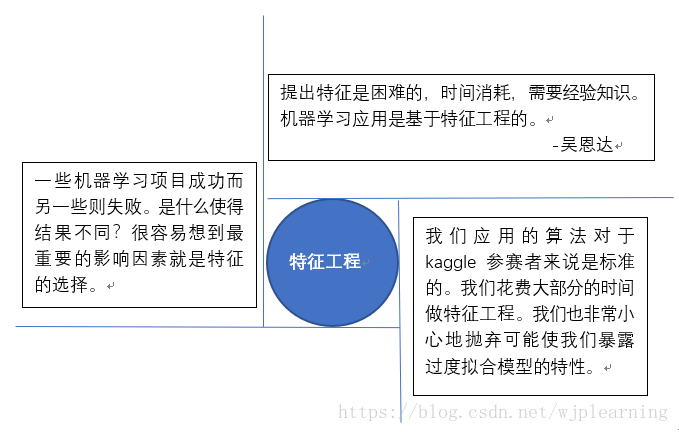

# 本章问题目录

本章的内容都是关于机器学习和深度学习的基本概念的，与具体的某个模型没有关系。

1. 监督、无监督、半监督、弱监督这些学习方法都是什么？
2. 监督学习的步骤有哪些？

## 1. 监督、无监督、半监督、弱监督学习都是什么？

根据数据和学习方式的不同，机器学习可以分为这四种。

### 监督学习(supervised learning)

1. 从标记的数据中完成机器学习任务。何为标记？就是用于进行机器学习的数据由两部分组成：一部分是输入，另一部分是期望的输出。用满足这个条件的数据进行学习的过程就成为监督学习。
2. 监督学习包括两大类问题：分类问题和回归问题。

### 无监督学习

1. 利用没有标注的数据进行机器学习任务的学习过程称为无监督学习。
2. 一般而言，如果我们对要解决的问题缺少足够的先验知识，或者是进行数据标注的成本过于高，这个时候我们就需要借助于无监督的方法为我们解决问题提供帮助。
3. 传统的机器学习方法中，典型的无监督学习算法就是聚类算法。聚类算法有两大类：划分方法和层次方法。划分方法就是借助一个关系度量方法，通过制定聚类的数量$K$，将样本划分为多个簇。划分方法有K-means、K-center、CLARANS方法。层次聚类由不同层次的聚类组成，层次之间有嵌套关系，不需要输入$K$，但是需要确定终止条件。
4. 深度学习中的无监督学习主要包括两类：一类是确定型的自编码方法，如自编码、稀疏自编码、降噪自编码。另一类是概率型的玻尔兹曼机及其该进方法。

### 半监督学习

1. 用于学习任务的数据既包含标注数据，又包含非标注数据。这样的学习称为半监督学习。
2. 这两种数据如何结合工作呢?如何利用已标注数据和未标注数据是半监督学习中需要解决的问题。有三个常用的基本假设来解决这个问题：a). 平滑假设，稠密数据区域相近的两个数据具有相同的标签；b). 聚类假设，同一簇中的数据具有同一个标签；c). 流行假设，高维数据嵌入到低维流行中，当两个数据在低维流行中位于相邻小局部时，这两个样本具有相同的标签。
3. 常用的半监督学习算法有：自训练(self-training)、生成式模型(Generative models)、协同训练(co-training)、传导式支持向量机(Transductive Support Vector Machine)、基于图的方法(Graph-based methods)。
4. 半监督的基本思想是利用数据分布上的模型假设来建立学习器对未标注数据进行标注。

### 弱监督学习

1. 用于学习的数据只是经过了弱标注，然后利用弱标注学习出更强的标签出来。何为弱标注？就是不完整标注，标注只是有助于学习目标，或者是目标的部分信息，或者是标注的不可靠，然后通过学习算法，得到完整的目标信息。

## 2. 监督学习的步骤有哪些？

### a. 准备数据

准备要训练、测试样本，并对样本进行标注。准备数据是一个非常耗时的过程，下图展示的学习过程中不同的部分耗时比例：

### b. 数据预处理

数据的质量决定了算法结果的上限，所以保证数据的质量是非常重要的。

在解决实际问题过程中，我们获取的数据可能会包含以下的质量问题：

- 不完全性：某些特征包含缺失值或者数据缺少某些特征
- 噪声：干扰数据，比如不准确的数据、错误的数据、异常的数据
- 不一致性：包含冲突的数据

数据预处理包括以下部分：

#### b-1. 缺失值和异常值的处理

缺失值是关于目标的信息缺失，异常值是关于目标的信息异常，这两个问题都会给模型带来学习上的偏差，使模型学习偏离正确的结果。错误的数据无法告诉正确的答案。所以缺失值和异常值必须得到合适的处理。

##### 缺失值的常用处理方法？

1. 删除；
2. 虚拟替换，就是造出一个不存在的虚拟值填充，所谓不存在就是数据中表示无意义的值；
3. 均值替换，利用同一纬度的数值类型数据的均值，数值类型可用；
4. 频数替换，利用同一纬度出现频率高的数据替换，非数值类型可用；
5. 回归替换，利用回归方法求值；

##### 关于离群点的问题？

离群点的原因如下图所示：

1. 离群点是正常的一个类别，它的存在是合理的，甚至是非常有用的；
2. 由于错误造成，比如统计错误、测量错误等等；
3. 自然变异，这种类型既不正常，因为第一次出现，又正常，不是因为错误造成的。

离群点的处理方法有：

1. 保持离群点，这个取决于我们的目的。有时离群点反倒提供关键的信息，比如银行欺诈；
2. 删除离群点，删除的方法有两种：1). 修改这个离群点；2). 替换。修改小于5%的数据对模型不会产生大的影响。

#### b-2. 数据归一化

*思考：为什么一定要归一化？*  
归一化就是将数据映射到固定的区间内。归一化的方法包括：  

1. Min-Max归一化  
线性地将数值映射到0~1区间内。$new\_value = \frac{value-min}{max-min}$
2. Z-score归一化，也叫标准归一化。  
$z = \frac{X-\mu}{\sigma}$，其中$\mu$为均值，$\sigma$为标准差

#### b-3. 数据离散化

*为何进行离散化？*
非数值变量，如果不离散化、数值化是无法使用数值模型的。对于数值类变量，离散化可以某种程度简化模型，降低对噪声的敏感度，方便模型的展示及解释。

*如何进行离散化？*
变量可以分为数值变量、分类变量，分类变量又可以分为有序变量和无序变量。

- 无序分类变量的离散化方法：onehot编码；  
- 有序分类变量的离散化方法：0，1，2，3，... 顺序编码即可；  
- 连续变量的离散化方法：1). 无监督划分方法，等宽划分，等频划分，聚类划分；2). 有监督方法，1R方法、基于信息熵的方法、基于卡方的方法。

#### b-4. 数据降维

*关于降维，后面会有专门的内容来分析*  
降维也是减小模型复杂度的一种方式。

#### b-5. 文本清理

在处理文本问题时，对于样本文本需要进行必要的清理工作，丢弃其中不重要的信息。

### c. 特征工程

笼统的定义，特征工程就是从数据中提取需要的特征的过程。
