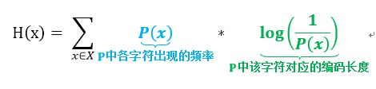
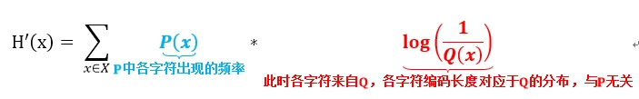

[TOC]

# 相对熵

相对熵，又称Kullback-Leibler散度(KL散度)。它是两个概率分布之间差异的**非对称**度量。

相对熵的定义：

- 离散随机变量：

$$KL(P||Q) = \sum P(x)log\frac{P(x)}{Q(x)}$$

- 连续随机变量

$$KL(P||Q) = \int P(x)log\frac{P(x)}{Q(x)}$$

## 1. 相对熵推导

假设变量$x \in X$满足概率分布$P(x)$，那么这个概率分布的熵是：$$H(x) = -\sum{P(x)logP(x)}$$

现在有另一个概率分布$Q(x)$，我们如果要用概率分布$Q(x)$来估计那些满足$P(x)$的变量，那么如何评估这中做法的好坏呢？就用这两个熵的差表示这种不确定性因为用新的分布表示时增加的程度。

$KL(P||Q)$
$ = \{-\sum{P(x)logQ(x)}\} - \{-\sum{P(x)logP(x)}\}$
$= \sum P(x)log\frac{P(x)}{Q(x)}$

当两个分布相同时，相对熵为0，交叉熵最大。

## 2. KL在信息论中的具体含义

在信息论中KL意义：它是用来度量使用基于Q分布的编码来编码来自P分布的样本平均所需的额外的Bit个数。

机器学习中，则是度量两个函数的相似程度。

基于P分布的编码方式去编码P中的样本需要的编码长度：

基于Q分布的编码方式去编码P中的样本需要的编码长度：

