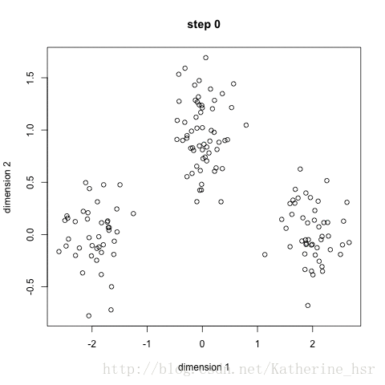

[TOC]

# K-Means聚类算法

## 1. K-Means算法步骤

1. 确定要分的簇的数量，并随机为每一簇选择一个初始的中心点；
2. 计算每个样本点到这些中心点的距离，离哪个中心点距离近，就分配到哪个中心点对应的簇中；
3. 根据已经分配好的簇，把这个簇中的样本的中心点作为新的中心点。
4. 重复2，3步，直到每次迭代后的结果变化不大就结束。
5. 可以多次随机更改初始的中心点，重复上面的过程，寻求更好的结果。

计算过程如下图：

## 2. 优缺点

- 优点
  计算在聚类算法中相对简单。

- 缺点
  1. 需要预先知道要分几个簇，这个对于预先不知道需要分几簇的场景，就成了额外的超参；但也有些场景，我们有明确的目的就是要分为指定的类别。
  2. 对异常值比较敏感，因为中心点是簇中样本取平均值，所以异常值会对中心点有较大的影响。

## 3. 改进

对K-means的改进是K-medians，也即K中心点。

K中心点算法选取每一簇的中心点不是求平均值，而是排序取位置在中间的值，所以对异常值不是那么敏感。
