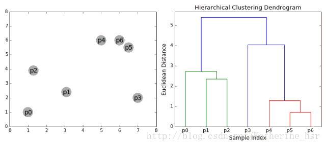

[TOC]

# 凝聚层次聚类(HAC)

层次聚类算法分为两类：自上而下和自下而上。凝聚层次聚类是自下而上的一种聚类算法。

HAC首先将每个数据点视为一个单一的簇，然后通过计算所有簇之间的距离来合并簇，知道所有的簇都合并为一个簇。

## 计算步骤

1. 首先我们将每个数据点视为一个单一的簇，然后选择一个测量两个簇之间距离的度量标准。例如我们使用average linkage作为标准，它将两个簇之间的距离定义为第一个簇中的数据点与第二个簇中的数据点之间的平均距离。

2. 在每次迭代中，我们将两个具有最小average linkage的簇合并成为一个簇。

3. 重复步骤2知道所有的数据点合并成一个簇，然后选择我们需要多少个簇。

## 优缺点

1. 不需要提前知道有多少个簇
2. 对距离度量标准的定义并不敏感
