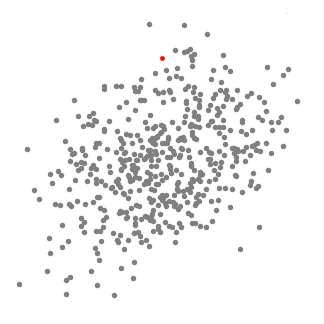

[TOC]

# 均值漂移聚类

如果要分类的样本中的确是存在不同的类别，或者说存在远近关系的差异性，那么在给定的样本中，大概率会存在相似性的远近。而且，越相似的聚集程度越大，也就是密度越大。这种大密度的聚集样本就可以被认为是同一类的。所以，聚类算法可以通过找到这个密度聚集区来确定不同的类别。均值漂移聚类就是这样一个算法，它通过设定一定的窗口，然后通过不断移动这个窗口，逐渐找到密度最大的窗口。这里有个问题？如何移动，向什么方向移动？均值漂移算法就是通过计算窗口内的均值中心点来实现窗口的不断移动。

## 1. 算法流程

1. 确定滑动窗口的半径r。随机且在样本空间中均匀选取一定数量的中心点。
2. 计算窗口内样本的均值作为新的中心点，这就实现了窗口的一次漂移。将窗口内样本的数量作为窗口的密度。重复此过程，知道窗口内的密度不再增加为止。
3. 上面两步会得到多个最终稳定的滑动窗口，如果滑动窗口之间有重叠，那么就保留密度最大的那个。最终得到的无重叠的窗口数量就对应于分类的数量。

单个窗口的漂移过程如下：

集群滑动漂移过程：

## 2. 优缺点

- 优点：
  不需要预先知道分类的数量；
  划定窗口，对异常值敏感性会降低；
  稳定状态依据密度不变，受均值影响较小。

- 缺点：
  