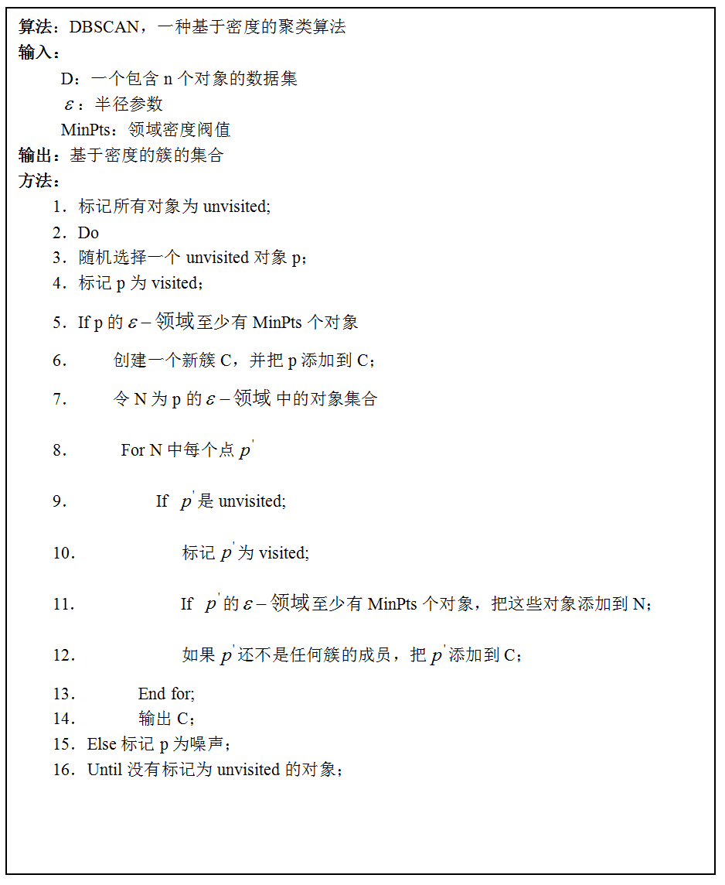

[TOC]

# 基于密度的聚类

DBSCAN(Density-Based Spatial Clustering of Applications with Noise)是一种基于密度的聚类算法。这个算法也不需要指定聚类的数量。

## 1. DBSCAN中的核心概念

DBSCAN将所有的数据点分为三类：

- 核心点
  在指定半径r内包含的数据点数量大于等于minPoints。

- 边界点
  落在核心点范围内，但是半径r内的数据点数量小于minPoints。

- 噪音点
  即不是核心点，又不是边界点。

- $\epsilon-$邻域
  以O为中心，$\epsilon$为半径的区域

- MinPts
  对象$\epsilon$邻域内的对象数量。

- 核心对象
  即前面定义的核心点

- 直接密度可达
  如果对象p在核心对象O的$\epsilon-$邻域内，那么就是p就是从O直接密度可达。

- 密度可达
  对象p经过一系列的直接密度可达链到达q，那么p和q就是密度可达。

- 密度相连
  如果两个点都是关于同一个点密度可达，那么这两个点就是密度相连。注意：假设a,b都是关于c密度可达，但是a和b之间不一定是密度可达的。

## 2. DBSCAN算法流程

**输入：**
D：包含n个对象的数据集
$\epsilon$：半径参数
MinPts：邻域密度阈值

**输出：**
基于密度的簇的集合

**计算过程：**

