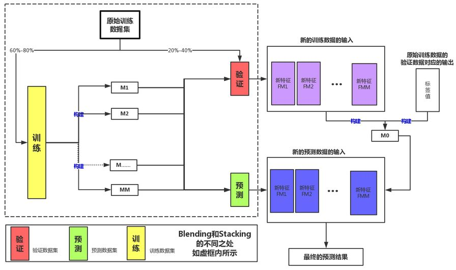

[TOC]

# 集成学习

集成学习的核心思想就是将多个**弱学习器**经过**一定方式组合**在一起构成一个**强学习器**。通俗表达就是“三个臭皮匠，顶一个诸葛亮”。

集成学习最早来源于Valiant提出的PAC(Probably Approximately Correct)学习模型，该模型中首次定义了弱学习器和强学习器的概念。**弱学习器**：准确率比随机猜测高一些的学习算法；**强学习器**：准确率很高且能在多项式时间内完成的学习算法。该模型提出了给定任意的弱学习算法，能否将其提升为强学习算法的问题。1990年，Schapire对其进行了肯定的证明。

目前集成学习中的“一定组合方式”包括：Voting、Averaging、Bagging、Boosting、Stacking和Blending。

## 1. Voting

一种很简单的集成思路，主要用于离散的分类问题。

包括：

1. 绝对多数投票法
投票超过半数的标记才会采用，否则拒绝。

2. 相对多数投票法
采用投票数量最多的标签，若同时有多个标签投票一致，则随机选取一个。

3. 加权投票法
为标记赋以不同的权重，可以理解为这是一种先验知识，然后再利用相对多数投票法。

Voting做法应该算是一种很泛的思想，它没有说明具体每个投票学习器的具体应该如何获取，也没有对具体学习器获取做任何限制。

## 2. Averaging

取平均，通常用于回归问题。

常见的Averaging方法：

1. 简单平均
2. 加权平均

这是应对回归问题的最简单直接的集成思想。

## 3. Bagging

Bootstrap Aggregation的简称。

**基本思路**：

对数据集进行有放回采样，得到多个数据集的随机采样子集，用这些随机子集分别对多个学习器进行训练，最终得到多个学习器。对于分类问题，多个学习器通过Voting的做法得到最终结果，对于回归问题，可以采用Averaging的做法。

Bagging一般使用强学习器，学习器之间不存在依赖关系，可以实现并行。这一点和Boosting算法是有不同的，Boosting倾向于用弱学习器来达到强学习器的效果。

Bagging的代表方法就是Random Forest。

## 4. Boosting

Boosting的思想核心：新的弱学习器基于前一个学习器的效果来进行调整，学习得到新的模型，最后将得到的多个学习器组合成一个学习器。

Boosting算法是一个串行优化的过程。

1995年，Freund等人提出了**AdaBoost算法**。1999年，Friedman提出了**Gradient Boosting算法**。这两种是Boosting思想的两大经典算法。

## 5. Stacking

stacking模型的结构：
整个stacking模型可以由多层组成，类似于神经网络模型的一层层网络。第一层模型以原始数据为输入，得到的预测值为输出。第一层的输出是第二层模型的输入，以此类推。

每一层中，有多个模型，比如可以是多个不一样的机器学习模型，每个模型可以处以一个样本得到这个样本的一个特征，多个模型就可以得到一个样本的多个特征。对于每个模型，为了能够合理处理所有的样本，采用K-折的方法训练模型，K-1的样本用于训练模型，剩余的一折预测值作为这个模型在这一折的输出。最后可以得到K个模型，也实现将所有样本数据处理得到与这个模型相应的特征。

每个模型处理测试集时，K-折得到的K个模型预测测试集，取平均值。

单个模型的单层处理过程：

单个模型的训练过程如下：

1. 拆解训练集。将训练数据随机且大致均匀的拆为m份

2. 在拆解后的训练集上训练模型，同时在测试集上预测。利用m-1份训练数据进行训练，预测剩余一份；在此过程进行的同时，利用相同的m-1份数据训练，在真正的测试集上预测；如此重复m次，将训练集上m次结果叠加为1列，将测试集上m次结果取均值融合为1列。

3. 使用k个分类器重复2过程。将分别得到k列训练集的预测结果，k列测试集预测结果。

4. 训练3过程得到的数据。将k列训练集预测结果和训练集真实label进行训练，将k列测试集预测结果作为测试集。

stacking多个模型的单层处理过程：

## 6. Blending

Blending与Stacking大致相同，只是Blending的主要区别在于训练集不是通过K-Fold的Cross Validation策略来获得预测值从而生成第二阶段模型的特征，而是建立一个Holdout集。简单来说，Blending**直接用不相交的数据集用于不同层的训练**。

以两层的Blending为例，训练集划分为两部分（d1，d2），测试集为test。

第一层：用d1训练多个模型，将其对d2和test的预测结果作为第二层的训练数据和测试数据的New Features。

第二层：用d2的New Features和标签训练新的分类器，然后把test的New Features输入作为最终的测试集，对test预测出的结果就是最终的模型融合的值。

## 7. stacking & blending

Blending与stacking相比优点在于：

1. 比stacking简单（因为不用进行k次的交叉验证来获得新特征）
2. 由于两层使用的数据不同，所以避免了一个信息泄露的问题。
3. 在团队建模过程中，不需要给队友分享自己的随机种子。

而缺点在于：

1. 由于blending对数据集这种划分形式，第二层的数据量比较少。
2. 由于第二层数据量比较少所以可能会过拟合。
3. stacking使用多次的CV(cross validation)会比较稳健

对于实践中的结果而言，stacking和blending的效果是差不多的，所以使用哪种方法都没什么所谓，完全取决于个人爱好。

## 参考

1. [集成学习之Blending(模型混合)](https://www.jianshu.com/p/b95f9e36dfef?utm_source=oschina-app)
2. [Ensemble Learning常见方法总结（Bagging、Boosting、Stacking、Blending）](https://blog.csdn.net/FrankieHello/article/details/81664135)
3. [集成学习之Boosting —— AdaBoost原理](https://www.cnblogs.com/massquantity/p/9063033.html)
4. [集成学习总结 & Stacking方法详解](https://blog.csdn.net/willduan1/article/details/73618677)
5. [模型融合：stacking&blending](https://blog.csdn.net/choven_meng/article/details/82913757)
