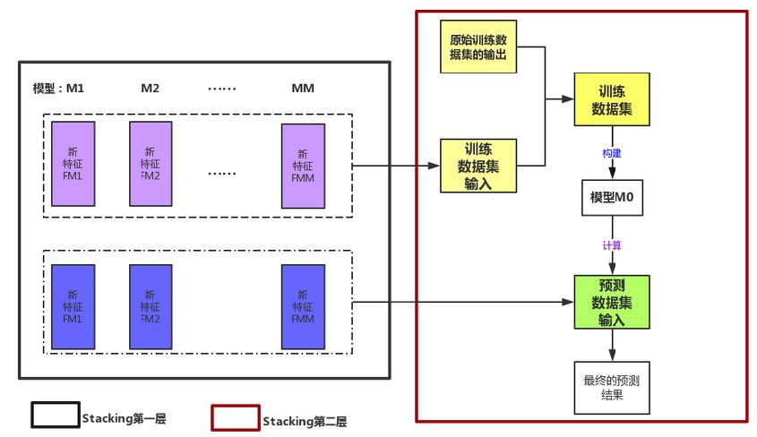
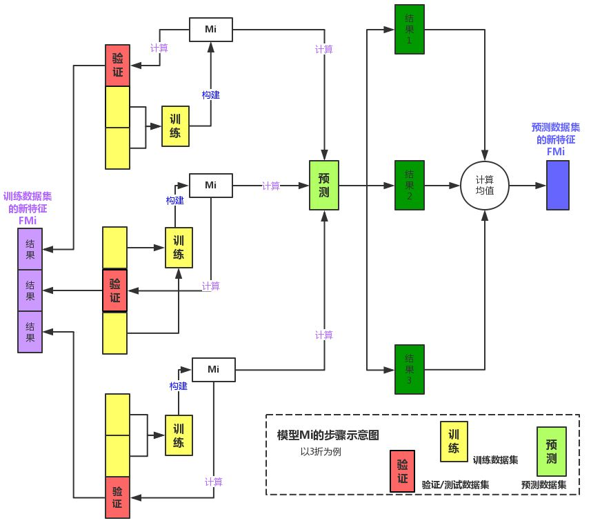
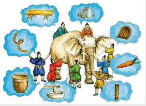
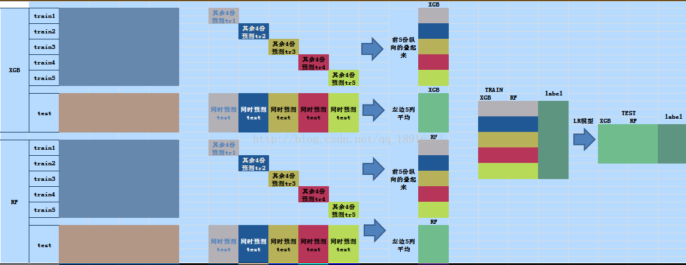
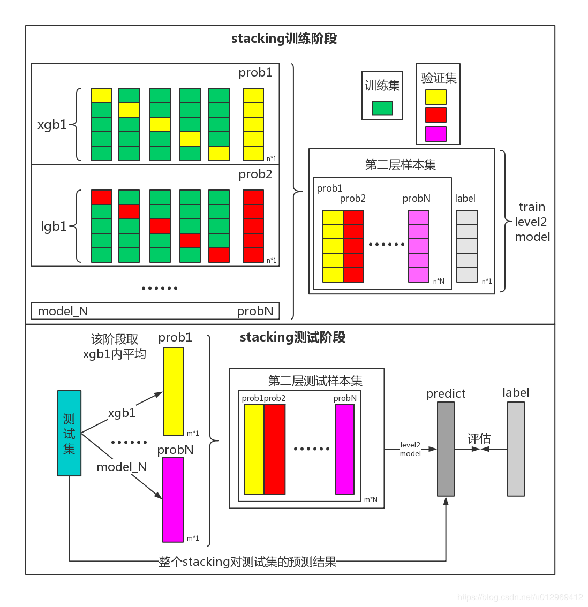
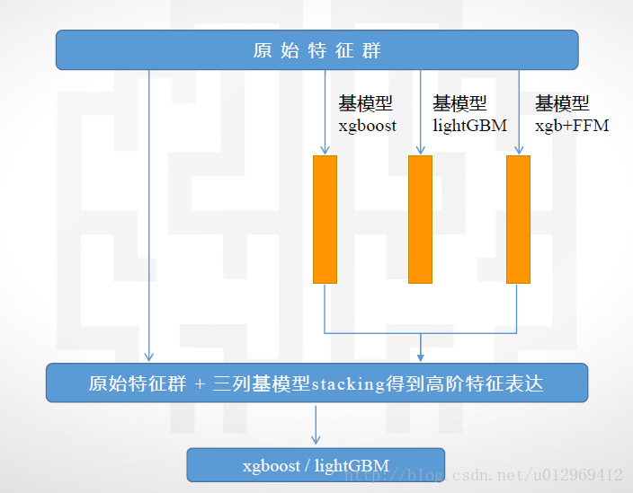

[TOC]

# Stacking(模型堆叠)

Stacking是多层的多模型集合方法。每一层可以包括多个模型，下一层利用上一层模型的结果进行学习。

Stacking算法在各大数据竞赛中被广泛使用，也是机器学习相关竞赛的必备技能，号称“大杀器”。

类似于其他集成学习算法，目标都是达到“三个臭皮匠，顶一个诸葛亮”的效果。

## 1. 举例介绍一

下面以两层Stacking运行过程为例：

第一层模型$M_i$的运行示意图：

## 2. 举例介绍二

下面通过一个“盲人摸象”的问题来讲解Stacking技术解决问题的过程。

这里大象就是提供的样本数据，盲人就是不同的算法模型。不同的算法会偏重于不同的点来对理解数据，或者使用数据，从而得到不同的结论。通过stacking技术来利用这多个“盲人”。

1. 选择模型。这里就是选择一帮盲人，而且是尽量选择得力的盲人，比如xgb、lgb、RF。
2. 划分数据。将数据分割成一定的份数，这里设为N。这里就是需要把大象这个样本数据切分，然后分割成几份。
3. 每个模型使用其中N-1份数据训练模型，然后预测剩下的一份数据，并保留结果，这个结果作为新特征。还要根据摸过的经验，去预测测试集，得到的就是新特征对应的label。
4. 当多个“盲人”都摸过大象数据之后，盲人会分享自己摸过的体验，以及对预测数据的预测情况。
5. 最后，我们通常用LR模型，来总结大家的经验。这个LR模型，看来有点像会议主持人哈，虽然摸象不咋地，但是特别会总结。

整个过程的图示如下：
这里我们将数据划分为了五份。

**注意**：不同模型对同一数据集的预测得到的新特征会拼接到一个特征向量里。

## 3. 图示Stacking

