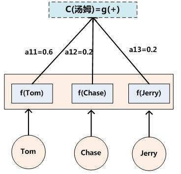
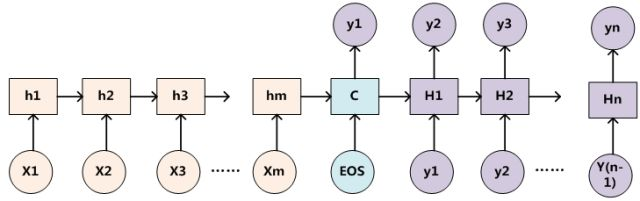
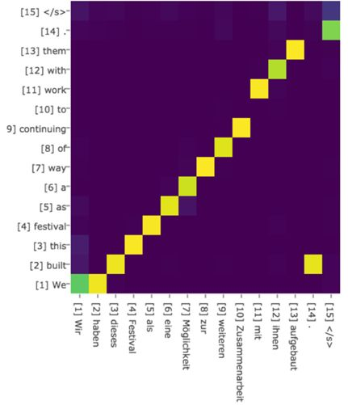
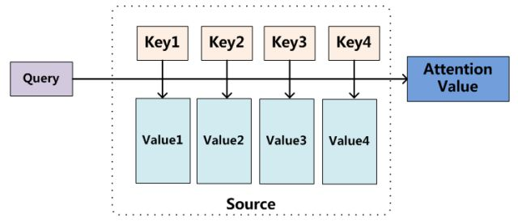
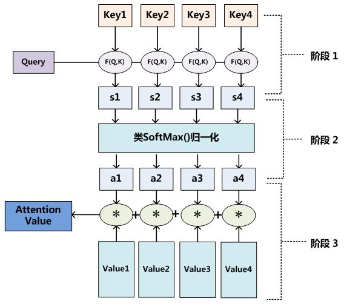
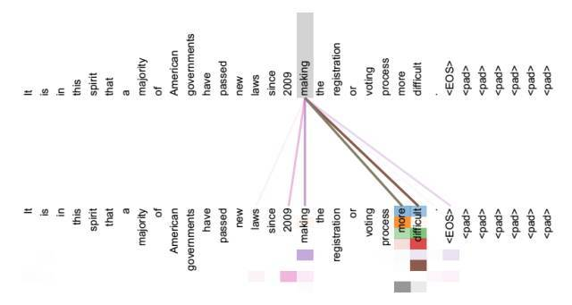
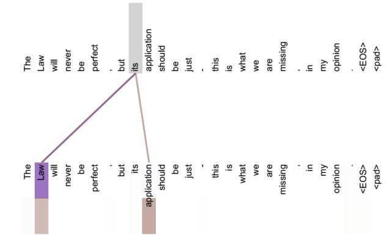
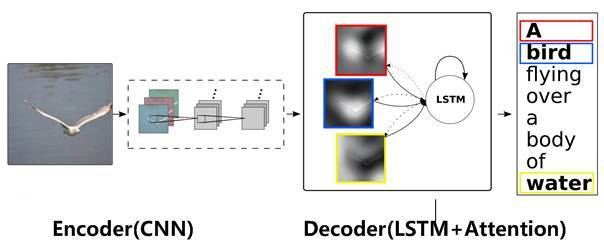

[TOC]

# Attention机制

## 1. 要回答的问题

- 什么是Attention？
- Attention解决了什么问题？

## 2. 关于Attention重要问题的回答

### 2.1 关于Attention的简单介绍

Attention到底是什么？单纯的Attention其实是不能算模型的，Attention本身不是一个完整的模型，它是对一些现有模型的细节改造。而这种改造不依赖于固定的模型。

Attention的本质就是**在提取输入的中间表示时，不应该单纯的不变，而是应该结合Target来对输入进行编码，获取与Target有关的中间表示。**

由于Attention常结合Encoder-Decoder框架，所以下面从Encoder-Decoder框架介绍起，然后通过说明传统Encoder-Decoder的不足，然后引入Attention。

#### 2.1.1 Encoder-Decoder

Encoder-Decoder的经典结构如下图：

文本处理领域的问题可以如下定义：

- 输入序列$Source=<x_1,x_2,...,x_m>$
- 输出序列$Target=<y_1,y_2,...,y_n>$

在文本处理中Source和Target的举例：

- 翻译系统：Source是一种语言，Target是另一种。
- 文本摘要：Source是一篇文章，Target是文章的几句描述语句。
- 对于QA：Source是问句，Target是答案。
  
在Encoder-Decoder结构中，Encoder会得到一个中间表示$C$：
$C=F(x_1,x_2,...,x_m)$

Decoder阶段则是根据中间语义表示$C$和$y_{i-1}$来更新$y_i$的状态：
$y_i = G(C,y_1,y_2,...,y_{i-1})$

##### 单纯Encoder-Decoder的缺陷：

从上面Decoder阶段得到输出的函数我们可以看出，对于每一个输出$y_i$，我们都是使用相同的输入序列的中间表示$C$，也就是说Source序列对Target序列的每一个输出都是贡献一样的。但是同常情况下，Source序列的元素对Target序列的元素的影响是不一样的。

举个简单的例子：I eat apple，翻译成中文就是我吃苹果。apple这个词与苹果这个词的相关性是更大的。

##### 需要进一步思考的问题？

为什么同一个$C$就不能把输入序列和输出序列的对应关系编码进去呢？

##### 引入Attention克服这个不足

引入Source的核心思想就是结合Target来获取Source的编码$C$。接下来逐步介绍引入Attention是如何操作的。

#### 2.1.2 Attention具体过程

- 对于输出序列$y_i$，会有不同的$C$
$y_1 = f(C_1)$
$y_2 = f(C_2,y_1)$
$y_3 = f(C_3,y_2,y_1)$

- 那这里的$C_i$是如何得到的呢？
$C$的计算公式：$C_i = \sum_{j=1}^{L_x}a_{ij}h_j$
说明：$L_x$表示Source序列的长度；$a_{ij}$表示Target序列的第i个单词与输入Source序列的第j个单词的Attention系数。$h_j$表示Source序列的第j个输入的语义编码。
“Tom chase Jerry”的翻译问题举例：

- Attention的权重系数$a_{ij}$是如何计算的呢？

由图中，我们可以得到$a_{ij}$的计算公式如下：
$a_{ij} = F(h_j,H_{i-1})$
大部分的Attention都是采用上面的计算逻辑，唯一的区别就是F函数的不同。

英语-德语翻译系统中，加入Attention后，Source和Target两个句子的Attention权重分配概率分布如下：

- 那么F函数都有哪些呢？
常用的方法有：向量的点积、向量的cosine或者通过额外的神经网络计算。

计算相似度的方法有以下4种：

- 点乘dot product:

$$f(Q,K_i) = Q^TK_i$$

- 权重General:

$$f(Q,K_i) = Q^TWK_i$$

- 拼接权重 concat：
  
$$f(Q,K_i) = W[Q^T;K_i]$$

- 感知机Perceptron：

$$f(Q,K_i) = V^Ttanh(WQ+UK_i)$$

### 2.2 关于Attention的进一步抽象

上面说明Attention时结合了Encoder-Decoder，下面将Attention机制从其中抽象出来。

Attention的本质过程可以用下图来概括：

说明：

- Source可以视作这里的key-value
- Target的一个元素视为Query
- 通过计算key与query之间之间的相似度，可以得到query与value的关系权重

$Attention(Query,Source) = \sum_{i=1}^{L_x}Similarity(Query,Key_i)*Value_i$

计算过程，详细展开如下：

### 2.3 Self-Attention

Self-Attention就是Source序列和Target序列是同一个序列时的Attention。

#### 2.3.1 Self-Attention的作用

Self-Attention可以表示同一个句子不同元素之间的关系权重，进而起到捕获同一个句子中单词之间的句法特征和语义特征，这有助于捕获句子中长距离的相互依赖关系。

Self-Attention的直观举例：

### 2.4 Attention的应用举例

#### 2.4.1 Attention在图像处理中的应用举例

给一张图片，系统输出一句描述语句。
