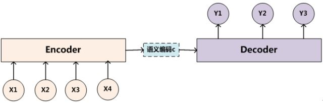

[TOC]

# Attention机制

## 1. 要回答的问题

- 什么是Attention？
- Attention解决了什么问题？

## 2. 关于Attention重要问题的回答

### 2.1 关于Attention的简单介绍

Attention到底是什么？单纯的Attention其实是不能算模型的，Attention本身不是一个完整的模型，它是对一些现有模型的细节改造。而这种改造不依赖于固定的模型。

Attention的本质就是**在提取输入的中间表示时，不应该单纯的不变，而是应该结合Target来对输入进行编码，获取与Target有关的中间表示。**

由于Attention常结合Encoder-Decoder框架，所以下面从Encoder-Decoder框架介绍起，然后通过说明传统Encoder-Decoder的不足，然后引入Attention。

#### 2.1.1 Encoder-Decoder

Encoder-Decoder的经典结构如下图：

文本处理领域的问题可以如下定义：

- 输入序列$Source=<x_1,x_2,...,x_m>$
- 输出序列$Target=<y_1,y_2,...,y_n>$
  
