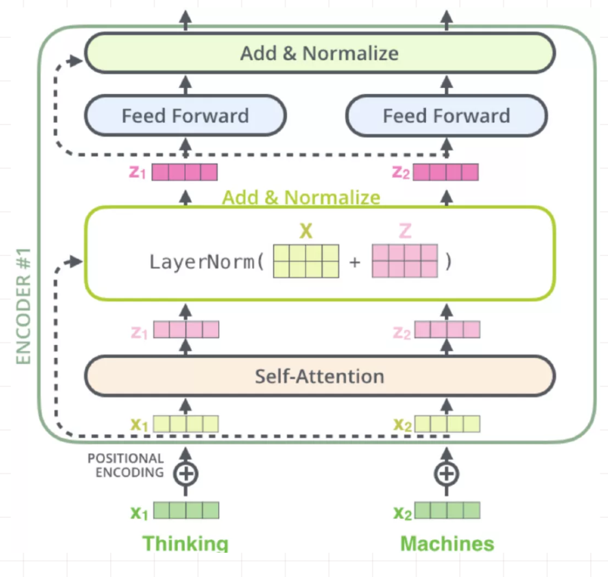

[TOC]

# Transformer

Attention Is All You Need

## 1. Transformer基础知识

### 1.1 Transformer的结构图

Transformer的结构放大效果：


Transformer缩小后的结构图：


Transformer结构的进一步展开图：


Transformer的单个Encoder和Decoder展开图：


### 1.2 Transformer逐步分析

后面的示例代码用到的数据格式如下图：


这是一个翻译模型，上面半部分是输入语言的多个句子x，下半部分是目标语言的多个句子y。x，y中的每个数字都是句子中单词的id，为0表示句子的长度未达到设置的最大长度。

#### 1.2.1 输入数据的Embedding表示

```python
def embedding(inputs,
              vocab_size,
              num_units, #隐藏层大小
              zero_pad=True,
              scale=True,
              scope="embedding",
              reuse=None):
    with tf.variable_scope(scope, reuse=reuse):
        lookup_table = tf.get_variable('lookup_table',
                                       dtype=tf.float32,
                                       shape=[vocab_size, num_units],
                                       initializer=tf.contrib.layers.xavier_initializer())
        if zero_pad: #由于输入和输出的表示中，对于空的用0填充，所以这里要添加一个id为0对应的词嵌入。
            zeros = tf.zeros(shape=[1,num_units])
            lookup_table = tf.concat((zeros, lookup_table[1:,:]), 0) #在lookup_table位置为0处设置为一个0向量

        outputs = tf.nn.embedding_lookup(lookup_table, inputs)

        if scale:
            outputs = outputs * (num_units ** 0.5)
    return outputs
```

#### 1.2.2 位置信息编码

Attention无法捕获序列位置信息，为了利用序列的位置信息，需要把位置信息显式编码到输入中。*（有个问题：为什么Attention不能捕获位置信息？）*

位置信息计算公式如下：
$PE(pos,2i) = sin(pos/10000^{2i/d_{model}})$
$PE(pos,2i+1) = cos(pos/10000^{2i/d_{model}})$

其中：pos代表的是第几个词，i代表的是embedding向量的第几维。

```python
def positional_encoding(inputs, #这里的input和embedding的input是一样的
                        num_units, #隐藏层大小
                        zero_pad=True,
                        scale=True,
                        scope="positional_encoding",
                        reuse=None):
    batch_size,sentence_length = inputs.get_shape().as_list()
    with tf.variable_scope(scope, reuse=reuse):
        """
        tf.tile(input,multiples) 复制multiples指定纬度和次数
        """
        position_index = tf.tile(tf.expand_dims(tf.range(sentence_length),0),[batch_size,1])

        position_encoding = \
            np.array([[pos / np.power(10000,2.*i/num_units) \
            for i in range(num_units)] for pos in range(sentence_length)])

        position_encoding[:,0::2] = np.sin(position_encoding[:,0::2])
        position_encoding[:,1::2] = np.cos(position_encoding[:,1::2])

        lookup_table = tf.convert_to_tensor(position_encoding)

        if zero_pad:
            zeros = tf.zeros(shape=[1,num_units])
            #在lookup_table 0的位置设置为一个0向量
            lookup_table = tf.concat((zeros, lookup_table[1:,:]), 0)

        outputs = tf.nn.embedding_lookup(lookup_table, position_index)

        if scale:
            outputs = outputs * (num_units ** 0.5)

    return outputs
```

然后，将embedding和positional_encoding两个结果相加，就得到输入的最终Embedding编码。
*有趣：两个相加是最好的编码方式吗？*

#### 1.2.3 Scaled Dot-Product Attention

Transformer的核心结构是Self-Attention。本论文引入了一种称为Multi-Head Attention，它是由多个Scaled Dot-Production并列，并将最终的结果concat。

下面首先介绍Scaled Dot-Production。其计算流程如下：


1. 对输入和输出进行embedding编码，编码方法在1.2.2中已有说明。
2. 得到Q、K、V，它们都是由上一步得到的输入和输出经过一层线性变换得到。

```python
#tf.layers.dense用以添加一个全连接层
Q = tf.layers.dense(embedding_output, num_units, activation=tf.nn.relu)
K = tf.layers.dense(embedding_output, num_units, activation=tf.nn.relu)
V = tf.layers.dense(embedding_output, num_units, activation=tf.nn.relu)
```

3. 计算相似度。论文中使用的是点乘来度量相似度。同时，还除以了$\sqrt{d_k}$。$d_k$是embedding的长度。

```python
outputs = tf.matmul(Q, tf.transpose(K, [0,2,1]))
outputs = outputs / (K.get_shape().as_list()[-1] ** 0.5)
```

4. 增加mask
添加mask的原因主要有两方面：
a) query和key中有些部分是填充数据，这部分数据需要用mask把其屏蔽掉，屏蔽掉的做法就是赋予一个很小的值或者0。
b) decoder过程是无法看到为未来信息的，encoder过程可以看到的未来是decoder，但是decoder能看到的只有它之前的信息。

(4.1) 遮蔽与key中存在填充部分有关的output的内容：

```python
key_masks = tf.sign(tf.abs(tf.reduce_sum(keys, axis=-1)))
#tf.tile是对数据量的扩张，不会改变纬度的多少
key_masks = tf.tile(tf.expan_dims(key_masks,1), [1, tf.shape(queries)[1],1])
# tf.ones_like(outputs)的作用就是获取一个和outputs形状相同，但元素值都是1的tensor
paddings = tf.ones_like(outputs) * (-2 ** 32 + 1)
outputs = tf.where(tf.equal(key_masks,0), paddings, outputs)
```

这样屏蔽之后的outputs如下图所示：


(4.2) Decoder中的Self-Attention的mask逻辑：
首先得到一个下三角矩阵，然后根据这个矩阵的1或0来对output进行mask。

```python
diag_vals = tf.ones_like(outputs[0,:,:])
#tf.contrib.linalg.LinearOperatorTriL现在已更改为
#tf.linalg.LinearOperatorLowerTriangular
tril = tf.contrib.linalg.LinearOperatorTriL(diag_vals).to_dense()
masks = tf.tile(tf.expand_dims(tril,0), [tf.shape(outputs)[0],1,1])
paddings = tf.ones_like(masks) * (-2 ** 32 + 1)
outputs = tf.where(tf.equal(masks, 0), paddings, outputs)
```

经过遮蔽后得到如下效果：


(4.3) 遮蔽与query中存在填充部分有关的output中的内容：

```python
query_masks = tf.sign(tf.abs(tf.reduce_sum(queries, axis=-1)))
query_masks = tf.tile(tf.expan_dims(query_masks,1), [1, tf.shape(keys)[1],1])
outputs *= query_masks
```

得到的效果如下：


(4.4) 将掩码的output执行softmax

```python
outputs = tf.nn.softmax(outputs)
```

5. 将得到的相似矩阵和Value相乘：

```python
outputs = tf.matmul(outputs, V)
```

#### 1.2.4 Multi-Head Attention

整体结构如下：


Multi-Head Attention相比Scaled Dot-Product Attention，区别就是前者是后者横向扩展head-nums次，矩阵大小发生变化。

最后，再经过一个线性变换。

#### 1.2.5 Feed-Forword Networks

在Attention操作之后，encoder和decoder的每一层都包含了一个全连接前馈网络。公式如下：

$FFN(x) = max(0,xW_1+b_1)W_2+b_2$

```python
def feedforward(
    inputs,
    num_units=[2048,512],
    scope="multihead_attention",
    reuse=None
):
    with tf.variable_scope(scope, reuse=reuse):
        params = {
            "inputs":inputs,
            "filters":num_units[0],
            "kernel_size":1,
            "activation":tf.nn.relu,
            "use_bias": True
        }
        outputs = tf.layers.conv1d(**params)

        params = {
            "inputs":outputs,
            "filters":num_units[0],
            "kernel_size":1,
            "activation":None,
            "use_bias": True
        }
        outputs = tf.layers.conv1d(**params)

        outputs += inputs
        outputs = normalize(outputs)

    return outputs
```

#### 1.2.6 Encoder整体结构

结合前面对Transformer网络结构细节的分析，这里对Encoder进行介绍。

Encoder有N层，默认是6层，每层包含两个sub-layer，就只前面介绍的一个multi-head Self-Attention。另一层就是全连接前馈层。

Encoder的网络结构示意图如下：


#### 1.2.7 Decoder整体结构

Decoder结构有N层，默认也是6层。每层有三个sub-layers。

第一层：
Masked Multi-head Self-Attention。为什么会有mask，是因为要生成target序列，在i时刻，大于i的时刻都没有结果，所以要做mask。

第二层：
实现第一层输出与encoder输出的Attention计算。这里使用的仍然是Multi-head Self-Attention。

第三层：
与Encoder一样，是一个全连接层。

Decoder的模型图如下：


#### 1.2.8 模型的输出

decoder的输出会经过一层全连接网络和Softmax得到最终的结果。


## 2. Transformer相关问题

### 2.1 Transformer需要回答的问题列表