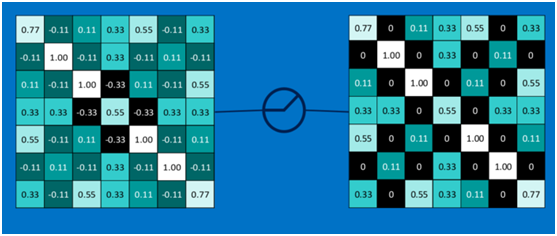
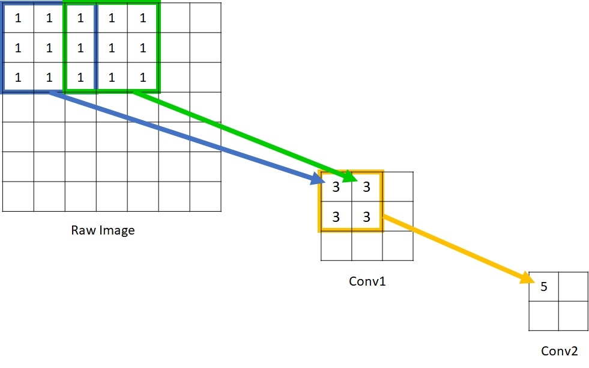

[TOC]

# CNN

Convolutional Neural Network.

CNN最成功的用武之地是图像处理领域，在CNN出现之前，图像处理是AI领域的一个困难问题，主要原因有两方面：

1. 数据量大
   一张图像随随便便就是几百万像素，甚至千万像素，每个像素有RGB三色数据构成，这意味着一层就需要千万的参数；

2. 特征难提取
   如何从图像庞大的数字化数据中提取出有效的特征是很难的，导致图像处理问题的准确率一致不高。加上图像发生简单的偏移、旋转、翻转等操作都会导致数据上有很大的差异，但是目标结果却没有变化。

CNN通过权重共享、池化、局部感受野解决了上面的两个问题。

神经网络的很多思想都是借鉴与人类的认知过程，CNN则是受到人类视觉信息处理过程的启发。所以下面先简单介绍一下人类视觉原理。

## 1. 人类视觉原理

1981 年的诺贝尔医学奖，颁发给了 David Hubel（出生于加拿大的美国神经生物学家） 和TorstenWiesel，以及 Roger Sperry。前两位的主要贡献，是“ 发现了视觉系统的信息处理 ”，可视皮层是分级的。

人类的视觉原理如下：从原始信号摄入开始（瞳孔摄入像素 Pixels），接着做初步处理（大脑皮层某些细胞发现边缘和方向），然后抽象（大脑判定，眼前的物体的形状，是圆形的），然后进一步抽象（大脑进一步判定该物体是只气球）。

也就是说人类处理视觉信息的原理是先由提取基础的底层特征，越往上提取的特征越接近真实物体，处于最上层的大脑皮层负责最终的物体识别。

CNN的设计思路便是借鉴了上面的人类视觉信号处理过程。

我们从上面这个CNN物体识别的图中可以发现，识别不同物体的CNN，前面的卷积层识别出的特征具有相似性，越往上，特征越接近目标物体。

## 2. CNN基本网络结构

在了解CNN网络结构之前，我们先看看常规的DNN(深度神经网络)的结构：

包含输入层、隐藏层、输出层。标准神经网络中的隐藏层可以理解为是对除了输入层和输出层之外的网络层的统称，并未对隐藏层的机构做什么约束。CNN网络是DNN的一种特殊网络，所以它的网络结构和DNN也是对应的。

下面是一个CNN网络结构的实例：

我们可以发现，CNN相比DNN区别在于它有几种特殊的隐藏层网络：卷积层、池化层。

CNN网络结构包括如下网络层：

- 输入层
- 卷积层
- Relu激活层
- 池化层
- 全连接层

下图是Mnist手写数字识别用CNN网络方案的网络结构图：

### 2.1 CNN输入层

输入层包含数据的基本处理操作，比如：去均值、归一化、白化、PCA降维等。

- 去均值：把输入的各个维度都中心化为0。
- 归一化：为了减少不同维度数据取值范围不一样带来的干扰。
- PCA：数据降维。
- 白化：对各个轴上的幅度进行归一化。

取均值和归一化效果：

去相关和白化效果：

### 2.2 卷积层

在说明卷积之前，先通过如下图直观感受一下卷积的计算过程：

图像是5x5，filter(卷积核)是3x3，经过卷积后得到的是这个图像的一个Feature map。

一个卷积核作用于图像的一块区域得到这块区域的一个特征值，特征值越大，表示这个区域块越接近卷积核所关心的特征。

一个卷积核就是一个特征提取器，它能从图像中提取对应的特征。同常，我们会使用多个卷积核filter，以从图像中提取不同类型的特征。至于我们需要几个filter，这就需要我们分析问题，我们需要从图像中提取几个类别的特征就可以用于目标任务。

#### 2.2.1 卷积核

卷积核，也称为filter。一个filter的形状由长、宽、深度三部分组成，长、宽很容易理解，但是需要强调的是卷积核的深度。

直接作用于输入图像的filter，如果图像是RGB3个channel，那么filter的深度就是3。如果某个卷积核作用于前一个卷积层的输出，那么filter的深度就是前一层filter的个数，因为前一个卷积层每个卷积核会生成一个Feature Map，一个Feature Map可以理解为一个Channel。不论Filter的输入数据的深度为多少，经过一个Filter之后，输出的深度都为1.

卷积核计算过程的公式如下：
$$a_{i,j} = f(\sum_{d=0}^{D-1}\sum_{m=0}^{F-1}\sum_{n=0}^{F-1}w_{d,m,n}x_{d,i+m,j+n} + w_b)$$

其中，D为Filter的深度，F为Filter的大小(长和宽相同)，$w_{d,m,n}$表示卷积核深度为d，行为m，列为n的权重。$x_{d,i,j}$表示图像的深度为d，行为i，列为j的数据。

下图展示了3通道的图像，经过两个Filter，每个Filter大小为3x3x3，得到两个Feature Map的计算过程：

#### 2.2.2 Filter和Kernel区别

在Keras中，Kernel和Filter是不一样的。

如果Channel=1，那么Kernel和Filter从程序表示层面是一样的。

当Channels>1时，一个Filter是Channels数量个Kernel。也就是说，Kernel是MxN，Filter是DxMxN，Filter是由多个Kernel组成，而且每个Kernel是不一样的，独立的。

### 2.3 激活函数Relu层

我们先看一看标准激活函数工作模式：

输入经过加权求和之后，在加上bias，然后输入给激活函数得到的就是输出。

然后我们对比CNN的卷积层，卷积运算就是一个加权求和的过程，要使用激活函数，只需要对卷积运算的结果直接使用激活函数便可以了。

下面图中的数据矩阵是经过卷积得到的Feature Map，对其使用Relu激活函数结果如下：

单个Feature Map经过Relu激活函数：

多有的Feature Map经过Relu激活函数：

### 2.4 池化层

关于池化，有单独的文件《Pooling Layer》解释这部分的内容。

### 2.5 全连接层

将经过卷积、Relu激活、池化层之后得到的结果串联起来，然后输入到后面的全连接层。全连接层可以有一层，也可以后多层。

如果是单层全连接层，则如下图：

也可以是多层全连接层：

## 3. CNN中的基本概念

在谈论CNN网络时，经常会遇到如下几个名词：卷积核、Filter、Channel、Feature Map。

### 3.1 卷积核和Filter

在前面的内容中，我们区分了Kernel和Filter。卷积核或者Kernel描述的是对单个Channel的操作，Filter则更多是描述整个卷积层对输入进行的操作。一个Filter包含了对输入的多个Channel的卷积操作。

一个Kernel没有深度，我们在表述中说卷积核，同常是因为Filter的深度不需要指定，它是和输入的深度一样的。我们只需要指定卷积核的长和宽就可以了。

另外，需要注意的是一个Filter中，不同的Channel使用的卷积核的权重是不一样的。

### 3.2 Channel

在CNN网络中，每一层的输入数据都是三维的，也就是输入数据是一层层的二维矩阵。这里的层数可以理解为Channel数。

比如黑白图像的Channel是1，彩色图像的Channel是3。CNN每个Filter会生成一个Channel。

### 3.3 Feature Map

输入层：在输入层，如果是灰度图片，那就只有一个feature map；如果是彩色图片，一般就是3个feature map（红绿蓝）。

其它层：层与层之间会有若干个卷积核（kernel）（也称为过滤器），上一层每个feature map跟每个卷积核做卷积，都会产生下一层的一个feature map，有N个卷积核，下层就会产生N个feather map。

一个Feature Map可以理解为对输入数据的一种视角，多个Feature Map就是输入数据的多个视角。一个Feature Map保留了输入数据的局部特征和这些局部特征之间的相对关系。

## 4. 局部感知

Local Connectivity。

局部感受野，local receptive fields。

感受野（Receptive Field）的定义是卷积神经网络每一层输出的特征图（feature map）上每个像素点在原始图像上映射的区域大小，这里的原始图像是指网络的输入图像，是经过预处理（如resize，warp，crop）后的图像。

神经元之所以无法对原始图像的所有信息进行感知，是因为在卷积神经网络中普遍使用卷积层和pooling层，在层与层之间均为局部连接。正应为卷积层的这种操作模型，导致输出的感受野只是原始图像的局部区域，所以称之为局部感受野。

局部感受野是和全连接的全局感知相对的。

### 4.1 感受野的计算

如图所示的原始图像，经过kernel_size=3, stride=2的Conv1，kernel_size=2, stride=1的Conv2后，输出特征图大小为，很明显，原始图像的每个单元的感受野为1，Conv1的每个单元的感受野为3，而由于Conv2的每个单元都是由范围的Conv1构成，因此回溯到原始图像，每个单元能够看到大小的区域范围。

现在归纳感受野计算公式：

感受野的大小与之前所有卷积层的filter size和stride的大小有关。

**定义**：$k_n$为kernel size，$s_n$为stride，$r_n$为第n卷积层的感受野大小。

由于$s_n$小于$k_n$，所以相邻的两次卷积会存在重叠，对于第n层卷积而言，重叠次数为$(k_n - 1)$次。

以下图为例:

对于Conv2层，如果没有存在重叠，那么感受野的大小为：$k_2 * r_1 = 6$，由于存在重叠，接下来要计算重叠部分：$(k_1- s_1)*r_0 = 1$，所以最终计算的$r_2 = k_2*r_1 - (k_2-1)*1 = 5$。

对于Conv3层，重叠部分：$(k_2- s_2)*r_1 = 3$，故$r_3 = k_3*r_2 - (k_3-1)*3 = 7$

总结起来，感受野计算公式：$r_n = k_n*r_{n-1} - (k_n-1)((k_{n-1}-s_{n-1})*r_{n-2})$

## 5. 参数共享

对于全连接的神经网络，隐藏层的每个神经元都会和输入的每个数据有关联，执行$\sigma(WX+b)$这样一个神经元操作。

但是我们展开前面所说的卷积运算，我们可以整个输入层共享的是一个卷积核的权重，比如3x3的卷积核，那么就是共享9个权重，如果加上一个bias，也就是10个参数。这10个参数会作用于整个输入，得到一个Feature Map。这是卷积的一个特点，常规的神经网络的神经元输出的是一个值，但是CNN网络的一个卷积核输出的是一个Feature Map，是一个表述图像特征的矩阵。

一个卷积核类似于传统神经网络的一个神经元。

参数共享只是通过卷积运算达到的效果，CNN进行卷积操作的根本原因是借助于卷积核提取图像的底层特征。一个局部特征与局部的像素块是有关的，通过这样的卷积操作可以捕获局部像素块包含的特征。通过多个Filter可以捕获多种类型的特征。

## 6. CNN的BP原理

这部分的内容由一个单独文件《CNN的BP原理》来描述。

## 7. 典型的卷积网络

由单独的《典型CNN网络》一文来介绍。

## 8. CNN实际应用

1. 图像的分类和检索
   图像分类是比较基础的应用，他可以节省大量的人工成本，将图像进行有效的分类。对于一些特定领域的图片，分类的准确率可以达到 95%+，已经算是一个可用性很高的应用了。

2. 目标定位检测
   就是在图像中定位目标的位置和大小。这个可以进一步应用于自动驾驶、医疗、安防等等。

3. 目标分割
   可以理解为图像像素级的分类任务。可以对前景和背景进行像素级的区分、再高级一点还可以识别出目标并且对目标进行分类。

   典型场景：美图秀秀、视频后期加工、图像生成…

4. 人脸识别
   典型场景：安防、金融、生活…

5. 骨骼识别
   骨骼识别是可以识别身体的关键骨骼，以及追踪骨骼的动作。
   典型场景：安防、电影、图像视频生成、游戏…

## 参考

1. [卷积神经网络CNN总结](https://www.cnblogs.com/skyfsm/p/6790245.html)
