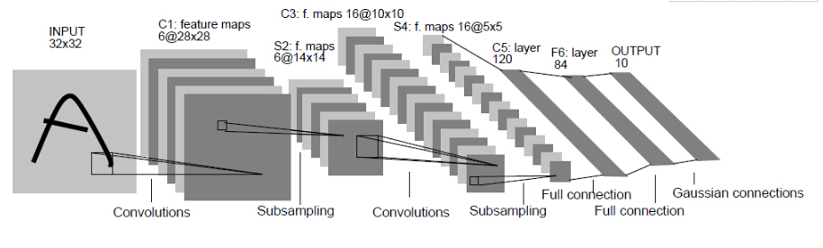
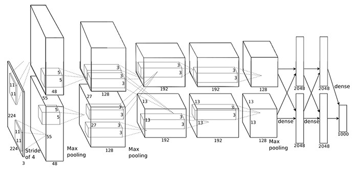

[TOC]

# CNN发展史

AI领域的神经网络都是或多或少受到对人的大脑处理信息的机制的启发而发明的，CNN也不例外。

CNN相关的理论可以最早追溯到1968年，Hubel和Wiesel对猫和猴的视觉系统的研究。

20世纪60年代初，David Hubel和Torsten Wiesel从约翰霍普金斯大学和Steven Kuffler一起来到哈佛大学，在哈佛医学院建立了神经生物学系。他们们在论文《Receptive fields, binocular interaction and functional architecture in the cat's visual cortex》中提出了Receptive fields的概念，因其在视觉系统中信息处理方面的杰出贡献，他们在1981年获得了诺贝尔生理学或医学奖。

在他们的论文中，提到了猫和猴的视觉皮层中含有对视野的小区域单独反应的神经元，如果眼睛没有移动，则视觉刺激影响单个神经元的视觉区域被称为感受野。相邻的细胞具有相似和重叠的感受野。感受野大小和位置在皮层之间系统地变化，形成完整的视觉空间图。这为CNN的局部感知奠定了基础。

## 1. Neocognitron

神经感知机。

1980年，日本科学家福岛邦彦在论文《Neocognitron: A self-organizing neural network model for a mechanism of pattern recognition unaffected by shift in position》中提出了一个包含卷积层、池化层的神经网络结构，标志第一个卷积神经网络的诞生，也是感受野概念在神经网络领域的首次应用。

老人家现在已经退休了，被誉为“八十多岁仍在奋斗的全球人工智能专家”。除了后来发展出卷积神经网络的Neurocognition（神经认知），现在深度学习中开始热闹起来的Attention（注意力）网络背后也有他的身影，他也在上世纪80年就提出过Attention概念和网络。

## 2. LeNet —— 开山之作

1998年。LeCun 乐春大神在论文《Gradient-Based Learning Applied to Document Recognition》中提出了 LeNet 网络架构，从而揭开了深度学习的神秘面纱。从1998年开始，深度学习这一领域就开始不断地被人们所熟知，也是因为这个网络架构，不断地推动着深度学习这一领域。当然啦，为什么不叫 LeNet 而叫 LeNet5 呢，因为 Yann LeCun 经过了很多次反复的试验之后的结果，同时也因为有5个卷基层因此以lenet5命名！

lenet5 架构是一个开创性的工作，因为图像的特征是分布在整个图像当中的，并且学习参数利用卷积在相同参数的多个位置中提取相似特性的一种有效方法。回归到 1998 年当时没有 GPU 来帮助训练，甚至 CPU 速度都非常慢。因此，对比使用每个像素作为一个单独的输入的多层神经网络，Lenet5 能够节省参数和计算是一个关键的优势。lenet5 论文中提到，全卷积不应该被放在第一层，因为图像中有着高度的空间相关性，并利用图像各个像素作为单独的输入特征不会利用这些相关性。因此有了 CNN 的三个特性了：1. 局部感知、2. 下采样、3. 权值共享。

从此之后，CNN的大体结构基本定下来了：卷积层、池化层、全连接层，这也是为什么称其为开山之作。如今深度框架中的LeNet是Lenet5的改进版，比如激活函数改成使用Relu。

LeNet-5的网络结构如下：

与现在CNN的卷积层、Relu层、池化层不同的是Relu使用的结构是卷积层、池化层，没有嵌套Relu激活层。

下图是LeNet网络结构的说明：

原始的CNN效果并不算好，而且训练也非常困难。虽然也在阅读支票、识别数字之类的任务上很有效果，但由于在一般的实际任务中表现不如SVM、Boosting等算法好，一直处于学术界边缘的地位。

## 3. AlexNet —— 王者归来

2012年，ImageNet图像识别大赛中，Hinton组的Alex Krizhevsky 发表了 AlexNet，并且以超过第二名10.9个百分点的绝对优势一举夺冠。从此深度学习和卷积神经网络名声鹊起，深度学习的研究如雨后春笋般出现。

AlexNet前5层是卷积层，后面3层是全连接层，最终Softmax输出1000类。

AlexNet中用到的创新点包括：

1. 相比LeNet使用更深的网络；
2. 使用Relu替代Sigmoid，解决了深度网络梯度弥散问题；
3. 数据增强处理技巧，比如图像的随机剪裁、水平翻转、平移变换、颜色光照变换；
4. 使用重叠的最大池化而不是较常用的平均池化，避免了平均池化的模糊化效果；
5. Dropout，该方法通过让全连接层的神经元（该模型在前两个全连接层引入Dropout）以一定的概率失去活性（比如0.5）失活的神经元不再参与前向和反向传播，相当于约有一半的神经元不再起作用。在测试的时候，让所有神经元的输出乘0.5。Dropout的引用，有效缓解了模型的过拟合。
6. LRN，Local Responce Normalization，局部响应归一层。基本思路是，假如这是网络的一块，比如是 13×13×256， LRN要做的就是选取一个位置，从这个位置穿过整个通道，能得到 256 个数字，并进行归一化。进行局部响应归一化的动机是，对于这张 13×13 的图像中的每个位置来说，我们可能并不需要太多的高激活神经元。但是后来，很多研究者发现 LRN 起不到太大作用，因为并不重要，而且我们现在并不用 LRN 来训练网络。
7. 使用多个GPU训练，从上面的AlexNet的结构图中可以看出上下两部分相同结构的网络，

### 3.1 LRN简单介绍

LRN层，做的事是对当前层的输出结果做平滑处理。

前后几层（对应位置的点）对中间这一层做一下平滑约束，计算方法是:

## 4. Network in Network

2013 年年尾，Min Lin 提出了在卷积后面再跟一个 1x1 的卷积核对图像进行卷积，这就是 Network-in-network 的核心思想了。NiN 在每次卷积完之后使用，目的是为了在进入下一层的时候合并更多的特征参数。同样 NiN 层也是违背 LeNet 的设计原则（浅层网络使用大的卷积核），但却有效地合并卷积特征，减少网络参数、同样的内存可以存储更大的网络。

根据 Min Lin 的 NiN 论文，他们说这个 “网络的网络”（NIN）能够提高 CNN 的局部感知区域。例如没有 NiN 的当前卷积是这样的：3x3 256 [conv] -> [maxpooling]，当增加了 NiN 之后的卷积是这样的：3x3 256 [conv] -> 1x1 256 [conv] -> [maxpooling]。

## 5. ZF-Net —— 稳步前进

ZFNet是2013ImageNet分类任务的冠军，其网络结构没什么改进，只是调了调参，性能较Alex提升了不少。ZF-Net只是将AlexNet第一层卷积核由11变成7，步长由4变为2，第3，4，5卷积层转变为384，384，256。这一年的ImageNet还是比较平静的一届，其冠军ZF-Net的名堂也没其他届的经典网络架构响亮。

## 6. VGG-Net —— 越走越深

VGG-Nets是由牛津大学VGG（Visual Geometry Group）提出，是**2014年**ImageNet竞赛定位任务的第一名和分类任务的第二名的中的基础网络。VGG可以看成是加深版本的AlexNet. 都是conv layer + FC layer，在当时看来这是一个非常深的网络了，因为层数高达十多层，我们从其论文名字就知道了（《Very Deep Convolutional Networks for Large-Scale Visual Recognition》），当然以现在的目光看来VGG真的称不上是一个very deep的网络。

为了解决权重初始化的问题，VGG采用了Pre-training的方式，就是先训练一部分小网络，然后在这部分网络稳定后，再逐渐加深网络。上面图中，从左到右，逐渐添加网络层，当到达D区时，效果最后，此时得到的网络结构成为VGG-16，E区域得到的网络结构是VGG-19。

VGG-16的网络结构如下图：

从VGG-16的结构图中可以看出，网络层相对AlexNet更深，而且相邻的几层都会用same类型的padding，输入和输出的形状相同。Filter的数量依次为64，128，256，512。

VGG的一个**最大特点**就是使用了很小的卷积核：3x3、1x1的卷积核，通过多个小的卷积核串联来捕获特征，与LeNet的设计原则相违背，因为LeNet相信大的卷积核能够捕获图像当中相似的特征（权值共享），AlexNet 在浅层网络开始的时候也是使用 9×9、11×11 卷积核，并且尽量在浅层网络的时候避免使用 1×1 的卷积核。但是 VGG 的神奇之处就是在于使用多个 3×3 卷积核可以模仿较大卷积核那样对图像进行局部感知。后来多个小的卷积核串联这一思想被 GoogleNet 和 ResNet 等吸收。

多个小的卷积核比一个大的卷积核有更多的非线性，增加了网络的表达能力。

## 7. GoogleNet —— 大浪推手

**2014年**，在 google 工作的 Christian Szegedy 为了找到一个深度神经网络结构能够有效地减少计算资源，于是有了这个 GoogleNet 了（也叫做 Inception V1）。

GoogLeNet在2014的ImageNet分类任务上击败了VGG-Nets夺得冠军，在ILSVRC 2014大赛中，GoogleNet获得第一名，而VGG屈居第二。GoogLeNet跟AlexNet,VGG-Nets这种单纯依靠加深网络结构进而改进网络性能的思路不一样，它另辟幽径，在加深网络的同时（22层），也在网络结构上做了创新，引入Inception结构代替了单纯的卷积+激活的传统操作（这思路最早由Network in Network提出）。GoogLeNet进一步把对卷积神经网络的研究推上新的高度。

GoogleNet不仅继承了VGG“越深越好”的理念，对于网络结构本身也作了大胆的创新。可以对比的是，AlexNet有60M个参数，而GoogleNet只有4M个参数。

GoogleNet的整体结构如下：

在GoogleNet的结构中，我们发现和AlexNet相比，多了称为Inception的子结构：

Inception通过多个卷积核获取不同的特征，然后将这些特征拼接到一起，以提供不同尺寸的特征。这些卷积核的stride是1，为了保证response图的大小一样，都使用0填充，每个卷积层后面紧跟Relu。

原始的GoogleNet也被称作Inception-v1。在后面的几年，GoogleNet还提出了几种改进的版本，最新的一个是Inception-v4（2016.8）。Inception系列的改进方向基本都集中在构建不同的Inception模型上。

### 7.1 为什么1x1的卷积核可以减少参数

这种做法在NIN中已经使用，我们这里解释以下为什么1x1的卷积核可以减少参数数量。

如果数据数据是单通道，显然无法减少参数的数量，但是在CNN想过网络中，越是往后，Channel数量越大，甚至达到几百上千。我们思考卷积的计算过程，多个Channel卷积后的矩阵会再次相加合并，所以不论多少的Channel，经过卷积运算之后的Channel都是1。

举下面一个例子：假设输入层是256个Feature Map，我们希望输出层仍旧得到256个Feature Map。如果我们直接使用3x3的卷积核，那么计算涉及的参数量：256x3x3x256=589000个参数。

接下来我们借助于1x1的卷积核，先输出64个Feature Map，然后在使用3x3的卷积核输出64个Feature Map，最后再使用1x1的卷积核输出256个Feature Map，计算过程涉及的参数量：
256x1x1x64 = 16000
64x64x3x3 = 36000
64x256x1x1 = 16000
总共约72000个参数，相比直接使用3x3，减少了约十倍了。

### 7.2 三个Loss单元

我们从GoogleNet结构图中还发现了一点不同，就是它有三个Softmax输出。这样的网络设计是为了帮助网络的收敛。在中间层加入辅助计算的LOSS单元，目的是计算损失时让低层的特征也有很好的区分能力，从而让网络更好地被训练。在论文中，这两个辅助LOSS单元的计算被乘以0.3，然后和最后的LOSS相加作为最终的损失函数来训练网络，loss=loss_2 + 0.3 \* loss_1 + 0.3 \* loss_0。

### 7.3 使用全局平均替换第一个全连接

GoogLeNet还有一个闪光点值得一提，那就是将后面的全连接层全部替换为简单的全局平均pooling，在最后参数会变的更少。而在AlexNet中最后3层的全连接层参数差不多占总参数的90%，使用大网络在宽度和深度允许GoogleNet移除全连接层，但并不会影响到结果的精度，在ImageNet中实现93.3%的精度，而且要比VGG还要快。

### 7.4 GoogleNet计算量

计算量如下图，可以看到参数总量并不大，但是计算次数是非常大的。

## 8. ResNet

2015年，微软亚洲研究院的何恺明等人，使用残差网络ResNet参加当年的ILSVRC，取得冠军，并在图像分类、目标检测等任务上的表现大幅超过之前的模型。

残差网络的最大特点就是网络结构的深度很深，从32层到152层，甚至后面的1202层。

我们回顾之前的卷积网络，我们发现网络深度都是在逐渐加深的。网络的表达能力随着网络深度的加深，会有所增强。何恺明等也在[4]中证明了：时间复杂度相同的网络，深度较深的网络性能会较好。但是对于不使用残差网络的模型，随着深度的增加性能并没有增加，反而会变差。比如下面在Cifar-10数据集上测试两种网络结构，性能对比：

由于训练时的误差随着深度的增加性能也变差了，所以我们可以认为并不是因为过拟合导致的。而且网络训练时也是用了Relu激活函数、BN等手段，一定程度上缓解了梯度消失的问题，所以真个问题是否是单纯有梯度消失造成的还需要进一步的验证。

### 8.1 残差网络结构

残差网络是由残差单元串联构成的。下图是一个VGG、非残差网络和残差网络的对比图。

下面给出残差网络中残差块的结构图：

其他不同深度的残差网络的结构如下表格：

残差网络的结构有如下特点：

1. 网络较瘦，控制了参数数量；
2. 存在明显层级，特征图个数逐层递进，保证输出特征表达能力；
3. 使用了较少的池化层，大量使用下采样，提高传播效率；
4. 没有使用Dropout，利用BN和全局平均池化进行正则化，加快了训练速度；
5. 层数较高时减少了3x3卷积个数，并用1x1卷积控制了3x3卷积的输入输出特征图数量

### 8.2 残差网络性能对比

- 残差网络和非残差网络收敛性的对比如下图，ImageNet数据上的收敛性对比：

分析上面的图，我们可以得出以下的结论：

1. 非残差网络增加网络深度性能没有增加；
2. 残差网络随深度增加，收敛性明显增加；
3. 残差网络如果深度不够，下过不会好于非残差网络。

- ImageNet数据集上以往的CNN模型和残差网络模型在验证集和测试集上的效果对比如下面两个图：

ps. top-5 error表示前五个预测都不包含正确结果的概率；top-1 err.表示预测得分最高的结果不包含正确的概率。

验证集效果：

测试集效果：

我们发现效果有了不小的提高。

- 在Cifar-10数据集上网络各层响应的方差分布：

上图有两部分，上面一个图按照网络层数排序，下面一个图按照方差大小排序。

分析上面的图我们可以发现，残差网络的大部分层的方差都比较稳定地处于较低水平，变化不大。这说明这些响应方差较低的层响应较为固定，很有可能权重近似于零，这也就是说其所对应的残差结构可能近似于单位映射,网络的实际有效层数是要比全部层数要少一些的，产生了跳过连接(Skip-connection)的作用。这样也就是网络为什么在较深的深度下仍可以保持并提升性能，且没有过多增加训练难度的原因。

关于残差网络的更多解释，会有单独的《残差网络》文件单独描述。

## 9. DenseNet —— 继往开来

自Resnet提出以后，ResNet的变种网络层出不穷，都各有其特点，网络性能也有一定的提升。本文介绍的最后一个网络是CVPR 2017最佳论文DenseNet，论文中提出的DenseNet（Dense Convolutional Network）主要还是和ResNet及Inception网络做对比，思想上有借鉴，但却是全新的结构，网络结构并不复杂，却非常有效，在CIFAR指标上全面超越ResNet。可以说DenseNet吸收了ResNet最精华的部分，并在此上做了更加创新的工作，使得网络性能进一步提升。

DenseNet是一种具有密集连接的神经网络，在网络中任何一层的输入都是前面所有层的输出的并集，任何一层的输出也会被输出到后面的所有层。

一个DenseNet Block的结构如下：

DenseNet块和残差网络块对比如下：

一提到密集连接，第一感觉就是庞大的参数量和计算量，但是DenseNet其实网络效率更高，它的做法就是减少每一层计算量，也就是Feature Map的数量，同时复用了之前网络层提取的特征。不仅如此，这种dense connection相当于每一层都直接连接input和loss，因此就可以减轻梯度消失现象，这样更深网络不是问题

需要明确一点，dense connectivity仅仅是在一个dense block里的，不同dense block 之间是没有dense connectivity的。如下图：

## 10. 总结

我们再来回顾开篇的对比图。从图中我们可以看出来，AlexNet 一类的模型没有考虑太多权重参数的问题，因此圆圈比较大。一开始 AlexNet 只是希望用深度网络能够找到更多图像当中的高维特征，后来发现当网络越深的时候需要的参数越多，硬件总是跟不上软件的发展，这个时候如果加深网络的话 GPU 的显存塞不下更多的参数，因此硬件限制了深度网络的发展。为了能够提高网络的深度和精度，于是大神们不断地研究，尝试使用小的卷积核代替大的卷积核能够带来精度上的提升，并且大面积地减少参数，于是网络的深度不再受硬件而制约。

## 参考

1. [一文带你了解卷积神经网络CNN的发展史](https://www.jiqizhixin.com/articles/2019-05-27-4)
2. [CNN的发展历程](https://blog.csdn.net/aaa958099161/article/details/90373543)
3. [Deep Residual Network 深度残差网络](https://zhuanlan.zhihu.com/p/22447440)
4. He, Kaiming, and Jian Sun. "Convolutional neural networks at constrained time cost." Proceedings of the IEEE Conference on Computer Vision and Pattern Recognition. 2015.
