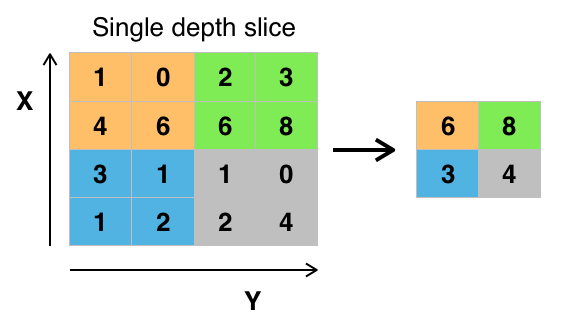
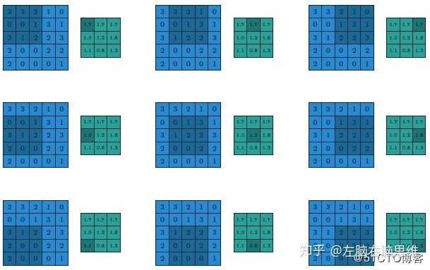
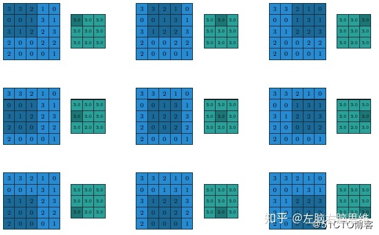
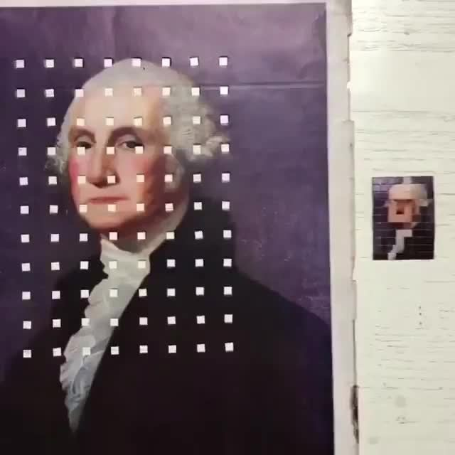
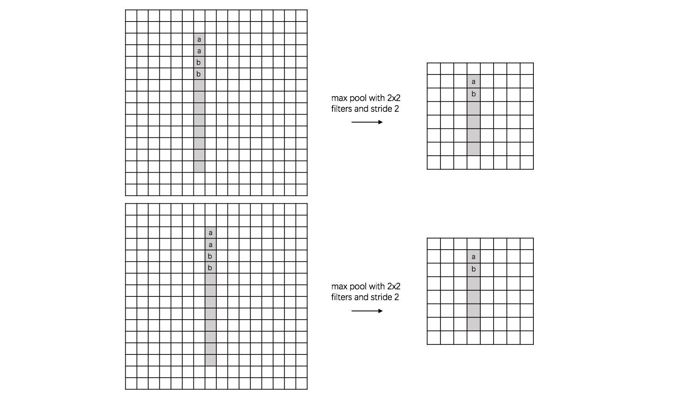
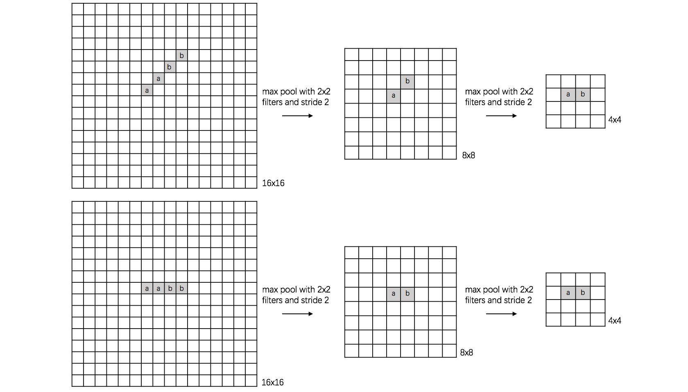
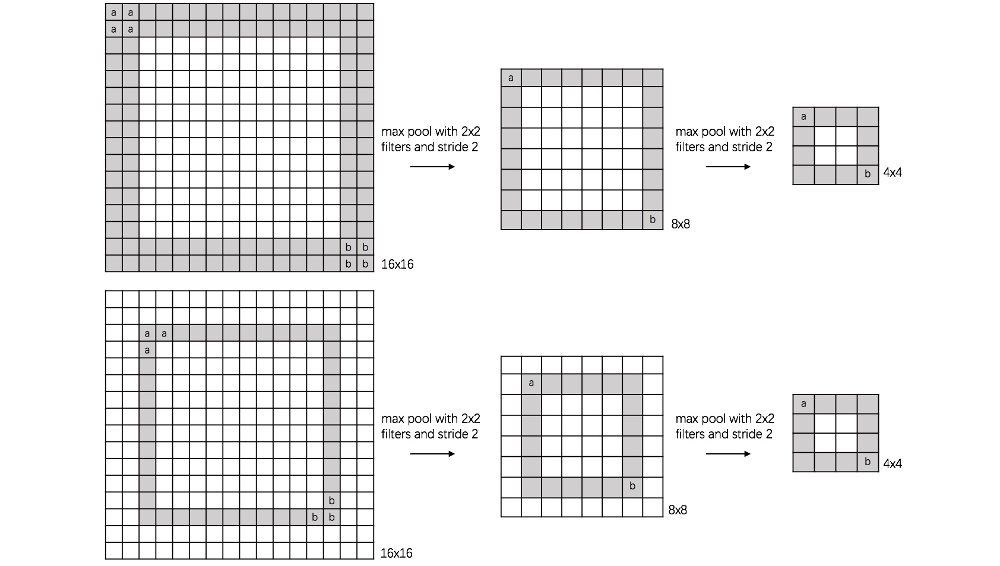

[TOC]

# 池化层

关于池化层，接下来会回答下面几个问题。

1. 什么是池化层？
2. 为什么引入池化层？
3. 池化层的使用场景是哪些？

提出一个基本的要求：认真阅读5篇以上相关的介绍内容之后，再动笔写相关的内容。

## 1. 什么是池化层

要说明什么是池化层，最简单的方式就是通过举例来展示池化层的计算效果。

如下图是一个pool_size为2，strides为2的池化层对一个4x4的矩阵进行“MaxPooling”的输入和输出。

从上面的一个简单例子可以看出池化层的作用其实就是一种“降采样”。对区域特征集再做一次特征压缩，提取出更为关键特征。

### 1.1 池化层的种类

池化算法有四种：最大池化(max pooling)、平均池化(average pooling)、全局平均池化(global average)、全局最大池化(global max)。最常用的就是最大池化，均值池化有时也会使用。

全局平均池化GAP：不以窗口的形式取均值，而是以feature map为单位进行均值化。即一个feature map输出一个值。

均值池化计算过程举例：
最大池化计算过程举例：

## 2. 为什么引入池化层

池化层的引入，主要是为了处理高像素的图像数据。图像处理的任务，比如目标检测等，并不要求图像有多个的像素、多清晰，只要图像能够保留物体的主要特征信息，其实就能够很好的完成目标任务。不但不必要，而且高像素还会给模型带来不必要的复杂度，增加模型的参数规模，增加了模型复杂度，提高了过拟合风险。

网上有一个有趣的例子，很好地说明了池化层的作用。在一张照片上等距离地提取一小块内容，然后拼接在一起，我们发现仍旧能够很好的保留原照片的轮廓信息。

### 2.1 池化层的作用

池化层的作用，总结起来，有三点：

1. 特征降维，保证主要特征的基础上，减少参数数量，模型复杂度，提高计算速度等等。
2. 特征不变性，图像小范围内的平移、旋转，都不会影响输出的内容。
3. 一定程度防止过拟合。

上面提到的不变性包括：平移不变性、旋转不变性、尺寸不变性。下面分别通过例子说明这种不变性。

1. 平移不变性

这是一个数字1的图片，原图是16x16，上面的图比下面的图偏左一个像素，经过pool_size=2,stride=2的max pool之后，得到的8x8的图像，1的像素处的位置都一样了。

2. 旋转不变性

3. 尺寸不变性

## 3. 池化层的使用场景

经常出现的场景就是在卷积层后面跟上一个池化层。

常用的池化层是2*2，步长为2。

## 补充知识：Padding

在CNN网络相关的计算中，会有一个常见的操作：padding。Padding就是对矩阵数据进行填充。

Padding有两种类型：

1. 不做填充；Keras的函数中对应的参数值是valid。
2. 都填充0，使得输入和输出保持相同的尺寸；Keras对应的参数值是same。

## 参考

1. [CNN网络的Pooling层有什么用？](https://www.zhihu.com/question/36686900)
2. [深度学习池化层是什么](https://zhuanlan.zhihu.com/p/58041276)
