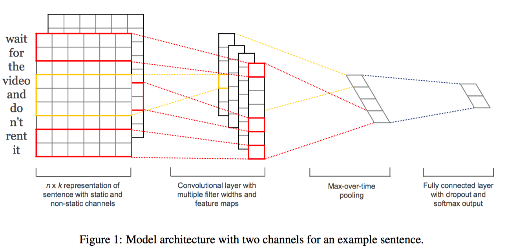
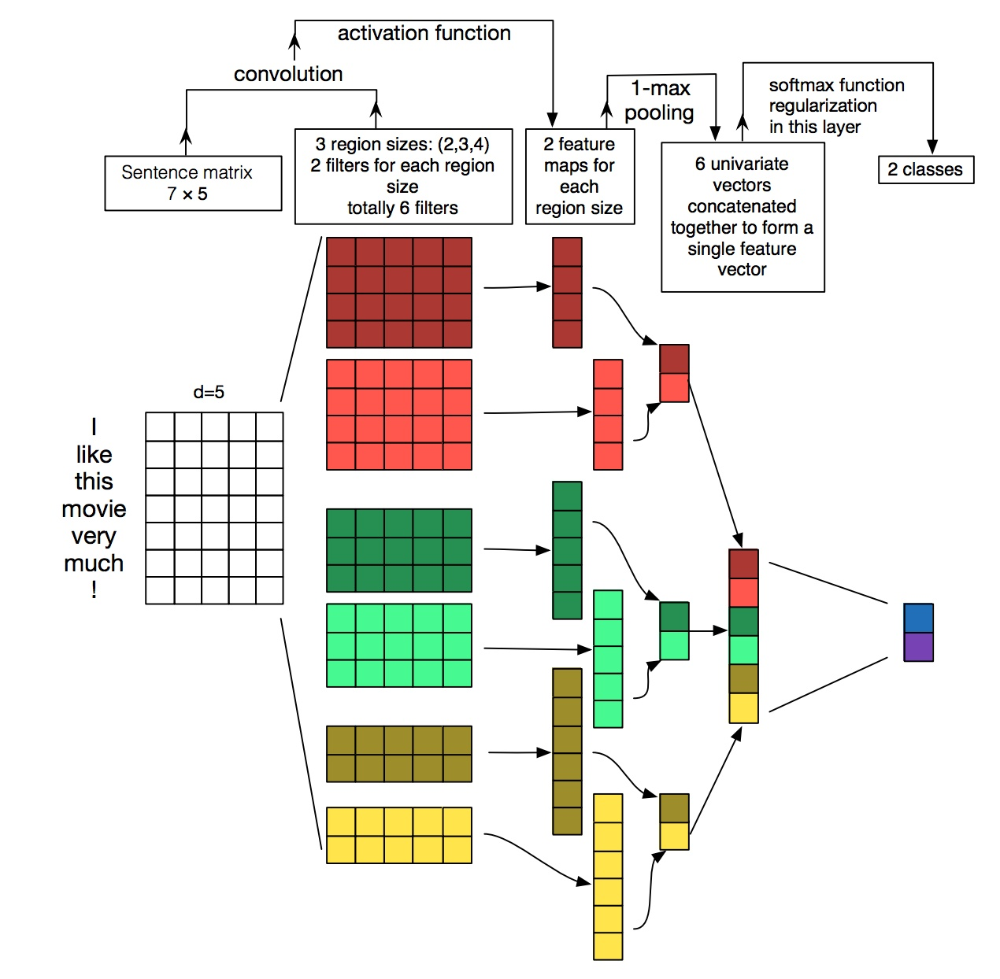

[TOC]

# CNN在NLP中的应用

## 1. TextCNN

**网络结构：**


更多内容可参考论文《Comvolutional Nerual Networks for Sentence Classification》

**补充说明：**

- 处理文本时，channel如何理解呢？一句话的不同channel可以是一句文本的不同方法的到的表示。

**计算过程：**


**Keras函数：**

```python
keras.layers.Conv1D(
    filters, # 输出的纬度，要用多少核
    kernel_size, # 核的大小
    strides=1, # 步长
    padding='valid',
    data_format='channels_last',
    dilation_rate=1, activation=None,
    use_bias=True,
    kernel_initializer='glorot_uniform',
    bias_initializer='zeros',
    kernel_regularizer=None,
    bias_regularizer=None,
    activity_regularizer=None,
    kernel_constraint=None,
    bias_constraint=None)
```

## 参考

1. [卷积神经网络(CNN)在句子建模上的应用](http://www.jeyzhang.com/cnn-apply-on-modelling-sentence.html)
2. [用深度学习（CNN RNN Attention）解决大规模文本分类问题 - 综述和实践](https://zhuanlan.zhihu.com/p/25928551)
3. [深度学习与文本分类总结第一篇--常用模型总结](https://blog.csdn.net/liuchonge/article/details/77140719)
4. [深度学习在文本分类中的应用](https://blog.csdn.net/u010223750/article/details/51437854)
