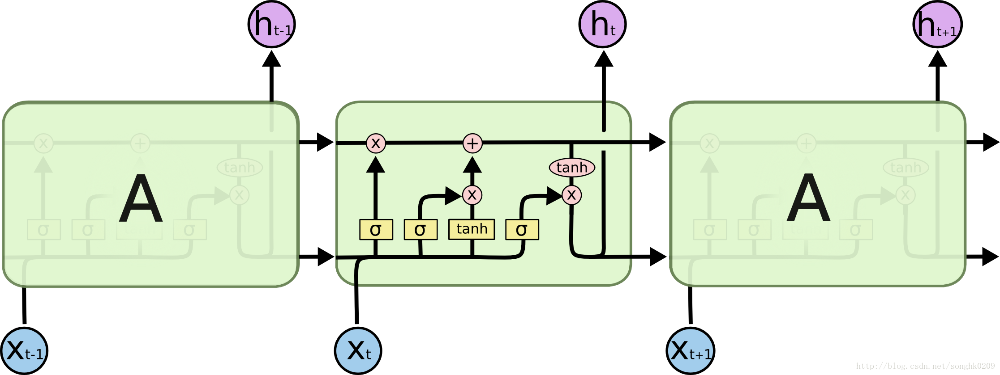

[TOC]

# 1. LSTM相关知识与问题

## 相关论文

[1. Long Short-term memory based recurrent nerual network archtectures for large vocabulary speech](RECOGNITIONhttps://arxiv.org/pdf/1402.1128v1.pdf)

[2. Sequence to Sequence Learning with Neural Networks](https://arxiv.org/abs/1409.3215)

## 1.1 需要回答的问题

- LSTM的网络结构是什么？
- LSTM的优点是啥？
- LSTM的不足是啥？
- LSTM前向传播过程详解？
- LSTM反向传播过程详解？
- LSTM有哪些变种？
- LSTM为什么能够解决Long term依赖问题？

## 1.2 LSTM前向传播过程介绍

[参考blog:Understanding LSTM Networks](http://colah.github.io/posts/2015-08-Understanding-LSTMs/)

1. LSTM的Cell经典结构图如下：

其中的符号注释如下，黄色方框表示一个网络层，红点表示点操作。

2. RNN的核心是隐藏状态向下一个状态转递信息。LSTM是RNN的变形，也有一个这样的主线，如下图：

主线之外，是LSTM模型在原有的状态上通过gate添加了更多的信息。

3. LSTM通过遗忘门决定哪些信息需要传递下去，哪些信息需要被遗忘。

相比RNN直接传递状态信息，LSTM通过遗忘门对状态信息进行了一层加权处理，使得信息往下传递有更高的精度，尽量减少多余信息的传递。

4. LSTM接下来通过输入门和一个tanh层来决定对哪些状态信息进行更新。

输入门是用来决定哪个状态信息需要更新，而tanh层则是决定信息更新多少。

5. 接下来就是要得到新的状态值。

6. 得到输出。这个过程有两部分组成，如下图：

第一部分，通过sigmoid函数来决定状态的哪些部分以怎样的比重作为输出，这一部分也叫输出门，用于控制输出的信息的。第二部分就是通过tanh来标准化状态，然后与输出门的内容点乘，得到最终的输出。

## 1.3 LSTM反向传播过程介绍

[参考blog:LSTM神经网络的详细推导及C++实现](https://blog.csdn.net/u012319493/article/details/52802302)

## 1.4 LSTM及其变体

[图解LSTM神经网络架构及其11种变体（附论文）](https://mp.weixin.qq.com/s?__biz=MzA3MzI4MjgzMw==&mid=2650719562&idx=1&sn=ad6693cdeaa18034ed1c53271f642ef7)
