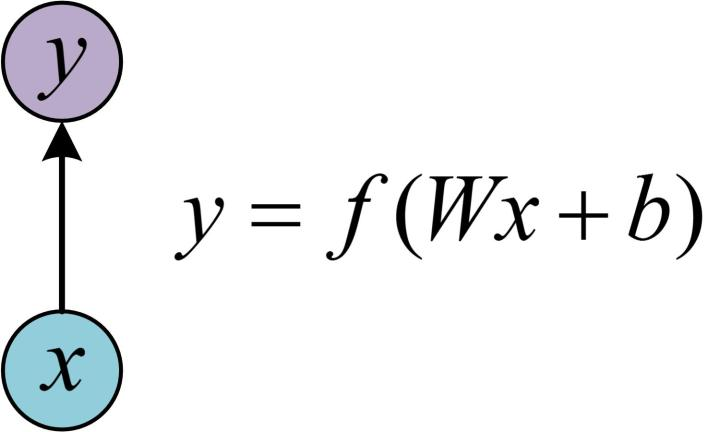
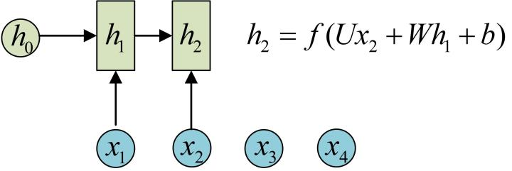
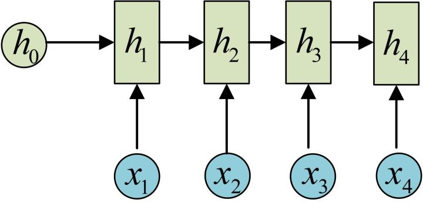
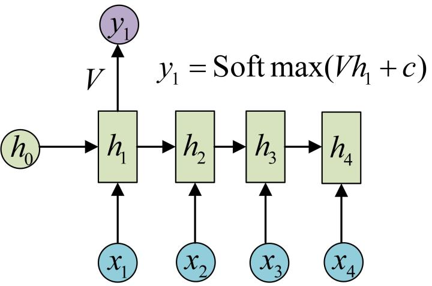
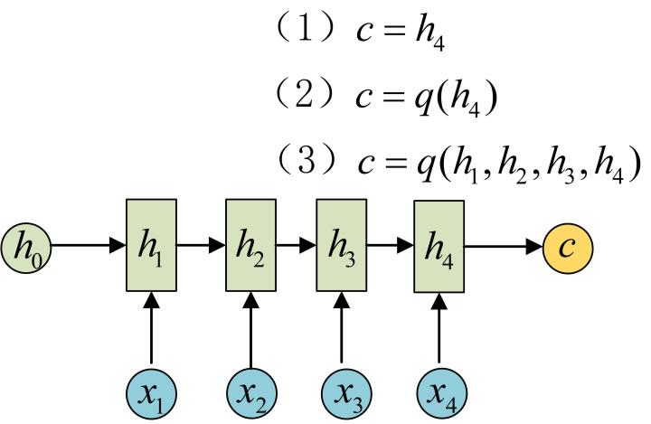
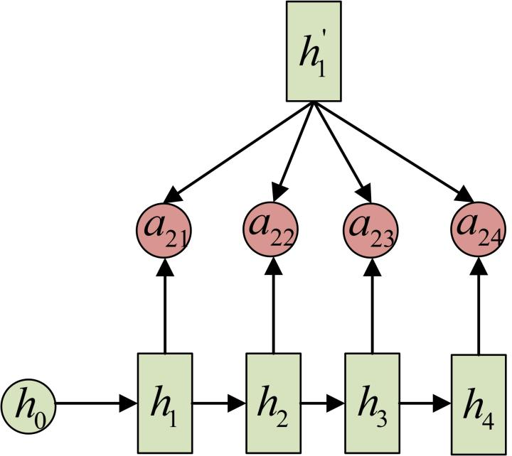

[TOC]

# 1. RNN基础知识

## 1.1 需要回答的问题

1. 什么是RNN？(ok)
2. 为什么需要RNN，或者说RNN解决了什么问题？(ok)
3. RNN与CNN的区别？
4. RNNs与FNNs的区别？
5. RNN中存在的问题有哪些？()
6. RNN有哪些特点？(ok)
7. RNN与传统的ANN在训练时有什么区别？
8. 为什么RNN在训练时Loss的波动比价大？
9. RNN的BPTT算法的推导过程？
10. RNN中为什么会出现梯度消失？
11. 如何解决RNN中的梯度消失问题？

## 1.2 为什么需要RNN

先看一个标准的NN的结构：

这是一个全连接网络，按理说它应该能解析出输入变量之间的所有关联关系。也就是说序列模型的前后依赖关系应该能够很容易的被网络学习到，为什么我们还需要一个专门的RNN网络来处理序列模型呢？

再考虑到CNN及其相关网络处理图像矩阵数据，RNN及其相关模型处理一维序列模型，我们可以发现一个现象：**神经网络模型由于其自身学习算法的限制，并不能一招吃遍天下。如果需要更为高效的解决问题，那么就需要根据具体的问题，来改造网络，使网络的结构能够更为直接有效的传递输入之间的关系。**

现在再回过头来看这个问题：为什么需要RNN？要回答这个问题，不外乎一点，其他网络结构没有在结构上强调序列问题的前后依赖关系(或者说前后依赖关系大于与其他位置的关系，所以必须要在模型结构中侧重于最重要的关系)，而RNN则充分反映了这种关系。

最后，我们看看RNN的结构，以对RNN结构的有直观的认识：

## 1.3 RNN结构详解

### 1.3.1 两个节点与对应数学关系

下图展示的是后面表示两个节点有连接时，两个节点之间的对应数学关系：

### 1.3.2 序列问题的抽象表示

所谓序列，本质是存在前后依赖的一系列对象，这个“前后”既可以是单向，也可以是双向。现实中也有很多序列模型可以描述的问题：

- NLP中的字、词、句，甚至是段落、篇章都可以视为序列模型的一个单元。
- 语音问题中每一帧的声音信号。
- 股票市场中，股票每一天的行情信息。

我们把这些序列问题统一的表示为$x_1,x_2,x_3,x_4,...,x_n$，即如下图：

### 1.3.3 经典RNN结构的计算过程

1. 初始化隐藏状态$h_0$。
2. 由$h_0$和$x_0$得到状态$h_1$。
    
3. 同理，$h_2$的状态如下得到：(注意，每一步使用的$W,b$都是一样的，这是参数共享)
    
4. 最后得到一个这样的隐藏序列：
    
5. $y_1$输出的计算过程
   
6. $y_2$及其他y的输出过程类似，共享相同的参数$V,c$
   

### 1.3.4 经典RNN处理具体问题时的特殊处理

经典的RNN结构对应的输入和输出都是一个序列，而且每个输入对应一个输出。但在解决实际问题时，输入或者输出有时并不能满足这种标准的形式，这个时候需要对标准形式做简单的变形处理。

#### 1.3.4.1 vector-to-sequence

这种场景是：**输入是一个，但是输出要求是一个序列**。对于这种情形，处理方法有两种：

1. 处理方法如下图，就是将一个输入通过重复n次模拟成一个输入序列。

2. 另一种处理方法是只在开始的时候有输入，后面只有隐藏状态之间的转换。

#### 1.3.4.2 sequence-to-vector

这种场景是：输入是一个序列，输出是一个(要么是一个单独的值，要么是一个向量)。对于这种情况的处理方法是通过最后一个隐藏状态得到输出。如下图：

#### 1.3.4.3 encoder-to-decoder结构

有时候我们会遇到输入序列和输出序列是不等长的情况，比如机器翻译，源语言的句子和目标语言的句子通常是不等长的。对于这种不等长的序列问题，我们可以通过encoder-decoder网络结构来处理。

1. encoder过程
   通过一个RNN将一个输入序列进行“编码”得到一个隐藏状态$c$，这个隐藏状态会传给后面的decoder用于得到输出序列。关于得到$c$有三种方式，如下图所示：
   

2. decoder过程
   decoder过程使用$c$的方式也有如下两种：
   
   

#### 1.3.4.4 三种结构使用场景都有哪些？

| 网络结构 | 结构图 | 使用场景 |
| :------ | :----: | :------------ |
| 1 vs N |  | 1.图像生成文字，输入一个图片，输出一句描述文本；2.根据图像生成语音或者音乐|
| N vs 1 |  | 1.输入一段文字，判断属性；2.输入一个句子，判断情感属性；3.输入一段视频，判断类别|
| N vs M |  | 1.机器翻译；2.文本摘要；3.阅读理解；4.语音识别，输入一段语音，输出一段文字|

#### 1.3.4.5 在encoder-decoder模型中引入Attention机制

先说单纯的encoder-decoder模型的不足，encoder阶段得到$c$这一个输出，如果输入序列过长，其他固定的$c$很难有足够的容量去包含关于输入序列的所有信息。一种做法是可以对$c$进行扩容，另一种做法是让$c$是可以变化的，也就是会随着decoder阶段不同的输出，使用不同的$c$。后面一种做法可以通过引入Attention机制实现。

下面简单介绍encoder-decoder中如何引入attention机制。关于Attention机制的内容，会有专门的章节来详细说明。

引入Attention机制后的Decoder阶段如下图：

与之前没有Attention的最大区别就是对于不同的输出，会选择不同的$c$，不同的$c$能够衡量编码阶段的隐藏状态$h_1,h_2,...,h_i$与解码过程中的隐藏状态$h^{'}_i$的关系权重。

以“我爱中国”的英文翻译为例，不同的$c$的效果如下图：

## 1.4 RNN有哪些特点？

1. 相比传统网络，RNN主要用于处理序列问题。
   传统的网络在同一网络层的不同单元之间不存在关联，无法反映同一层序列之间的关联关系。

2. RNN中前一状态的输出会作为当前状态的输入，用以得到当前状态的输出。存在这么一个循环过程，使得RNN能够存储历史信息，便于挖掘历史状态与当前状态之间的关系。

3. RNN的同一隐藏层单元之间是存在权值连接的，而且这个权值是共享的。

## 1.5 RNN训练过程与ANN的有什么异同？

相同点：都是使用反向传播算法学习参数。
不同点：

- RNNs中的W、U、V参数是共享的。而传统网络各层参数之间没有关系。
- 反向传播不仅有纵向的反向传播，还有横向的反向传播，也就是向之前网络状态的反向传播。

## 1.6 为什么RNN在训练时的Loss波动很大？
