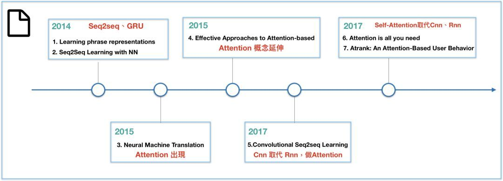
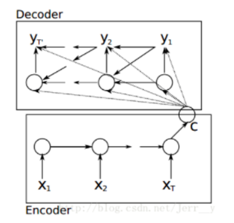
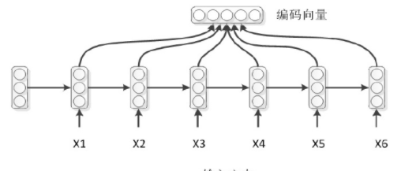
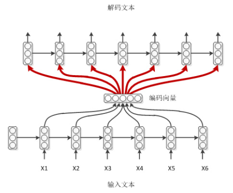
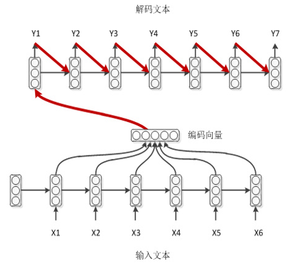
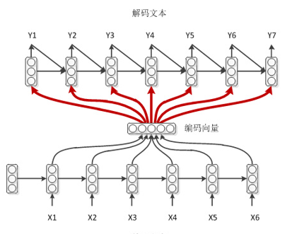
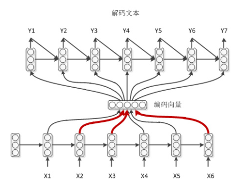

[TOC]

# Seq2Seq模型

seq2seq，全称sequence to sequence，就是序列到序列处理问题的模型。被广泛用于机器翻译、聊天机器人，甚至图像生成文字等场景中。

seq2seq结构的模型通常就是一个Encoder-Decoder结构的网络。Encoder将一个可变长度的输入序列变为一个固定长度的向量表示。Decoder则是将这个固定长度的向量表示解码成可变长度的输出序列。

假设输入序列表示为$x = \{x_1,x_2,x_3,...,x_m\}$，输出序列表示为$y = \{y_1, y_2,...,y_n\}$。$y_t$表示当前的输出。所有的seq2seq模型都是最大化如下目标函数：$$p(y|x) = \prod_{t=1}^{n_y}p(y_t|y_1,y_2,...,y_{t-1},x)$$

如果直接使用上面的目标函数，由于相乘的每一项都是小于1的值，那么多个项相乘就会出现**数值下溢**的问题。所以实际处理中，我们通常会对上面公式取$log$，这样把相乘编程对数求和。

## 1. Encoder-Decoder结构

最初的E-D结构是由两个RNN组成：

编码时：输入一个序列，得到一个中间表示C。
解码时：每个输出$y_i$都是由C、$y_{i-1}$、上一时刻的隐藏状态$s_{i-1}$共同作用生成。

## 2. 常用的四种seq2seq结构

上面提到的seq2seq结构只是其最初的结构，Encoder部分最后一个时刻的隐藏状态作为整个序列的编码表示。但是这种做法效果并不好。

所以，通常的做法是将整个序列的隐藏层编码进行“求和平均”的方式得到序列的Encoder。如图：

### 2.1 结构1

### 2.2 结构2

### 2.3 结构3

### 2.4 结构4

结构四就是在结构三的基础上引入了Attention机制。

## 3. Seq2Seq与Attention

## 改进

seq2seq模型的核心部分在Decoder阶段，优化的工作也主要集中在这里：

- greedy search：基础的解码方法
- beam search：对greedy的改进
- attention机制：它的引入使得解码时，每一步可以有针对地关注与当前有关的编码结果，从而减小了编码器输出表示的学习难度，也更容易学到长期的依赖关系。（这里有个问题需要思考：为什么Attention更容易学到长期的依赖关系？？）
- memory network：从外部获取知识。
- 其他方法：
  - 堆叠多层的RNN的Decoder；
  - 增加Dropout机制；
  - 与Encoder建立残差连接

## 参考

1. [Seq2Seq模型讲解](https://blog.csdn.net/irving_zhang/article/details/78889364)
2. [真正的完全图解Seq2Seq Attention模型](https://zhuanlan.zhihu.com/p/40920384)
