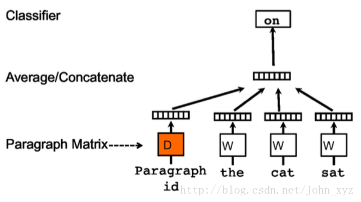
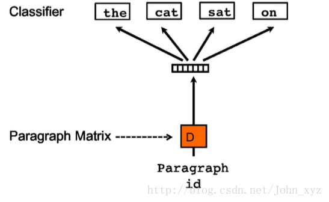

[TOC]

# Doc2Vec

Doc2Vec是Word2Vec的扩展，思想上借鉴Word2Vec，用于获取文档、段落、多个句子等的一个向量表示，以对文档的关键做概括的表示。获取的向量表示可以用于文本相似性计算、文本分类等。

## Doc2Vec训练算法

Doc2Vec的训练算法也有两种。

### A distributed memory model

从下图中我们可以很容易理解，在word2vec的训练时，预测一个单词时，我们通过上下文的单词向量来表示目标单词。在Doc2vec的训练中，预测单词的上下文多了一个paragraph vector，这个vector就是文档的向量表示。毕竟，预测单词时，它所处的文档级的表示也是能提供有用的信息的，也可以理解为这个paragraph vector是文档的主题信息。

### Paragraph vector without word order: Distributed bag of words

这种做法就是忽略上下文，直接通过paramgraph vector去预测document中随机的单词。具体做法就是每个迭代，从文本中采样得到一个窗口，再从窗口中随机采样一个单词作为预测任务。

## 代码实现

Python库gensim中的models.doc2vec就是对Doc2vec的实现。

## 参考

1. [原始论文](https://cs.stanford.edu/~quocle/paragraph_vector.pdf)
