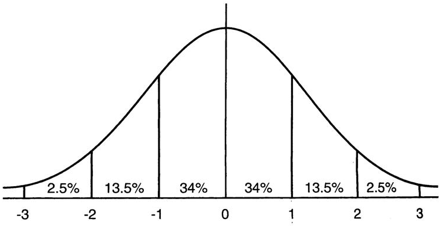
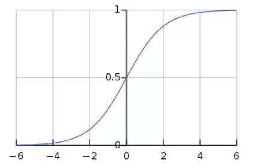

[TOC]

# Batch Normalization

## 1. 相关引用

[1. Batch Normalization: Accelerating Deep Network Training by Reducing Internal Covariate Shift](https://arxiv.org/abs/1502.03167)

[2. 深入理解Batch Normalization批标准化](http://www.cnblogs.com/guoyaohua/p/8724433.html)

## 2. Batch Normalization基础知识

### 2.1 有关IID

机器学习中有一个重要的假设：独立同分布假设，即IID(independent and identically distributed)。

具体指的就是：随机过程中，每次采样都视为一个随机变量的输出值，这些随机变量相互独立，而且这些变量满足相同的概率分布。

为什么机器学习有这样一个假设？
因为如果不同的采样数据不是“师出同门”，那就**无法通过其中的一些数据学习另外的数据**。也就无法用训练数据训练好的模型用于测试数据，更无法用于预测未知的数据。

我们这节介绍的Batch Normalization的核心作用就是：**使训练过程的每一层的神经网络的输入都保持相同的分布。**

这里就涉及到两个问题：

1. 为什么每一层的输入的分布是不同的，数学上说明为什么会不同？
2. 为什么需要它们的分布是相同的？

与第二个问题还有一个相关的更为基本、深刻的问题：
为什么随着网络的加深，训练起来越困难，收敛越来越慢？

这些问题留待后面去思考解决。

### 2.2 Internal Covariate Shift

论文中提到Batch Normalization就是通过reduce internal covariate shift来发挥作用的。

那么什么是“internal covariate shift”?

一句话概括就是：隐藏层的输入的分布发生变化，发生了偏移。

输入层数据在随着网络加深，后面的隐藏层输入的分布会逐渐发生变动，整体分布逐渐向激活函数的两端靠近，导致梯度逐渐的变得很小，也就导致训练收敛速度越来越慢。

直观上理解如下图：


### 2.3 Batch Normalization的核心思想

核心思想就是：将每个隐藏层输入的分布规范化，转换到分布均值为0，方差为1的标准正太分布上。这样，激活函数的输入就会落在梯度变化更为明显的区域，可以解决梯度消失的问题。

接下来具体分析将分布转换到标准正太分布的意义：

(1) 先看看标准正太分布的概率分布图：


意味着新的输入落到[-1,1]的概率会变大，落到[-2,2]的概率超过90%。

(2) 对激活函数的影响，假设激活函数为sigmoid


sigmoid函数的导数：$f^{'}(x) = f(x)*(1-f(x))$，$f(x)$是sigmoid(x)函数。对应的曲线如下图：


sigmoid函数在[-2,2]之间的梯度变化接近线性。这就有效避免了梯度饱和，加快收敛速度。

但是，but，新的问题来了：激活函数本来是要在整个网络中引入非线性的，如果将输入都落在了“近线性区”，那模型的表达力其实是会下降的。极端的理解，多层的只有线性变化的神经网络其实可以等效变换为一层，也就是说，多层的表达能力变成了一层的表达能力。

所以，Batch Normalization对满足均值为0，方差为1的x有进行了下面的操作：$y=scale * x + shift$，每个神经元都增加了这两个操作。scale和shift参数是通过训练学习到的。这个过程可以理解为将数据的分布再向两端移动一些，增加非线性。

猛一看，感觉很奇怪，一方面将数据分布向中间靠，另一方面有通过参数把数据分布向两侧微调。看似是一个自相矛盾的行为，但是这种做法的本质在于**通过scale和shift两个参数可以学习，让隐藏层输入数据的分布也可以通过训练去学习，使隐藏层分布可以更有效地传递信息。**

这里又要思考一个问题了：**隐藏层输入的分布到底在整个神经网络中的作用是啥？它可以被改变的理论依据是啥？**

是不是可以这么理解：IID假设知识假设原始最外层的输入数据，并不是对隐藏层有强制要求。隐藏层的作用核心在于输入信息的变换处理和传递，隐藏层的数据分布只是为了更好的实现有效信息的传递，达到最好的输出结果，这样的一个隐藏层就是最好的。隐藏层并无和输入绑定的明确关系，而是“乙方”，服务“甲方”真是的需求。所以，隐藏层输入的分布可以以最终目标为导向地调整。

### 2.4 Batch Normalization具体是怎么做的？

假设对于一个神经网络来说，其中的两层结构如下：


加入了Batch Normalization后的结构如下图：


Batch Normalization要和Mini-batch SGD结合使用。一次训练的样本假设包含m个训练实例，具体的BN操作作用于每个隐藏单元。每个隐藏单元的输入：
$$\hat{x}^{(k)} = \frac{x^{(k)-E[x^{(k)}]}}{\sqrt{Var[x^{(k)}]}}$$
其中：$x^{(k)}$是t-1层第k个神经元输出到t层某个神经元的输入。

接下来，又对$\hat{x}^{(k)}$进行如下操作：
$$y^{(k)} = \gamma^{(k)}\hat{x}^{(k)}+\beta^{(k)}$$

整个计算过程如下图所示：


### 2.5 在推理过程中，Batch Normalization是如何处理的呢？

在推理或者预测阶段，输入时一个，不存在均值和方差，那么如何使用Batch Normalization的逻辑呢？

计算算法如下：


### 2.6 Tensorflow相关代码

```python
def batch_norm(inputs,
               decay=0.999,
               center=True,
               scale=False,
               epsilon=0.001,
               activation_fn=None,
               param_initializers=None,
               param_regularizers=None,
               updates_collections=ops.GraphKeys.UPDATE_OPS,
               is_training=True,
               reuse=None,
               variables_collections=None,
               outputs_collections=None,
               trainable=True,
               batch_weights=None,
               fused=None,
               data_format=DATA_FORMAT_NHWC,
               zero_debias_moving_mean=False,
               scope=None,
               renorm=False,
               renorm_clipping=None,
               renorm_decay=0.99,
               adjustment=None):
    pass
    """
    有关参数的说明：
    inputs:
    a tensor with 2 or more dimentions, where the first dimention has `batch_size`.

    decay:
    代表加权指数平均值的衰减速度，是使用了一种叫做加权指数衰减的方法更新均值和方差。值太小会导致均值方差更新太快，而值太大又会导致几乎没有衰减，容易出现过拟合。

    center：
    if True, add offset of `beta` to normalization tensor. If False, `beta` is ignored.

    scale:
    是否使用`gamma`对BN后面的值进行放大。

    epsilon：
    为了避免分布为0，给分母加上一个极小的值。

    activation_fn:
    激活函数，默认为None，即使用线性激活函数。

    param_initializers:
    可选的beta、gamma、moving mean、moving variance初始化参数。

    param_regularizers:
    可选的beta和gamma的正则化项

    updates_collections:
    其变量默认是tf.GraphKeys.UPDATE_OPS，在训练时提供了一种内置的均值和方差更新机制，即通过图中的tf.Graphs.UPDATE_OPS变量来更新，但它是在每次当前批次训练完成后才更新均值和方差，这样就导致当前数据总是使用前一次的均值和方差，没有得到最新的更新。所以一般都会将其设置为None，让均值和方差即时更新。这样虽然相比默认值在性能上稍慢点，但是对模型的训练还是有很大帮助的。

    is_training:
    True表示是训练过程，这时会不断更新样本集的均值和方差。当测试时，设置为False，这样就会使用训练样本的均值和方差。

    reuse:
    这一层的变量是否需要reused。

    variales_collections:
    Optional collections for the variables.

    outputs_collections:
    Collections to add the outputs.

    trainable:
    True, will add variables to graph collections `GraphKeys.TRAINABLE_VARIABLES`

    batch_weights:
    an optional tensor of shape `[batch_size]`, containing a frequenccy weight
    for each batch item.

    used:
    used: Use nn.fused_batch_norm if True, otherwise
    nn.batch_normalization

    data_format: A string. `NHWC` default, `NCHW` are supported.
    `NHWC`: [batch, height, width, channels]
    `NCHW`：[batch, channels, height, width]
    关于两种format的说明：https://mp.weixin.qq.com/s/I4Q1Bv7yecqYXUra49o7tw
    """
```

## 3. Batch Normalization有关的问题

### 3.1 BN有哪些好处？

1. 提高训练速度，收敛速度加快；
2. 增加分类效果，类似于Dropout，起到防止过拟合的作用；
3. 调节参数时，对初始化参数要求没那么高了；
4. 可以使用大的learning_rate;