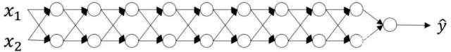

[TOC]

# 神经网络权重初始化

## 1. 权重初始化

我们知道每一层神经网络的每一个神经元都是一个如下函数$\sigma{(WX+b)}$，其中$\sigma$是激活函数。其中$W,b$的值，就是我们要初始化的值。

为了方便后面分析权重初始化不合理会导致的问题，我们有如下定义：$y = \sigma{(z)}, z = WX+b$，其中$X$就是上一层网络神经元的输出。反向传播时，我们求的梯度时：$\frac{\partial y}{\partial W} = \frac{\partial{\sigma}}{\partial z} * \frac{\partial z}{\partial W} = \frac{\partial{\sigma}}{\partial z} * X$。我们由此可以得出一个结论：**梯度的大小和上一层网络的神经元输出是有直接关系的**。记住这个关系，这个关系有助于我们后面的分析。

另外，权重$W$的更新公式如下：$W_{new} = W_{old} - \alpha {\frac{\partial y}{\partial W} }$。

## 2. 零权重初始化或者常数权重初始化

这种初始化方法会导致每个神经元都有相同的输出，权重也都是更新相同的值，也就是说每个神经元都是相同的。这违背了不同的神经元应该学习不同特征的基本需求，极大削弱了神经网络的表达力，致使模型效果很差。

## 3. 过大或者过小初始化

假设如下网络结构，每一层有两个神经元的全连接网络：

我们根据前面分析的梯度公式可以知道，反向传播过程是和激活函数的梯度以及上一层网络的输出是有关系的。

权重过小或者过大，会首先导致$z$值变小或变大，根据不同的激活函数，权重过大或过小可能会有不同方向的影响，但是总结起来，大致会导致两个可能的问题：梯度消失和梯度爆炸，这两个问题可以说是是从梯度层面反映问题的两个极端。

关于权重过大或过小的一种简化形式的分析就是假设激活函数是$y=x$的线性函数，我们可以发现网络的输出$y = W^{[0]}...W^{[l]}X$，如果$W$的值过小或者过大，那么根据矩阵的乘法，我们可以知道输出$y$的值会变得很小或者很大，进而导致梯度的消失或爆炸。

不合理的初始值，直接会导致一层网络出现问题，进而问题传导到后面的网络。

## 4. 怎样的初始化是好的

先定要达到的目标：

- 激活输出的均值为0
- 激活输出的方差应该保持一致

在这两个假设下，反向传播的梯度信号就不会在任意层中被过小或过大的值相乘，从而在不出现梯度爆炸或消失等问题。

## 参考

1. [深度学习中神经网络的几种权重初始化方法](https://blog.csdn.net/u012328159/article/details/80025785)
2. [什么是深度学习成功的开始？参数初始化（xavier，he等）](https://zhuanlan.zhihu.com/p/57454669)
3. [神经网络权重矩阵初始化的意义？](https://www.zhihu.com/question/291032522)
4. [吴恩达深度学习课补充教程：交互式demo助你理解神经网络初始化](https://baijiahao.baidu.com/s?id=1634669138509059169&wfr=spider&for=pc)
5. [神经网络中的权重初始化一览：从基础到Kaiming](http://www.360doc.com/content/19/0421/21/99071_830420474.shtml)
