[TOC]

# 手写BP过程

一个简单的神经网络通常至少有三层：输入层、隐藏层、输出层，隐藏层可以根据问题复杂程度增加。

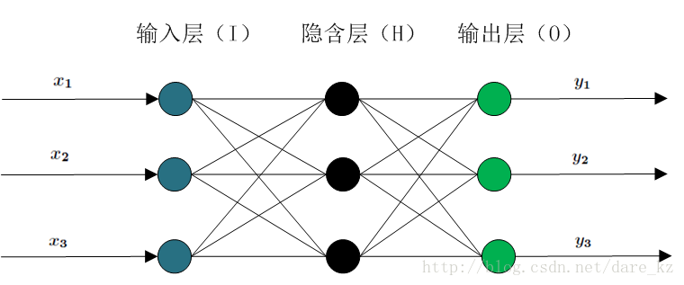

## 神经元

在上面图中，除了输入层，隐藏层和输出层的每个点都代表一个神经元，每个神经元都是完成了如下一个操作：

$$activation(WX+b)$$

也就是对$WX+b$使用激活函数得到一个单值的输出，如下图。

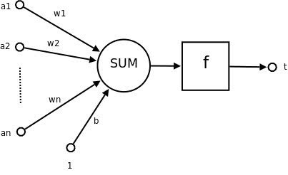

## 举例演示整个过程

### 1. 问题

定义如下一个简单的回归问题，采用的网络结构如下图所示：

注意：网络中的神经元没有使用bias。

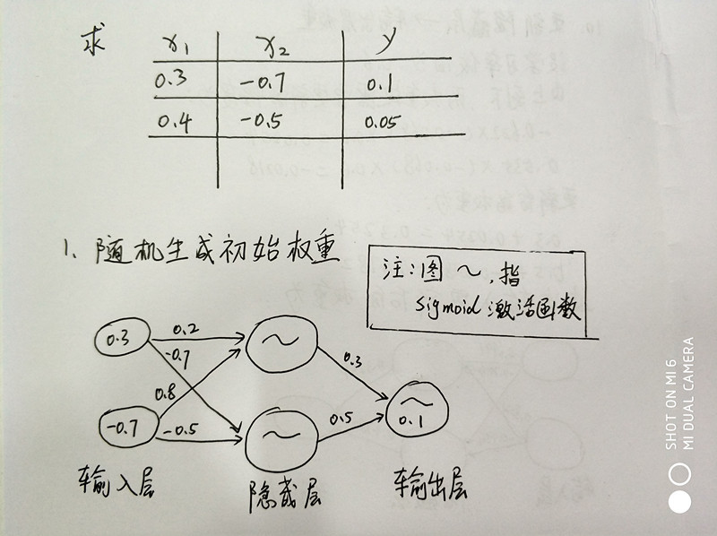

### 2. 输入层到隐藏层

输入层到隐藏层经过两部分：加权求和以及激活函数，得到的是隐藏层的输出，也就是输出层的输入。

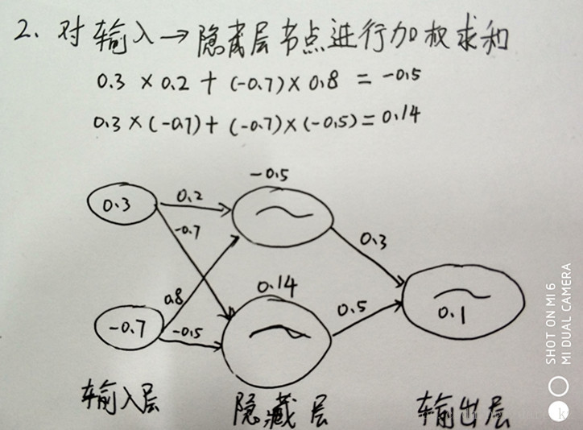
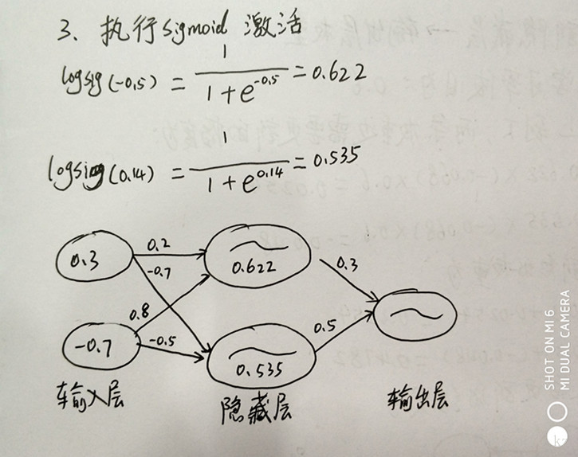

### 3. 隐藏层到输出层

过程类似于输入层到输出层，不过这里输出层只有一个神经元而已。
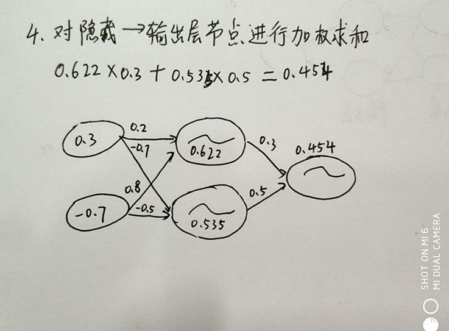
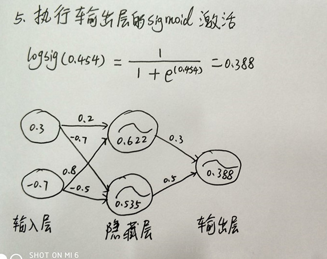

### 4. 计算误差及残差

误差用于判断模型当前是否满足需求，残差用于进行反向传播。

注：残差和误差的区别：

- 残差：观测值与拟合值的偏离
- 误差：观测值与真实值的偏离

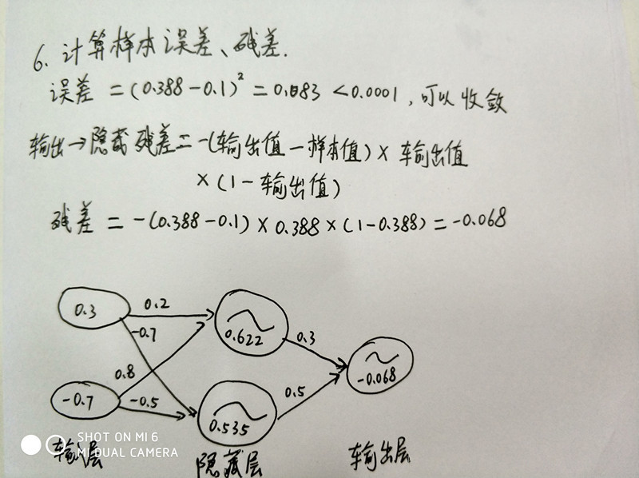

注意：这里残差的计算公式中包含了sigmoid的梯度。

### 5. 隐藏层残差

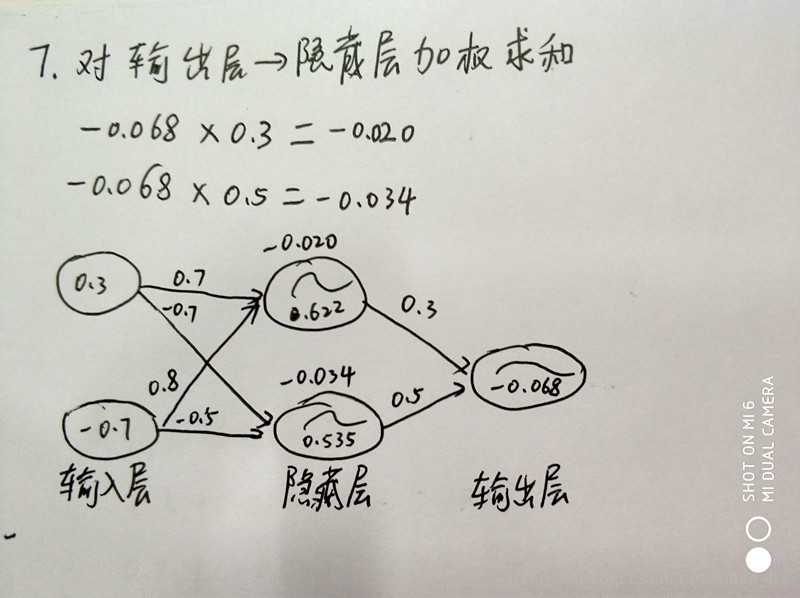
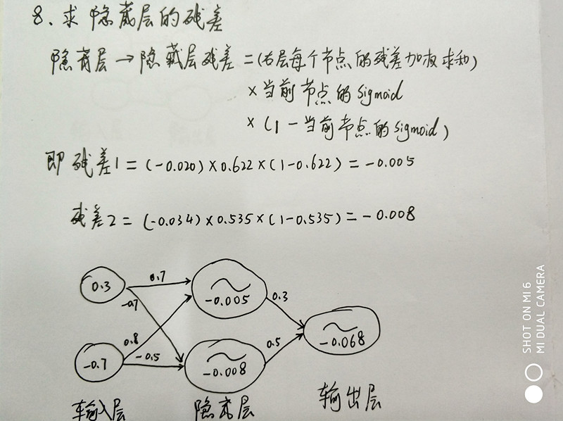

### 6. 更新输入到隐藏层的权重

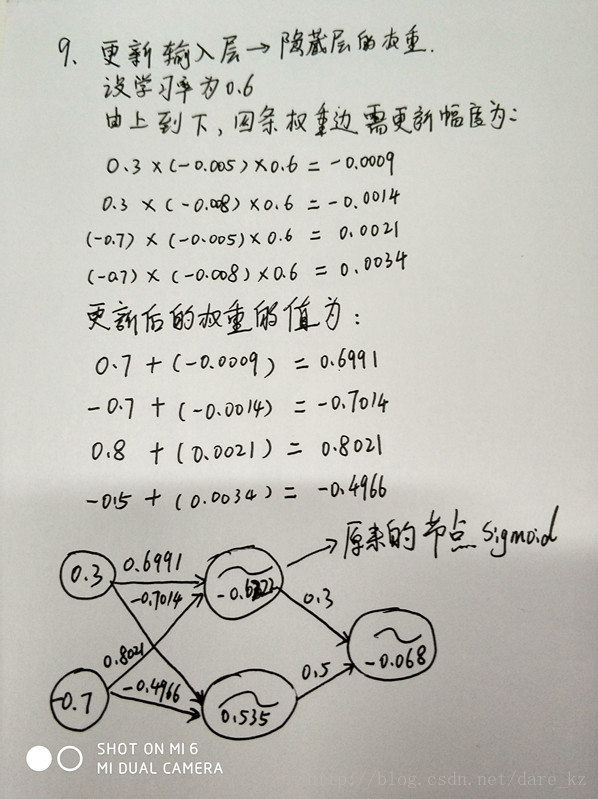

### 7. 更新隐藏层到输出层的权重

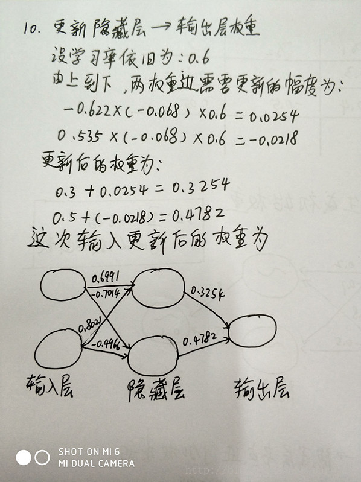

## 参考

1. [手算BP网络](https://blog.csdn.net/dare_kz/article/details/77603522)
