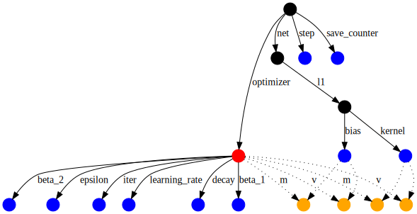
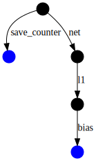

[TOC]

# Checkpoint

Checkpoint简单地说就是一个检查点，它保存了模型的每个变量的精准值，但是不包含模型定义的计算过程和结构的任何说明，所以checkpoint一般用在可以获取模型的代码时。

与checkpoint对应的是SavedModel，这种格式保存的模型不仅包含模型的变量的值，还包括计算结构的描述信息。所以这种格式的model是独立于文件的。它们适用于模型的部署。

接下来的内容只描述和Checkpoint有关的内容，关于模型保存的方式有哪些，分别如何使用等问题由专门的文档说明。

## 1. 实例代码

后面的代码依赖于下面的基础代码：

```python
import tensorflow as tf

class Net(tf.keras.Model):
    def __init__(self):
        super(Net, self).__init__()
        self.l1 = tf.keras.layers.Dense(5)

    def call(self, x):
        return self.l1(x)

# 实例化模型
net = Net()
```

## 2. 利用tf.keras的API保存Checkpoint

做法非常简单，就是保存权重即可。

```python
net.save_weights('easy_checkpoint')
```

## 3. Writing checkpoints

Tensorflow模型的持久化状态是存储在tf.Variable对象中。这些tf.Variable对象可以直接创建，但是我们通常会使用更高级的APIs来创建，比如tf.keras.layers、tf.keras.Model。

最简单的管理变量的方式就是将这些变量绑定到Python对象上，然后引用这些对象。

tf.train.Checkpoint，tf.keras.layers.Layer，tf.keras.Model的子类会自动跟踪赋值给它们属性的变量。下面有个例子构建了一个简单的线性模型，然后写入一个包含模型所有变量的checkpoint。

最简单的方式就是通过Model.save_weights方法。

### 3.1 手动写入checkpoint

先定义一个玩具一样的数据集和优化过程。

```python
def toy_dataset():
    inputs = tf.range(10.)[:,None]
    labels = inputs * 5. + tf.range(5.)[None,:]
    return tf.data.Dataset.from_tensor_slices(dict(x=inputs, y=labels)).repeat().batch(2)

def train_step(net, example, optimizer):
    with tf.GradientTape as tape:
        output = net(example['x'])
        loss = tf.reduce_mean(tf.abs(output - example['y']))
    variables = net.trainable_variables
    gradients = tape.gradient(loss, variables)
    optimizer.apply_gradients(zip(gradients, variables))
    return loss
```

### 3.2 创建checkpoint对象

手动创建checkpoint需要一个tf.train.Checkpint对象。**那些想要写入checkpoint的对象，可以设置为这个对象的属性**。

tf.train.CheckpointManager可以用于管理多个checkpoints。

```python
opt = tf.keras.optimizers.Adam(0.1)
dataset = toy_dataset()
iterator = iter(dataset)
ckpt = tf.train.Checkpoint(step=tf.Variable(1), optimizer=opt, net=net, iterator=iterator)
manager = tf.train.CheckpointManager(ckpt, './tf_ckpts', max_to_keep=3) # 表示只保留最新的三个Checkpoint
```

### 3.3 训练模型和创建checkpoint

下面训练循环创建model和optimizer的实例，然后把它们写入tf.train.Checkpoint对象。

```python
def train_and_checkpoint(net, manager):
    ckpt.restore(manager.latest_checkpoint)
    if manager.latest_checkpoint:
        print("Restored from {}".format(manager.latest_checkpoint))
    else:
        print("Initializing from scratch.")

    for _ in range(50):
        example = next(iterator)
        loss = train_step(net, example, opt)
        ckpt.step.assign_add(1)
        if int(ckpt.step) % 10 == 0:
            save_path = manager.save()
            print("Saved checkpoint for step {}: {}".format(int(ckpt.step), save_path))
            print("loss {:1.2f}".format(loss.numpy()))
```

### 3.4 恢复模型并重新训练

```python
opt = tf.keras.optimizers.Adam(0.1)
net = Net()
dataset = toy_dataset()
iterator = iter(dataset)
ckpt = tf.train.Checkpoint(step=tf.Variable(1),optimizer=opt, net=net, iterator=iterator)
manager = tf.train.CheckpointManager(ckpt, './tf_ckpts', max_to_keep=3)

train_and_checkpoint(net, manager)
```

tf.train.CheckpointManager对象会删除旧的checkpoints。可以通过manager.checkpoints查看保留的checkpoints。

## 4. 加载机制

Tensorflow匹配checkpoint中的变量的方式就是遍历一个边有名字的有向图，从被加载的变量开始。边的名字同常来源于对象属性的名字。比如对于self.l1 = ...，那么就会使用“l1”这个名字作为边的名字。tf.train.Checkpoint则是使用它的keyword参数名，比如在tf.train.Checkpoint(step=...)，会使用“step”作为边名。

前面例子的变量有向图如下所示：



其中，optimizer是红色节点，常规变量是蓝色，optimizer的slot变量是黄色。

Slot变量时optimizer的状态的一部分，但是确实为了专门的变量创建的，比如上图中的“m”边，对应的是动量，Adam优化器为了记录不同变量。Slot变量只有在当这个变量和optimzer都saved时，才会保存。

当在一个Checkpoint对象上调用restore方法时，只要从这个Checkpoint对象出发，有一个匹配的路径，那么就会恢复这个变量的值。

比如上面的图中，我们想要恢复其中bias变量的值，那么我们可以如下构造一个这样的路径来恢复变量的值：

```python
to_restore = tf.Variable(tf.zeros([5]))
print(to_restore.numpy())

fake_layer = tf.train.Checkpoint(bias=to_restore)

fake_net = tf.train.Checkpoint(l1=fake_layer)
new_root = tf.train.Checkpoint(net=fake_net)
status = new_root.restore(tf.train.latest_checkpoint('./tf_ckpts/'))
print(to_restore.numpy())
```

上面的代码只是构建了如下一个有向子图：


注意：其中save_count变量节点是Checkpoint用于对Checkpoint计数的。

restore()函数返回了一个status对象，这个对象有一个可选的断言方法。这些断言可以用来获取status的信息。

由于刚才定义的子图中的变量都加载了，所以status.assert_existing_objects_matched()断言能够通过。如果保存的Checkpoint和定义的变量能够完全匹配，那么status.assert_consumed()断言能够通过，否则就会抛出异常。

## 5. 延迟加载恢复变量

Tensorflow的Layer对象，当其输入shape确定时，那么它可能延迟期其变量的创建，直到第一次被调用。

为了支持这种惯例，tf.train.Checkpoint会将没有匹配的变量入列其恢复。
