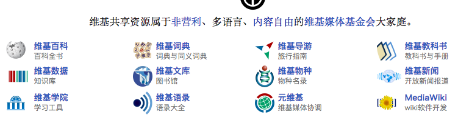

[TOC]

# 维基

[维基共享数据](https://commons.wikimedia.org/wiki/%E9%A6%96%E9%A1%B5)

维基共享数据下面有这么多类型的共享数据类型：

- 维基百科
- 维基词典
- 维基数据
- .....

## 处理维基百科数据

- Java语言
可以使用jwpl来处理wiki的数据。

- Python语言
可以使用[WikiExtractor](https://github.com/attardi/wikiextractor)来处理wiki数据。
