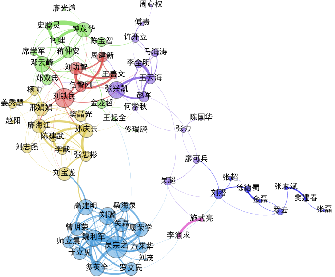
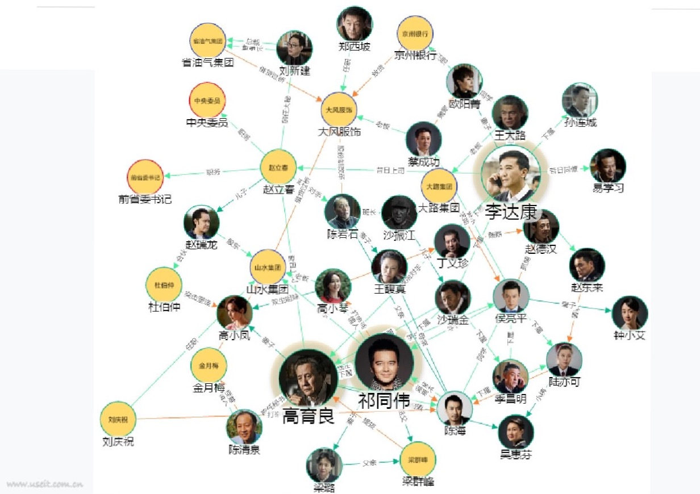

[TOC]

# 知识图谱概论

## 1. 几个知识图谱相关的基本概念

1. 本体
   概念的集合，在面向对象变成中叫类，在数据管理里面叫元数据。比如人、事、物、组织等。本体用于对数据进行建模，通过对本体的研究来明确知识图谱中要构建的数据。

2. 实体
   简单的说就是本体+实例。实体是在本体的基础上创建的具体数据。

## 2. 关于知识图谱的理解

### 2.1 图谱的核心：关联性

按照目前对图谱的认识，谈一谈对图谱的理解。

“图谱”，数据呈现出的核心形态是“图”，比如下面的人与人之间的网状关系图：

还比如《人民的名义》中的人物关系，构建成如下图谱：

从上面的例子中，我们可以发现，一个图谱勾勒出了不同节点之间的连接关系。通过图谱我们可以发现节点之间的直接、间接关系。如果不是借助于图谱，我们很难发现节点之间的错综复杂的关联性。**发现间接联系或者说关系就是图谱的核心功能**。

这里再强调一次：**关联性才是图谱的核心**。

所以，当我们尝试着用图谱的方式来组织数据时，我们就要思考下面的基础问题：

1. 构建图谱的数据之间是否存在有意义的关联性？
2. 实体之间的哪些关联性是有价值的？
3. 实体之间要通过什么属性来关联？

### 2.2 SPO与属性

图谱的是由一系列的SPO组成的，Subject和Object都是我们关心的实体，这和属性是有区别的。

“小王看了《红楼梦》”，“万科董事长为郁亮”，这里涉及的“小王”、“红楼梦”、“万科”、“郁亮”都是实体，而且这些实体都是在构建的图谱中有意义的。它们都包含了SPO。

“小明的身高是1.75m”，这里的“身高”就是属性，属性的值“1.75m”也不具备关联性，所以只是属性。属性不是图谱关心的核心内容，但是属性仍旧可以存储到图谱中。
