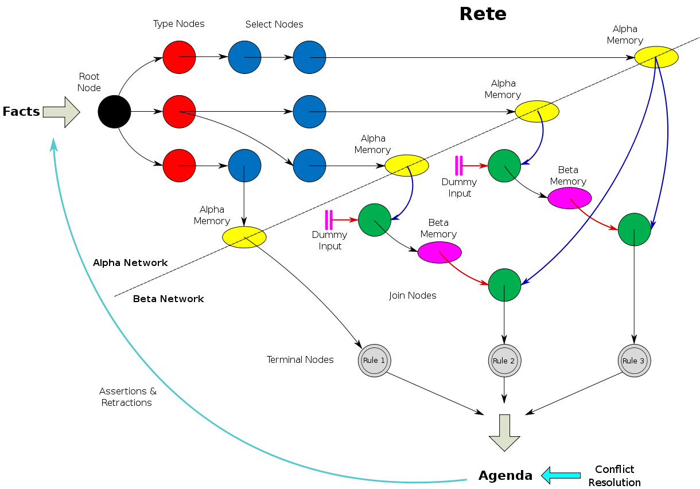

[TOC]

# Rete算法

Rete算法是一种前向规则匹配算法，匹配速度和规则的数据是没有关系的。Rete在拉丁语中是“net”，有网络的含义，rete算法就是通过将规则构建成一个网络，每个规则就是网络上的一个节点。

Rete算法用于产生式系统，在一个产生式系统中，被处理的数据叫做Working Memory，用于判定的规则分为两部分：LHS（Left hand side）和RHS（Right hand side），分别表示前提和结论。

## 基本概念

- 事实
  对象与对象之间、对象与属性之间的多元关系。事实可以通过如下形式的三元组来表示：(identifier ^attribute value)
  比如：
    > w1:(B1  ^ on B2)       w6:(B2  ^color blue)
    > w2:(B1  ^ on B3)       w7:(B3  ^left-of B4)
    > w3:(B1  ^ color red)   w8:(B3  ^on table)
    > w4:(B2  ^on table)     w9:(B3  ^color red)
    > w5:(B2  ^left-of B3)

- 规则
  LHS->RHS，由条件和结论两部分组成。

- 模式
  已知事实的泛化形式，没有实例化的多元关系。
  >(^on)
  >(^left-of)
  >(^color red)

## Rete网络说明

rete网络主要由两部分组成，alpha network和beta network。

### alpha network

用于过滤working memory，找出符合规则中每一个模式的集合，生成alpha memory。有两种节点：过滤type的节点、其他的过滤节点。

### beta network

有Join节点和Beta memory节点，Beta memory用于存储join后的结果，join则是用于合并不同的集合。

### rete网络的Example

假设有如下的规则：
> IF：
> 年级是三年级以上，
> 性别是男的，
> 年龄小于10岁，
> 身体健壮，
> 身高170cm以上，
> THEN： 这个男孩是一个篮球苗子，需要培养

对应的rete网络如下：

Fact的匹配过程如下：
匹配过程中事实在网络节点中的流转顺序为A–>B–>C–>D–>E–>F–>G–>H–>I—>规则匹配通过

1. 从working-Memory中拿出一个待匹配的StudentFact对象，进入根节点然后进行匹配，以下是fact在各个节点中的活动图

2. A节点：拿StudentFact的年级数值进行年级匹配，如果年级符合条件，则把该StudentFact的引用记录到A节点的alpha内存区中，退出年级匹配。

3. B节点：拿StudentFact的性别内容进行性别匹配，如果性别符合条件，则把该StudentFact的引用记录到B节点的alpha内存区中，然后找到B节点左引用的Beta节点，也就是C节点。

4. C节点：C节点找到自己的左引用也就是A节点，看看A节点的alpha内存区中是否存放了StudentFact的引用，如果存放，说明年级和性别两个条件都符合，则在C节点的Beta内存区中存放StudentFact的引用，退出性别匹配。

5. D节点：拿StudentFact的年龄数值进行年龄条件匹配，如果年龄符合条件，则把该StudentFact的引用记录到D节点的alpha的内存区中，然后找到D节点的左引用的Beta节点，也就是E节点。

6. E节点：E节点找到自己的左引用也就是C节点，看看C节点的Beta内存区中是否存放了StudentFact的引用，如果存放，说明年级，性别，年龄三个条件符合，则在E节点的Beta内存区中存放StudentFact的引用，退出年龄匹配。

7. F节点：拿StudentFact的身体数值进行身体条件匹配，如果身体条件符合，则把该StudentFact的引用记录到D节点的alpha的内存区中，然后找到F节点的左引用的Beta节点，也就是G节点。

8. G节点：G节点找到自己的左引用也就是E节点，看看E节点的Beta内存区中是否存放了StudentFact的引用，如果存放，说明年级，性别，年龄，身体四个条件符合，则在G节点的Beta内存区中存放StudentFact的引用，退出身体匹配

9. H节点：拿StudentFact的身高数值进行身高条件匹配，如果身高条件符合，则把该StudentFact的引用记录到H节点的alpha的内存区中，然后找到H节点的左引用的Beta节点，也就是I节点。

10. I节点：I节点找到自己的左引用也就是G节点，看看G节点的Beta内存区中是否存放了StudentFact的引用，如果存放了，说明年级，性别，年龄，身体，身高五个条件都符合，则在I节点的Beta内存区中存放StudentFact引用。同时说明该StudentFact对象匹配了该规则，形成一个议程，加入到冲突区，执行该条件的结果部分：该学生是一个篮球苗子。

## Rete网络构建过程

1. 创建root节点；
2. 加入规则1（alpha节点从1开始，beta节点从2开始）
    a. 取出模式1，检查模式的参数类型，如果是新类型，就创建新的类型节点；
    b. 检查模式1对应的alpha节点是否存在，如果存在则记录节点的位置；如果不存在则添加一个alpha节点到网络中，同时根据alpha节点的模式创建alpha内存表。
    c. 重复a，b直至所有的模式处理完。
    d. 组合Beta节点，方式为如下：
    > 1). i=2, Beta(2)的左输入为alpha(1)，右输入节点为alpha(2);
    > 2). 如果i>2, Beta(i)的左输入为beta(i-1)，右输入为alpha(i)
    > 3). 并将两个父节点的内存表内联成自己的内存表。

    e. 重复d，直到所有的beta节点都处理完。
3. 重复2步骤，知道所有的规则处理完。

## Rete算法的特点

Rete算法有两个特点使其优于传统的模式匹配算法。
1、状态保存
事实集合中的每次变化，其匹配后的状态都被保存再alpha和beta节点中。在下一次事实集合发生变化时，绝大多数的结果都不需要变化，rete算法通过保存操作过程中的状态，避免了大量的重复计算。Rete算法主要是为那些事实集合变化不大的系统设计的，当每次事实集合的变化非常剧烈时，rete的状态保存算法效果并不理想。

2、节点共享
另一个特点就是不同规则之间含有相同的模式，从而可以共享同一个节点。Rete网络的各个部分包含各种不同的节点共享。

## Rete算法的不足

a. 事实的删除与事实的添加顺序相同, 除了要执行与事实添加相同的计算外, 还需要执行查找, 开销很高 [3]。

b. RETE 算法使用了β存储区存储已计算的中间结果, 以牺牲空间换取时间, 从而加快系统的速度。然而β存储区根据规则的条件与事实的数目而成指数级增长, 所以当规则与事实很多时, 会耗尽系统资源 [3]。

针对 Rete 算法的特点和不足，在应用或者开发基于 Rete 算法的规则引擎时，提出如下建议：

    a. 容易变化的规则尽量置后匹配，可以减少规则的变化带来规则库的变化。
    b. 约束性较为通用或较强的模式尽量置前匹配，可以避免不必要的匹配。
    c. 针对 Rete 算法内存开销大和事实增加删除影响效率的问题，技术上应该在 alpha 内存和 beata 内存中，只存储指向内存的指针，并对指针建里索引（可用 hash 表或者非平衡二叉树）。
    d. Rete 算法 JoinNode 可以扩展为 AndJoinNode 和 OrJoinNode，两种节点可以再进行组合 [5]。

## 参考资源

1. [Rete算法原理及实现](https://www.xttblog.com/?p=2632)
2. [drools-rete算法](https://blog.csdn.net/u012373815/article/details/53869097)

