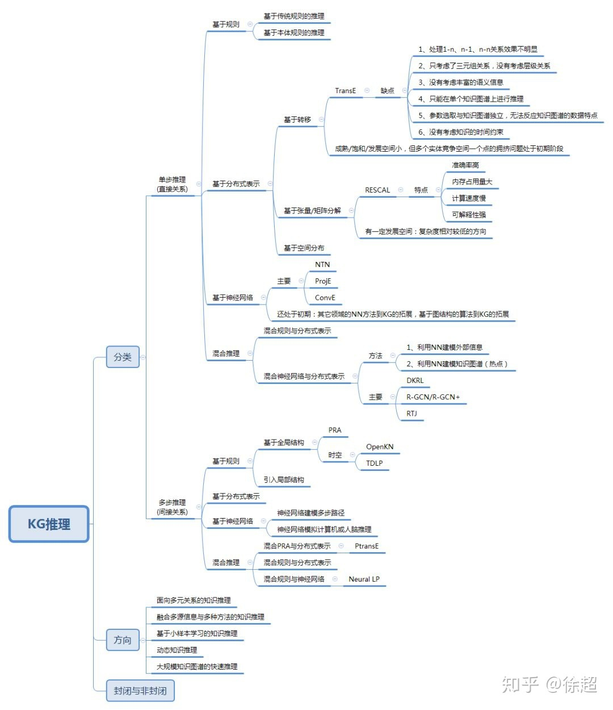

[TOC]

# 知识推理

基于知识图谱的应用主要包括如何利用这种包含语义的数据进行知识的挖掘、发现、推理以发现新知识或者实现上层的如搜索、问答、决策、推荐等。

## 1. 知识推理的作用

推理作为知识图谱的一个主要应用，具体的作用或者说应用场景有哪些呢？

- 发现新知识
  图谱中的有些实体之间没有关联，但是它们之间有关系。

- 问答、搜索推荐
  
## 2. 知识推理的基本原理

知识推理的算法可以分为两大类：基于规则的推理和基于算法的推理。

### 2.1 基于规则的推理

基于规则的推理也就是基于逻辑的推理。这种类型的方法要解决大量逻辑定义（也就是规则）下的推理问题。相关的算法有：

基于可满足性的算法：GSAT、WALKSAT等；
基于前向链接的算法：rete

通过业务本体框架中的相关约束做相关的推理，比如类别推理、属性推理等。

### 2.2 基于算法的推理

## 3. 知识图谱推理算法

常见的算法：

- 距离模型SE
- 单层神经网络SLM
- 能量模型SME
- 双线性模型LMF
- 张量神经网络NTN/ProjE
- 矩阵分解模型RESCAL
- 乘法方法SimpIE、DistMULT(不区分头尾实体)、HOLE(区分头尾实体)、CompIEx(虚实向量)、Analogy(类比推理)
- TransE 同一语义空间表示
- TransH 让一个实体在不同的关系下有不同的表示
- TransR 认为不同的关系拥有不同的语义空间(实体向关系空间投射)
- CTransR 细分关系
- TransD：为头尾实体构建不同的投影矩阵（矩阵与实体关系都相关）
- TranSparse：为头尾实体构建不同的投影矩阵（不同的矩阵稀疏度）
- TransA：损失函数中距离度量改用马氏距离，并为每一维的学习设置不同权重
- TransG：用高斯混合模型来描述头尾实体（一种关系，对应多种语义；每种语义用高斯分布表示）
- KG2E：头尾实体的向量差用高斯分布表示，关系也用高斯分布表示，评估两个分布之间的相似度
- ConvE：图结构的多层卷积网络

SimplE:

(1)每个实体表示成两个向量：头实体向量和尾实体向量（每个向量是独立的）

(2)每个关系表示成两个关系：顺关系和逆关系向量

DKRL：

(1)结构化信息的表示：原有的算法

(2)描述性信息的表示：用CBOW或者深度学习网络对描述信息进行建模

(3)能量函数：Es+Ed(Edd+Esd+Eds)

OpenKGC:

(1)只用文本信息特征来学习实体和关系的表示；

(2)能为没有见过的实体学习表示向量（但该构成该实体的单词必须是固定的）

PTransE:

(1) 可靠性路径的选择；

(2) 路径的表示学习（语义表示-组合表示）

R-GCN/R-GCN+：

(1) GCN提供了一个为图节点表示学习的框架；

(2) R-GCN提供了一个三元组自编码解码的评分方法；

每种类别下的重要算法

张量神经网络：SLM、NTN、ProjE

图卷积网络：R-GCN/R-GCN+、ConvE

分布式+规则的混合：Naual Lp、DKRL、RTJ、ComplexER、ComplexE+NNE

基于路径的建模：PTransE

多源信息融合的建模: DKRL、KGC、NLFeat、TEKE_H、SSP

### 几个重要趋势

- 融合其它多源信息：
    融合三元组实体的描述信息
    融合三元组实体的属性信息
    融合网络文本信息（把单词作为研究基准/把实体作为研究基准）
    融合其它知识库信息

- 加入路径信息
    加入业务规则信息
    编码解码的原理、多层卷积模型
- 混合使用
