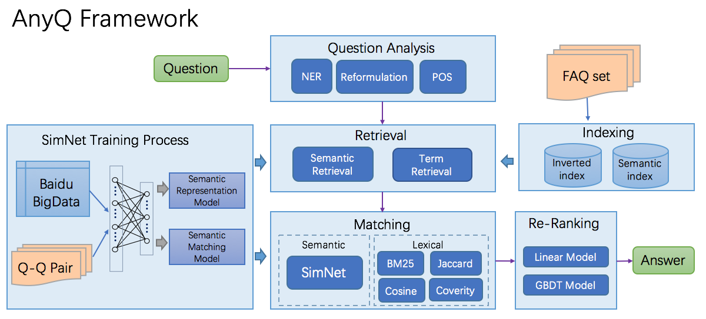
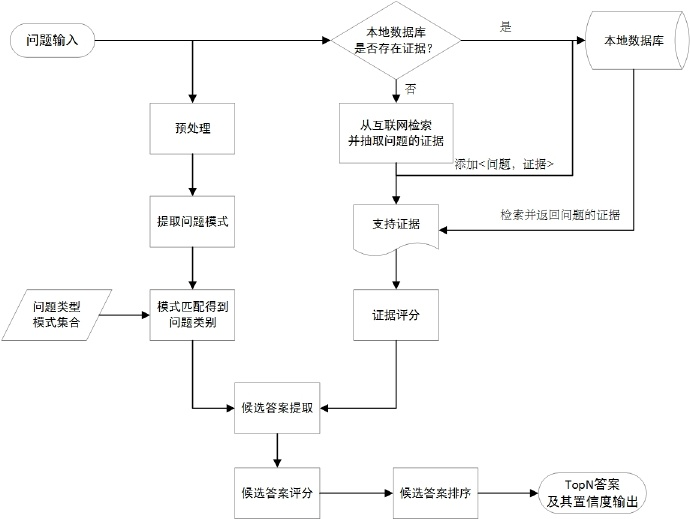

[TOC]

# 开源问答系统

## 1. 目前有哪些？(2019)

1. [AnyQ](https://github.com/baidu/AnyQ)
2. [DrQA](https://github.com/facebookresearch/DrQA)
3. [QuestionAnsweringSystem](https://github.com/ysc/QuestionAnsweringSystem)

## 2. 分别介绍

### 2.1 AnyQ

AnyQ(ANswer Your Questions)，百度开源的一个问答系统项目。这个项目主要包含两部分：面向FAQ集合的问答系统框架和文本语义匹配工具SimNet。

问答系统框架采用了配置化、插件化的设计，各功能均以插件形式加入，当前共开放了20+个插件。开发者可以使用AnyQ系统快速构建和定制适用于特定场景的FAQ问答系统，并加速迭代和升级。

SimNet是百度自然语言处理部于2013年自主研发的语义匹配框架，该框架目前在百度各个产品上广泛应用，主要包含：BOW、CNN、RNN、MM-DNN等核心网络结构形式，同时基于该框架也集成了学术界主流的语义匹配模型，如MachPyramid、MV-LSTM、K-NRM等模型。SimNet使用PaddleFluid和Tensorflow实现，可方便实现模型扩展。

AnyQ的架构图如下：

从框架图上我们可以看出，AnyQ主要有Question Analysis、Retrieval、Matching、Re-Rank等部分组成。

### 2.2 DrQA

DrQA是Facebook开源的开放域问答系统，通过理解wikipedia的内容来回答用户的问题。

DrQA针对“机器阅读规模”(MRS)的任务，这种情况需要我们从大量的非结构化文档中搜索答案。因此，系统需要能够结合文档检索和文档理解功能。

### 2.3 QuestionAnsweringSystem

后面简称此系统为QAS。

QAS是用Java实现的一个机器问答系统，能够自动分析问题并给出候选答案。

系统架构如下：

工作的原理：

1. 判断问题的类型（也是在判断答案的类型），目前其使用的是模式匹配的方式；这里是一个分类问题，后面可以使用的模型还有很多。
2. 提取问题关键词。
3. 利用关键词搜索多个数据源，当前的数据源主要是人工标注的语料库、谷歌、百度。
4. 从搜索结果中根据问题的类型提取候选答案。比如：人名型就会对候选数据进行分词，得到词性为人物的词作为候选答案。数字型答案，就会从候选语句中提取数字作为候选答案。
5. 结合问题以及搜索结果对答案进行打分。
6. 返回得分最高的答案。

目前支持5种类型的的问题：

1. 人名
   APDPlat的作者是谁？
   APDPlat的发起人是谁？
   谁死后发布了七十二疑冢？
   习近平最爱的女人是谁？
2. 地名
   “海的女儿”是哪个城市的城徽？
   世界上流经国家最多的河流是哪条？
   世界上最长的河流是什么？
   汉城是哪个国家的首都？
3. 机构团体名
   BMW是哪个汽车公司制造的？
   长城信用卡是哪个银行发行的？
   美国历史上第一所高等学府是哪个学校？
4. 数字
   地球表面积有多少平方公里？
   北京大学占地多少平方米？
   撒哈拉有多少平方公里？
5. 时间
   哪一年第一次提出大跃进的口号？
   大庆油田是哪一年发现的？
