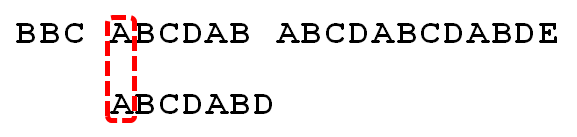
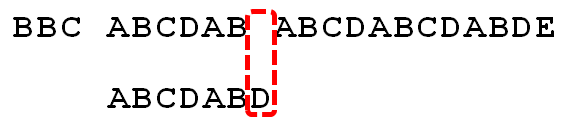

[TOC]

# KMP算法详解

在介绍KMP之前，我们先要明确要解决的问题。

给定字符串root，及一个模式串pattern，目标是从root中找出与pattern匹配的子串出现的位置。

## 暴力匹配

面对这个问题，最直接的做法就是：

假设root字符串匹配到了位置i，pattern匹配到了位置j，接下来：

- 如果i和j对应的字符相等，那么继续i=i+1, j=j+1;
- 如果i和j对应的字符不相等，那么j=0， i=i-(j+1);

举例展示这个处理过程：

暴力破解每次i和j都要回溯，其实这里存在很大的重复劳动，因为j之前的字符已经和i之前的相应位置的字符做过了比较。其实i是不需要回溯的，j也不一定需要回溯到0，利用pattern字符串中的规律可以做到，这也是KMP算法的核心。

## KMP算法

KMP，Knuth-Morris-Pratt，是由Donald Knuth、Vaughan Pratt、James H. Morris三个人于1977年联合发表。

KMP算法描述：

同样假设当前root字符串匹配到了i位置，pattern匹配到了j位置。

- 如果j = -1，或者当前字符i和j相等，则i++， j++，继续匹配下一个字符；
- 如果j != -1，且当前字符匹配失败，则令i不变，j = next[j]。

从上面我们可以看出，next数组的含义：假设next[j] = k，就表示pattern[0,k-1] = pattern[j-k,j-1]是相等的。

利用KMP算法，前面暴力匹配的做法最后一步可以如下优化：

## KMP算法复杂度

root长度为n，pattern长度为m。

复杂度：O(n+m)

## 参考

1. [很详尽的KMP算法](https://www.cnblogs.com/ZuoAndFutureGirl/p/9028287.html)
