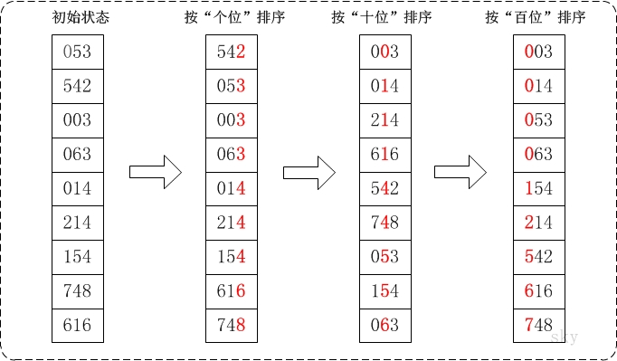

[TOC]

# 基数排序

基数排序是一种**非比较型整数排序算法**，核心思想就是：将整数按位从低位到高位以此比较大小。

基数排序是**桶排序**的扩展。

注意：这里所说的整数并不是一定要是整数，对于格式规范的数据，比如日期、浮点数、字符串，其实都可以用基数排序算法进行排序的。

## 1. 一个简单的例子

1. 将要排序的数字统一成相同的长度，不足的左侧补0。
2. 从个位开始，比较大小，然后十位比较大小，以此类推。注意：同一位比较大小时要求是稳定的。
3. 最后，得到一个有序的数值。

## 2. 动态效果

## 3. 算法复杂度

算法是**稳定**的。

**时间复杂度：**
这个时间复杂度比较好计算：$count*length$；其中 count 为数组元素最高位数，length为元素个数；所以时间复杂度：$O(n*d)$。

**空间复杂度：**
空间复杂度是使用了两个临时的数组：10 + length；所以空间复杂度：$O(n)$。

## 基数排序 vs 计数排序 vs 桶排序

这三种排序算法都利用了**桶的概念**，但对桶的使用方法上有明显差异：

- 基数排序：根据键值的每位数字来分配桶；
- 计数排序：每个桶只存储单一键值；
- 桶排序：每个桶存储一定范围的数值；
