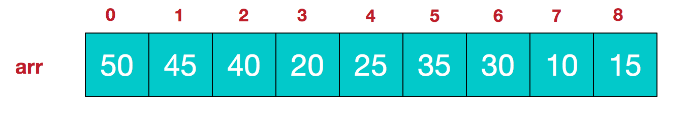

[TOC]

# 堆排序

先来一个简单的介绍：堆排序就是在**堆这种数据结构**进行排序的算法。堆排序**是一种选择排序**，它的最好、最坏、平均复杂度都是$O(nlogn)$，同时它也是一种**不稳定**的排序。

## 1. 关于堆

**堆**是满足如下条件的**完全二叉树**：每个结点的值都大于或等于其左右孩子结点的值，这称为大顶堆；或者每个结点的值都小于等于其左右孩子结点的值，这称为小顶堆。


讲到这里，提到了完全二叉树，那么就需要简单介绍一下完全二叉树和满二叉树。

### 1.1 满二叉树

就是说深度为$k$二叉树，有$2^k-1$个结点，那么这棵二叉树就是满二叉树。

从下图中直观感受一下：


### 1.2 完全二叉树

树的深度为$k$，前$k-1$层是满二叉树，但是最后一层可以不完全填充，但是子节点都是靠左对齐。

直观感受如下图：


### 1.3 堆的存储结构

上面提到的堆的定义及特征反映的是堆的逻辑结构，所谓逻辑结构就是堆要对外体现出的功能和属性特征。而存储结构则是指的堆在计算机的存储层面的形式。

**堆同常用数组结构来存储。**


使用上面的存储结构，我们可以如下定义大顶堆和小顶堆：
**大顶堆**：arr[i] >= arr[2i+1] && arr[i] >= arr[2i+2]
**小顶堆**：arr[i] <= arr[2i+1] && arr[i] <= arr[2i+2]

从存储结构我们也能得到一点启发：堆排序其实就是把数据按照堆的逻辑结构来构建，借助堆本身的特性来实现高效的排序。同时，我们一直到了为什么要求是完全二叉树，因为只有是完全二叉树，才能利用数组索引来查找子结点。

## 2. 堆排序详解

先总的说明一下堆排序的思路：

1. **建堆**：如果升序排列用大顶堆，降序排列用小顶堆；
2. **堆顶元素沉淀**：指的就是将堆顶元素与堆底交换；
3. **调整堆**：前面堆顶与末尾元素交换后，将除了最后一个元素外剩下元素从新建堆，通过不停地将堆顶元素与堆尾元素交换，来完成数据的排序。

接下来，通过举例来解释堆排序的过程：

## 2.1 建堆过程

1. 假设原始待排序数据如下，图的上面部分是逻辑结构视图，下面是存储结构视图：
   

2. 从最后一个非叶子结点开始，从其左右孩子结点中选择一个最大的与其交换：
关于求一个结点的父结点的公式：假设一个结点的索引为i，那么它的两个孩子结点分别为$2i+1$和$2i+2$，反过来，假设一个结点索引为k，它的父节点的索引为i，那么有$2i+1=k$，或者$2i+2=k$，如果要准确计算，可以根据k是奇数还是偶数来决定。但是没有必要，可以直接通过$(k-1)/2$取整数来去定。

(4-1)/2 = 1，故第一个非叶子节点索引为1：


3. 接下来，索引等于1-1=0的另一个非子结点，从其左右孩子中选择一个最大的与父结点交换：
   

   这次交换导致子堆不符合大顶堆的条件了，调整子堆的数据。
   

   **注意**：其实，每次只要发生了父子结点的交换，那么就要继续判断交换的子结点对应的子树是否需要修正。

### 2.2 调整堆

这个步骤就是不停地重复两个过程：1. 把堆顶与堆末尾元素交换；2. 调整除了末尾元素之外的元素重新构成一个堆。

1. 将堆顶元素9与末尾元素4交换。
   

2. 重新调整结构，使其满足堆的定义。
   

3. 再将堆顶元素8与末尾元素5交换。
   

4. 继续上面的过程，如此反复，最终得到如下有序的序列。
   

### 2.3 动态构建过程


## 3. 复杂度与稳定性

堆排序的复杂度包含两部分：建堆过程，堆调整过程。

**建堆过程：**

```java
// 循环建立初始堆
for (int i = length / 2; i >= 0; i--){
    HeapAdjust(list, i, length);
}
```

建堆过程，是一个完全二叉树调整结构的过程。层数有$log_2{n}$层，第$i$层总共有$2^i$个结点，这些节点最多会需要往下走$log_2{n}-i$层。

故有：
$T(n) = \sum_{i=0}^{log_2{n}}{2^i}*(log_2{n}-i)$
$=2n-log_2{n} - 2$
$=O(n)$

**堆调整过程：**
调整一个堆顶元素到堆底的复杂度就是堆的深度$log_2{n}$，总共需要$n*log_2{n}$。

**稳定性：**
不稳定排序。原因就在于一个数据，从完全二叉树的逻辑结构去看时，结点与孩子结点是跳跃的。所以调整结点与孩子结点的顺序就有可能改变相同数据的相对位置。

## 4. 堆排序的优缺点

**优点：**
对数据的有序性不敏感，最好、最差、平均时间复杂度都是$O(nlon_2{n})$。

堆排序占花费是时间主要是在建堆的时候。所以在数据量方面来说，如果数据量越大，堆排序的优势就越明显。

**缺点：**
缓存局部性差。

## 5. 堆排序与快排对比

堆排序虽然和快排复杂度都是$O(nlog_2{n})$，但是堆排序的复杂度的**常系数比较大**。但是，堆排序最差情况的时间复杂度也是$O(nlog_2{n})$，这一点比快排的$O(n^2)$强。

还有一点，堆排序的**缓存局部性**较差，因为堆排序移动数据是跳跃性比较大。

## 6. 堆排序与选择排序

直接选择排序中，为了从 R[1..n]中选出关键字最小的记录，必须进行 n-1 次比较，然后在 R[2..n]中选出关键字最小的记录，又需要做 n-2 次比较。事实上，后面的 n-2 次比较中，有许多比较可能在前面的 n-1 次比较中已经做过，但由于前一趟排序时未保留这些比较结果，所以后一趟排序时又重复执行了这些比较操作。堆排序可**通过树形结构**保存部分比较结果，可减少比较次数。

## 参考

1. [图解排序算法(三)之堆排序](https://www.cnblogs.com/chengxiao/p/6129630.html)
2. [排序（6）：堆排序](https://cuijiahua.com/blog/2018/01/algorithm_6.html)
3. [堆排序](https://www.cnblogs.com/skywang12345/p/3602162.html)
