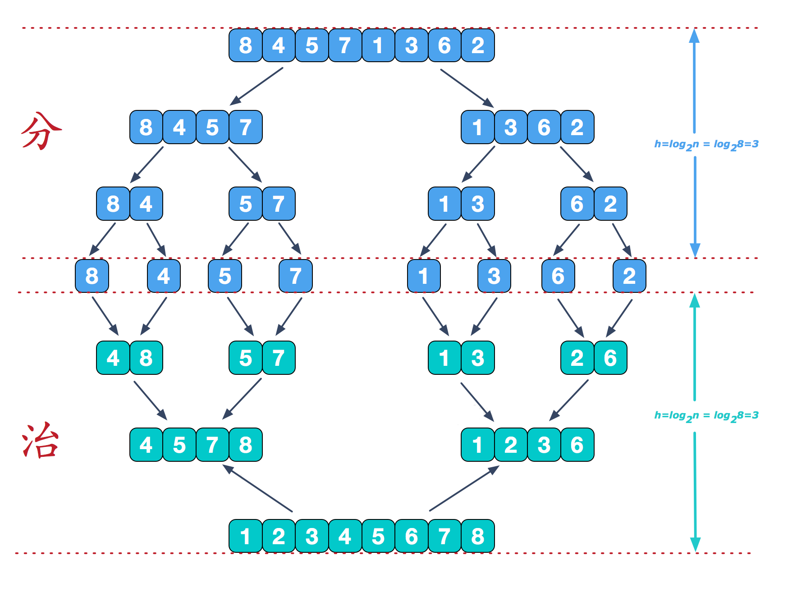
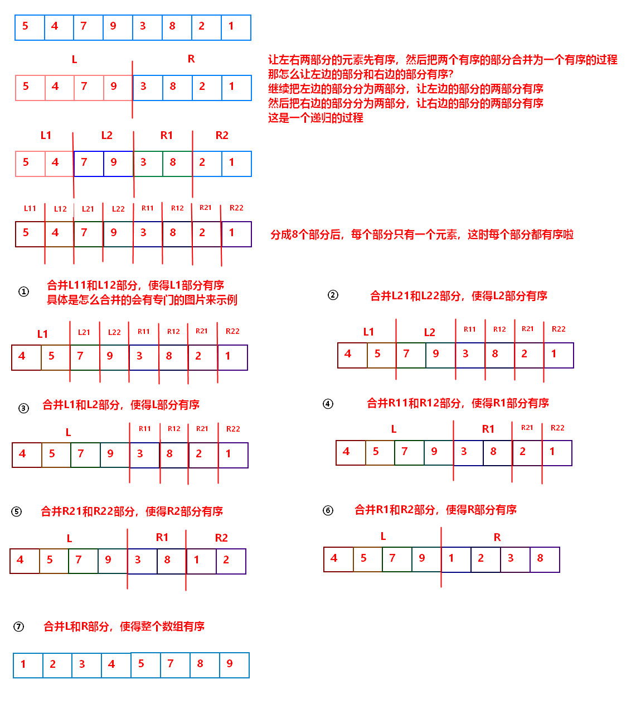
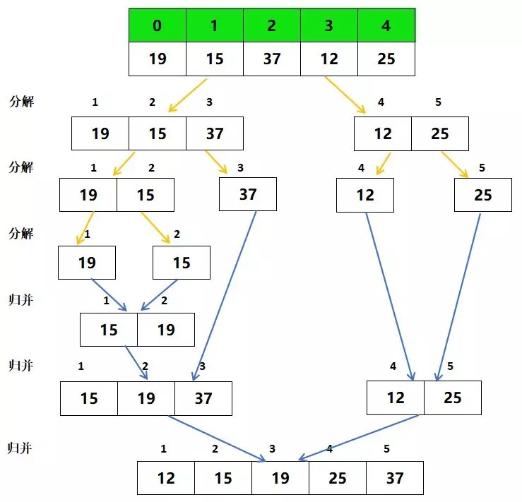
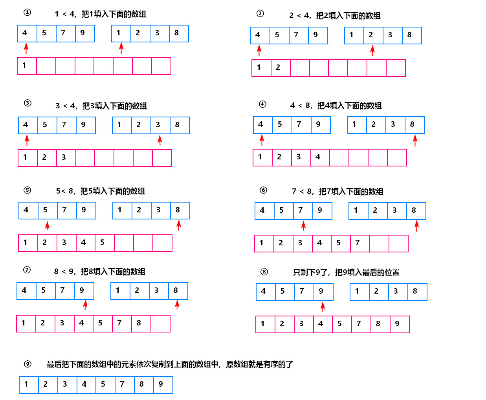

[TOC]

# 归并排序

归并排序的核心思想就是“分而治之”，是分治法最典型的代表。

分，就是把大问题分成规模小的子问题，这些子问题是原来问题规模小的实例，也就是与原问题同质；

治，把每个小问题解决了，然后合并小问题的结果。

## 1. 归并排序的简单描述

这里给出归并排序的简单文字描述，算是对图描述的补充形式。

归并排序的思路：

1. 将待排序序列平均分为两份，得到两个待排序列；
2. 将1得到的两个待排序列，每个再分割为两个待排序列，直到序列只有一个元素；
3. 从底层开始，逐渐合并排序结果。

下图就是上面文字描述的最好图示。

归并排序除了分解，然后就是一个合并过程，合并时解决问题的另一个关键步骤。下图给出合并过程解决问题的思路。

## 2. 动态展示

## 3. 复杂度分析

**时间复杂度**：
$O(nlogn)$，最好、最坏、平均都是这个复杂度。

从前面的图示我们可以看出，归并排序的过程就是一个二叉树，每一层需要$O(n)$复杂度的比较，总的比较次数就是二叉树的深度$logn$，所以复杂度是$O(nlogn)$。

**空间复杂度**：
$O(n)$，因为在进行合并操作时，需要一个大小为n的数组来存放排序好的元素。

**稳定性**：
稳定的。

## 参考

1. [排序（7）：归并排序](https://cuijiahua.com/blog/2018/01/algorithm_7.html)
2. [排序算法：归并排序](https://zhuanlan.zhihu.com/p/36075856)
