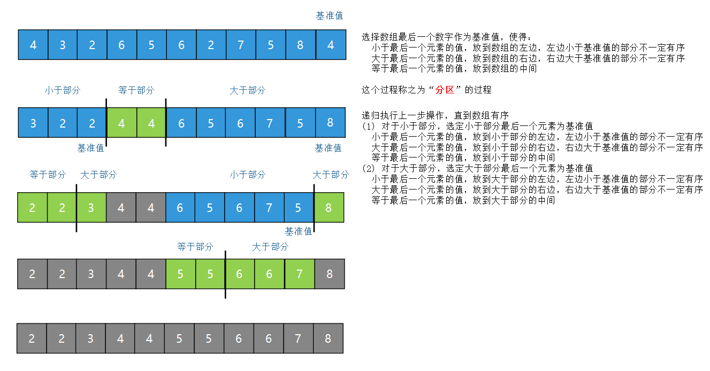
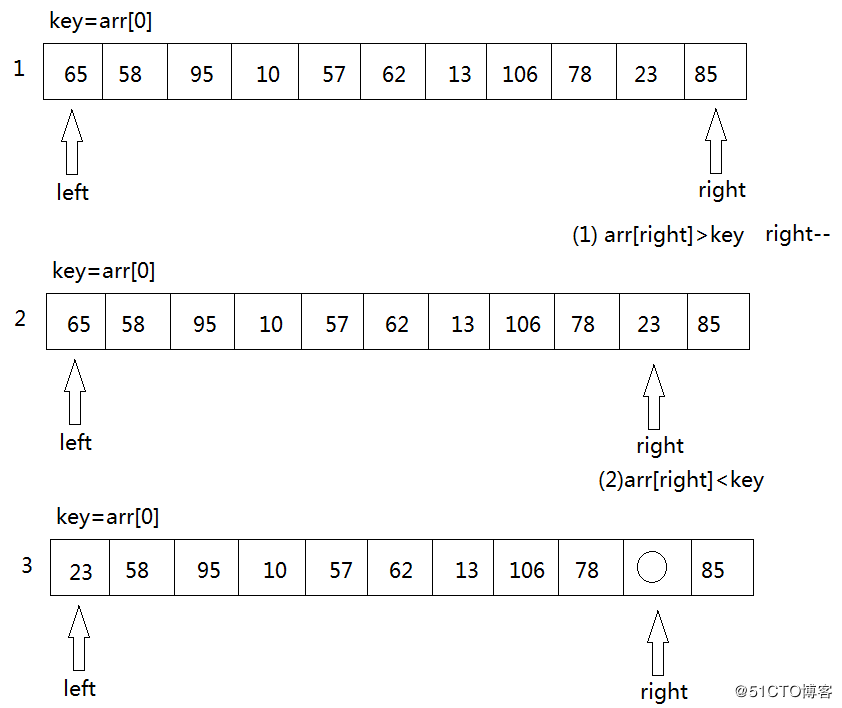
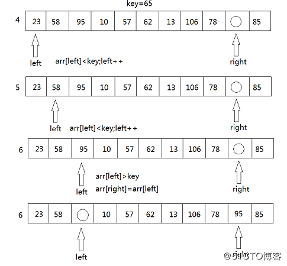
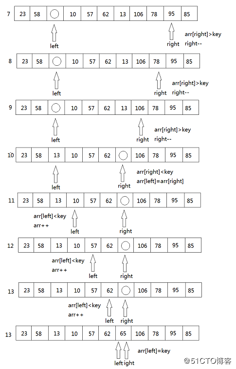

[TOC]

# 快速排序

快速排序是C.R.A.Hoare于1962年提出的一种划分交换排序，核心思想就是“分治法”。

既然是分治法，那么就有一个“分”、“治”和“合并”的过程。

分区的过程，其实就完成了一个元素的位置的确定，分完的区，就构成了另外的子问题，然后基于重复分区操作，如此递归，最后完成问题的解决。

由于快速排序是“原址排序”，所以不存在合并的操作。

## 1. 快排的思路

虽然前面已经间接的说明了快排解决问题的思路，这里还是需要简单的总结：

1. 选取一个基准。

基准的选取有两类策略：**固定的选取**最开始的元素或者结尾的元素，之所以固定选择两端的元素，是因为方便程序的处理；**随机选取**，然后将随机选择的元素交换到开始或者结尾的位置，然后在进行接下来的操作。

2. 将待排序元素分到基准的两端。

过程就是通过**两个哨兵**，将除基准元素外的其他元素分割为三个区域，一个是其中元素比基准小的区；第二个区是元素比基准大的区；第三个区是等待与基准比较的区。通过将确定的元素与这些区边界处的元素交换来增加区的大小，知道真个序列只有两个分区为止。

注意，这里的两个哨兵的设置是有不同的做法的，常见的是设置low和high两个哨兵，分别从两端向中间靠拢，中间是待确定分区，low之前是小于基准的，high之后是大于基准的。

《算法导论》中给出的做法则是两个哨兵都从起始端开始，假设前后两个哨兵分别为i和j，i之前，包括i，的元素是比基准小；i到j之间的是比基准大；j之后的是待确定；等j结束了，就完成了一次分割。

3. 对得到的两个分区，递归调用快排方法。

## 2. 快速排序图示

### 2.1 哨兵从两端开始

### 2.2 哨兵从一端开始

## 3. 快排为什么快

这里给出一个直观的解释，通过一个“基准”，将元素分为两部分，小于基准的元素和大于基准的元素之间就不存在后续的重复比较了，这样减少了很多不必要的比较。

## 4. 算法复杂度分析

1. 最坏情况

每次选择的基准都是序列中最大或者最小的元素。
$$C_{max} = \sum_{i=1}^{n-1}{n-1} = \frac{n(n-1)}{2} = O(n^2)$$

2. 最好情况

每次的基准都是最中间，时间复杂度$O(nlogn)$。

3. 平均复杂度

复杂度：$O(nlogn)$。

## 5. 快排优化

前面介绍的快速排序的做法有下面几个可以优化的点。

### 5.1 基准的选择

我们前面提到的基准选择有两种做法，从一端选择，或者随机选择，这两种做法都是不好的。最简单的例子是：比如已经是有序的序列，如果我们从一端选择，那么就会编程最坏的情况。

最理想的情况是选中其中的中间值，但是哪个是中间值我们是无法知道的，所以在选择“基准”之前，对待排序序列进行简单的**抽样评估**，评估序列的**有序性**。

最常用的做法是“三数取中”法，就是从序列中最后一项、第一项、中间项中选择一个中位数作为基准。但是对于大数组，这种做法太过粗糙，还有一种做法就是按照一定的步长抽样，然后选中其中的中位数作为基准。

### 5.2 分区策略

在前面“算法思路”部分，我们提到“两个哨兵”将序列划分为三个区，小于基准的区，大于基准的区和未排序的区。我们也提到了两种做法，哨兵从一端开始或者哨兵从两端开始。那么，哪个方式更好呢？

更好的方式是**从两端开始分区**，为什么？因为之中做法可以将元素**一步到位放到正确的分区**中。

### 5.3 重复元素

如果序列中有大量重复的元素，极端一点，元素都是相等的。那么快速排序就退化为最差情况了。这种情况如何优化呢？

思路就是增加分区：**小于pivot、等于pivot、大于pivot 三个分区**。“等于基准”的区不需要参与后面的排序，所以排序性能会极大优化。

### 5.4 优化小数组效率

**为什么要优化小数组？**
因为对于规模很小的情况，快速排序的优势并不明显（可能没有优势），而递归型的算法还会带来额外的开销。于是对于这类情况可以选择非递归型的算法来替代。

**多小的数组算小数组？替换的算法是什么？**
通常这个阈值设定为16（ v8 中设定的是10），替换的算法一般是选择排序。据说阈值的设定是要考虑更好地利用 cpu 缓存。

### 5.5 监控递归过程

这里我要说的是内省排序。想想看，我们已经做了一些努力来避免快速排序算法进入最坏的情况。但事实上可能并不如我们想象地那么理想。理想情况下，快速排序算法的递归尝试会到多深呢？这个很好回答：$logN$。好，如果现在递归深度已经到了$logN$，我会觉得很正常，毕竟不太可能每次都是最好情况嘛；那如果此时递归深度达到$2logN$呢？我想你应该慌了，比理想情况递归深了一倍还没有结束。而此时，我觉得可以认为可能已经进入最差情况了，继续使用快速排序只会更遭，可以考虑对这个分区采用其他排序算法来处理。通常我们会使用堆排序。为啥要用堆排序？因为它的平均和最差时间复杂度都是$O(NlogN)$。这就是内省排序的思想。

### 5.6 优化递归

内省排序虽然会避免递归过深，但它的目的并不是为了优化递归。

在分区过程中，我们其实是把一个大的问题分解成两个小一点的问题分别处理。这时我们需要考虑一下，这两个小问题哪个更小。先处理更小规模的问题，再处理更大规模的问题，这样可以减小递归深度，节约栈开销。

楼上也有人提到了尾递归。对于支持尾递归的语言，自然是极好的，小规模的问题先递归，减少递归深度，大规模的问题直接通过尾递归优化掉，不进入递归栈。

### 5.7 并行

对于大规模的排序，可以将递归过程并行化。
