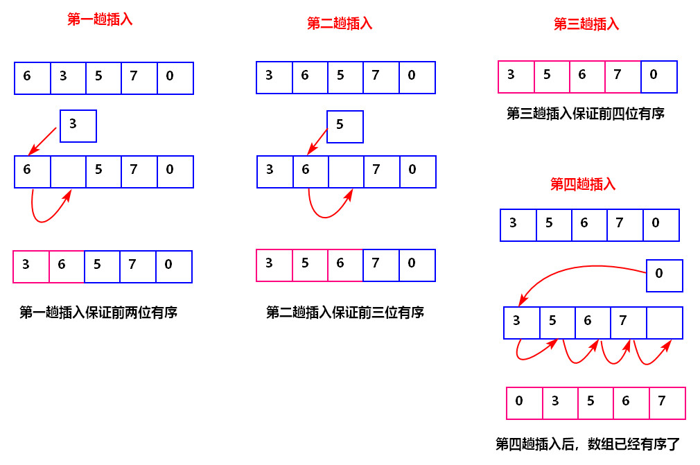
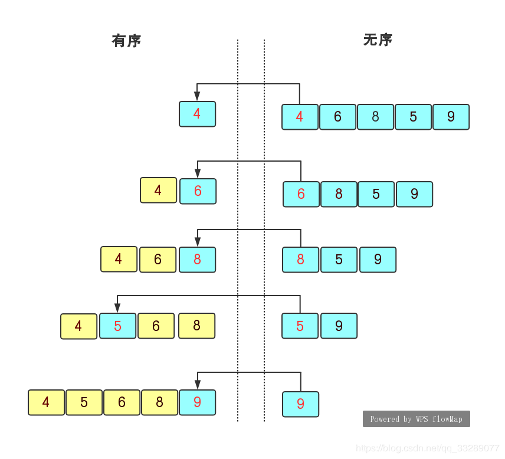
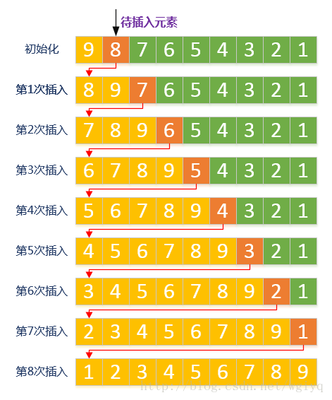

[TOC]

# 插入排序

插入排序用一句话描述就是：将一个待排序元素插入到一个已经有序的序列中。

## 1. 复杂度和稳定性

**时间复杂度**：
最好的情况是数据本来就有序，那么只需要比较n-1次，但是不用数据移动，复杂度$O(n)$。

最坏的情况是数据完全反序，此时时间复杂度为$O(n^2)$。

**空间复杂度**：
$O(1)$

**稳定性**：
稳定。因为遇到相同的元素，就不再发生交换。

## 2. 优化

需要优化的点就是查找新的元素在有序列表元素中的位置这个操作，这里可以二分查找的方式。
