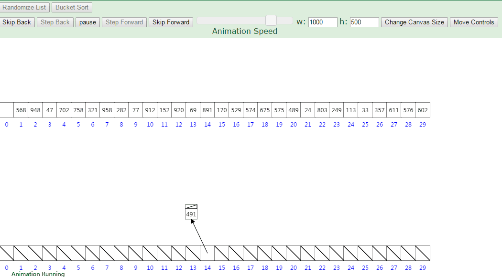

[TOC]

# 桶排序

桶排序从1956年就开始被使用，该算法的基本思想是由 E.J.Issac R.C.Singleton 提出来。

桶排序是将待排序集合中处于同一个值域的元素存入同一个桶中，也就是根据元素值特性将集合拆分为多个区域，则拆分后形成的多个桶，从值域上看是处于有序状态的。对每个桶中元素进行排序，则所有桶中元素构成的集合是已排序的。

桶排序可以说是彻底的“分而治之”思想。

## 1. 算法详解

桶排序算法可以分为三个部分：

1. 确定映射规则，或者说映射函数，将元素映射到不同的桶中；
2. 对同一桶内的元素，选择合适的排序算法进行排序；
3. 合并排序后的每个桶内的元素到统一的集合中，即可得到最终结果。

第一步是很关键的，映射规则需要根据数据元素的分布情况来决定。设计不好，可能会导致两个极端：所有元素都被映射到了一个桶上；每个元素都映射到一个单独的桶上。第一个极端，排序退化为常规的其他排序算法；第二种极端则是演化为了计数排序。

## 2. 举例说明

### 2.1 一个简单的例子

假设有如下待排序序列：

[-7, 51, 3, 121, -3, 32, 21, 43, 4, 25, 56, 77, 16, 22, 87, 56, -10, 68, 99, 70]

**第一步，定义映射规则：**
映射规则定义为：$f(x) = \frac{x}{10} - \frac{min}{10}$，其实就是将元素区间大小定位10。桶的个数为$\frac{max}{10} - \frac{min}{10} = 14$。

**第二步，遍历待排序元素，添加到桶中：**

**第三步，每个桶内的元素进行排序，并移到原来的存放元素的列表中。**

### 2.2 另一个例子

待排序的序列为：[63, 157, 189, 51, 101, 47, 141, 121, 157, 156, 194, 117, 98, 139, 67, 133, 181, 13, 28, 109]

动态效果图如下：注意，这里的序列和上面的序列是不一样的。

## 3. 复杂度分析

### 3.1 时间复杂度分析

第一步，复杂度是$O(n)$，因为是将n个元素移动到不同的桶中。

第二步，假设总的元素数量为N，桶数量为M，则平均每个桶有$\frac{N}{M}$个元素。假设我们每个桶采用的排序算法的复杂度是$O(nlogn)$，那么M个桶的复杂度是$M*\frac{N}{M}log{\frac{N}{M}} = N(logN - logM)$。

如果$M = N$，则复杂度为O(N)，计数排序的复杂度。如果$M=1$，则退化为常规排序复杂度为O(N + NlogN)。

### 3.2 空间复杂度分析

$M$个桶，假设格外的N个元素的空间，共$O(M+N)$。

### 3.3 稳定性

这个取决于每个桶采用的排序算法。如果桶内排序的算法稳定，那么桶排序稳定，否则，不稳定。

## 4. 桶排序与快排

快速排序是将集合拆分为两个值域，这里称为两个桶，再分别对两个桶进行排序，最终完成排序。桶排序则是将集合拆分为多个桶，对每个桶进行排序，则完成排序过程。两者不同之处在于，快排是在集合本身上进行排序，属于原地排序方式，且对每个桶的排序方式也是快排。桶排序则是提供了额外的操作空间，在额外空间上对桶进行排序，避免了构成桶过程的元素比较和交换操作，同时可以自主选择恰当的排序算法对桶进行排序。

## 5. 桶排序与计数排序

当然桶排序更是对计数排序的改进，计数排序申请的额外空间跨度从最小元素值到最大元素值，若待排序集合中元素不是依次递增的，则必然有空间浪费情况。桶排序则是弱化了这种浪费情况，将最小值到最大值之间的每一个位置申请空间，更新为最小值到最大值之间每一个固定区域申请空间，尽量减少了元素值大小不连续情况下的空间浪费情况。

## 6. 桶排序的应用

桶排序在海量数据中的应用

一年的全国高考考生人数为500 万，分数使用标准分，最低100 ，最高900 ，没有小数，你把这500 万元素的数组排个序。

分析：对500W数据排序，如果基于比较的先进排序，平均比较次数为$O(5000000*log5000000)≈1.112亿$。但是我们发现，这些数据都有特殊的条件：$100=<score<=900$。那么我们就可以考虑桶排序这样一个“投机取巧”的办法、让其在毫秒级别就完成500万排序。

方法：创建801(900-100)个桶。将每个考生的分数丢进f(score)=score-100的桶中。这个过程从头到尾遍历一遍数据只需要500W次。然后根据桶号大小依次将桶中数值输出，即可以得到一个有序的序列。而且可以很容易的得到100分有几人，501分有几人。

实际上，桶排序对数据的条件有特殊要求，如果上面的分数不是从100-900，而是从0-2亿，那么分配2亿个桶显然是不可能的。所以桶排序有其局限性，适合元素值集合并不大的情况。
