[TOC]

# 计数排序

计数排序也是一个非比较型排序算法(还有一个是基数排序)，此算法是由Harold H. Seward于1954年提出。这种非比较型排序算法的一大特点就是需要借助于额外的空间，而且要依赖于数据本身的有序的特性，然后将复杂度降到$O(n)$。

基于比较的排序算法的复杂度有一个**理论边界**：$O(nlogn)$。

计数排序过程中不存在元素之间的比较和交换操作，根据元素本身的值，将每个元素出现的次数记录到辅助空间后，通过对辅助空间内数据的计算，即可确定每一个元素最终的位置。

## 1. 算法详解

我们从计数排序的基础版开始介绍，后面逐渐介绍其升级改进版。

### 1.1 基础版算法

这应该是一个很基础、直接的计数排序算法的思路。

算法步骤：

1. 找出最大元素max；
2. 创建数组count，数组大小为max+1，数组每个元素的默认值都是0；**注意**：为什么数组大小为max+1，这是为了能够将元素的值直接作为数组的索引来使用；
3. 遍历待排序数组的每一个元素，将数组count[value]的值增加1；
4. 遍历count数组，至于从大到小还是从小到大，取决于排序方向。如果对应位置元素不为0，那么将对应位置的索引值填充到结果数组中，count数组对应为止的值减1，直到元素值为0，在开始下一个位置，直到遍历结束。
5. 得到结果数组。**注意**：结果数组可以使用原始数组的空间来存储。

这种做法可以解决一些比较特殊的场景，比如元素值都是大于等于0的，且元素是从很小的值开始比较均匀的分布的。

算法举例：
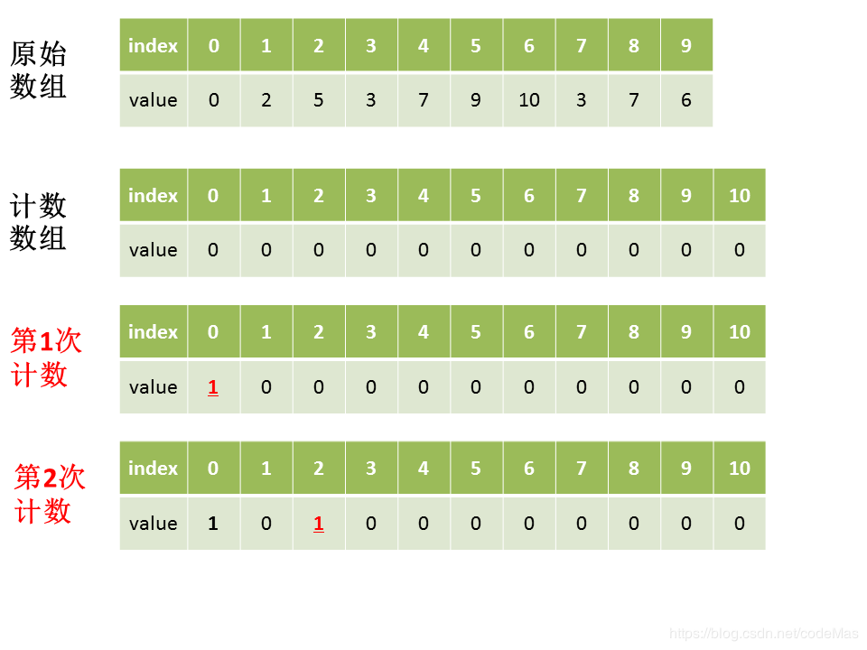
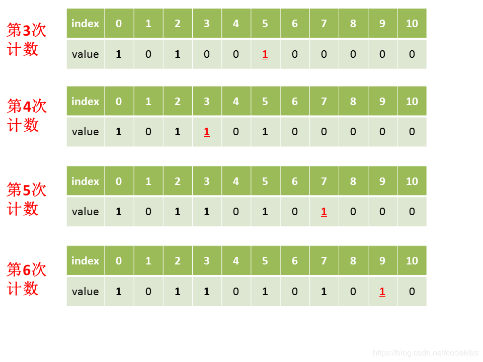
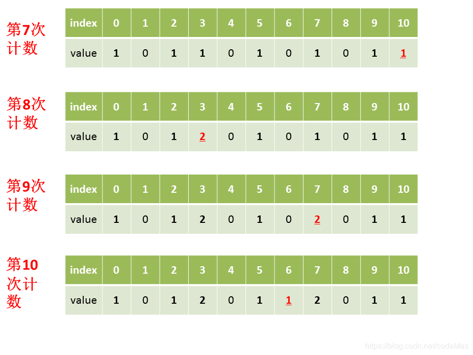

我们可以很容易发现基础版计数排序算法的缺陷，也就是前面说的应用场景。一旦不是前面说的场景，比如元素的值为负，就无法直接作为索引；或者元素的值都几种在不较大的不连续区间等等，这种做法就会很浪费空间。

这些问题可以通过优化版来解决。

### 1.2 优化版计数排序

确定计数数组的区间大小的方式改为：$max - min + 1$，由此来确定区间。同时 $value - min$，来确定value值的索引位置。

当从count数组取值时，将索引位置加上min值便是真正的数值了。

不再文字描述具体过程，直接给出图例：
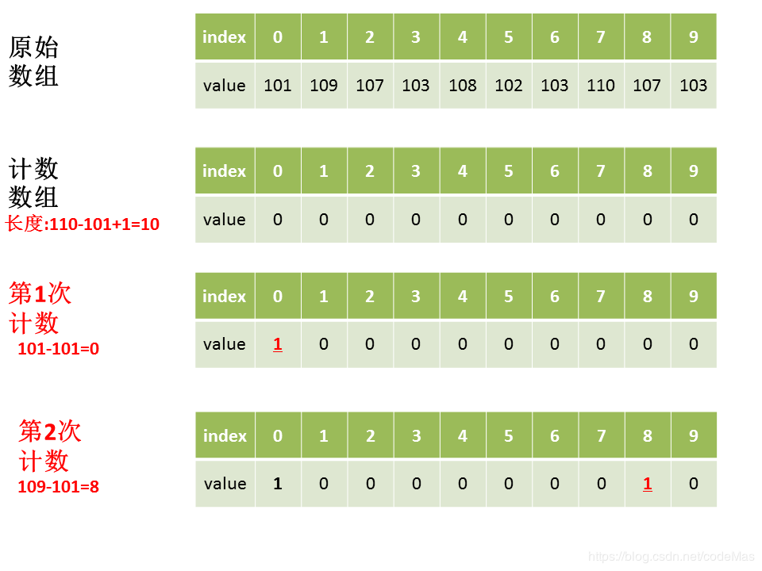
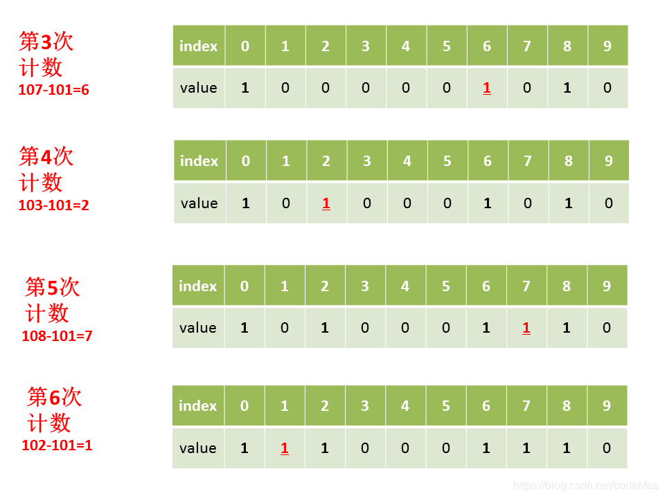
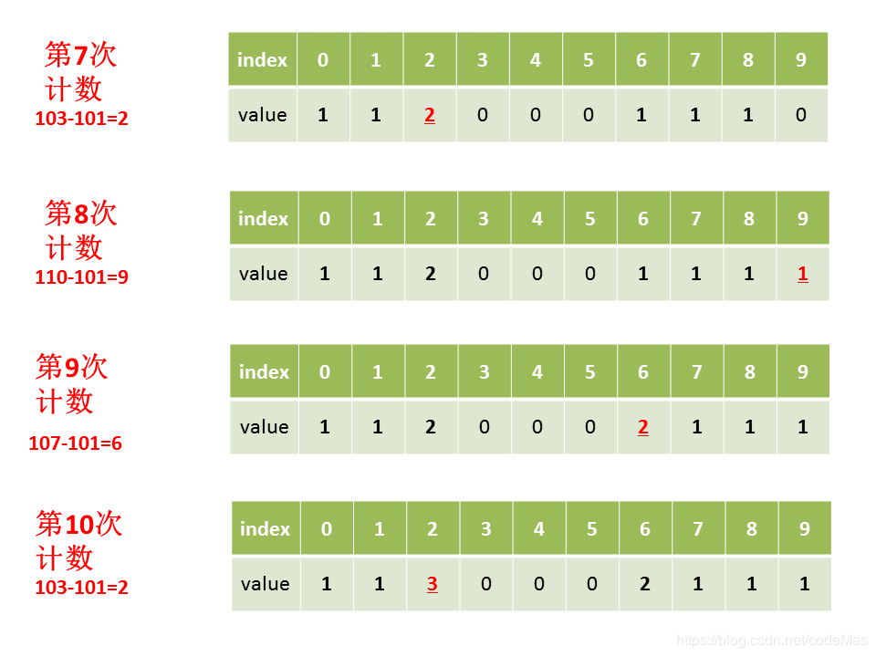

### 1.3 进一步改进

前面的方式存放到结果列表中的每个元素都是我们程序生成出来的。但是，如果我们不想中间生成元素，而是希望使用原来的元素，怎么办呢？这时，就需要这一种改进方法，直接确定元素的位置，然后把原始元素放到相应的位置上。

在1.2图示的步骤之后，继续如下步骤：$count[i+1] = count[i+1] + count[i]$;
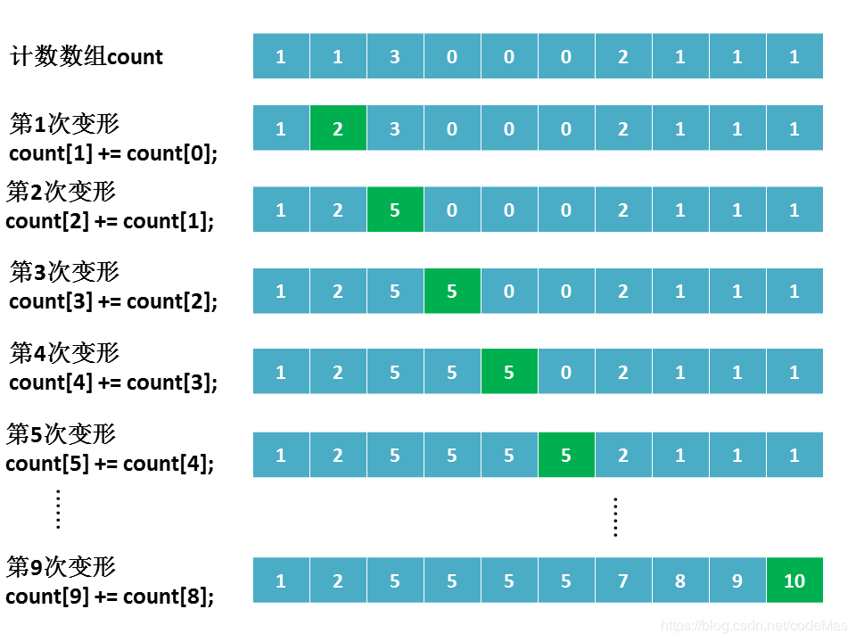

这样得到的新的数组的元素的值就能反映相应元素的位置信息。

接下来如何确定元素的位置，不再文字描述，直接通过举例解释：
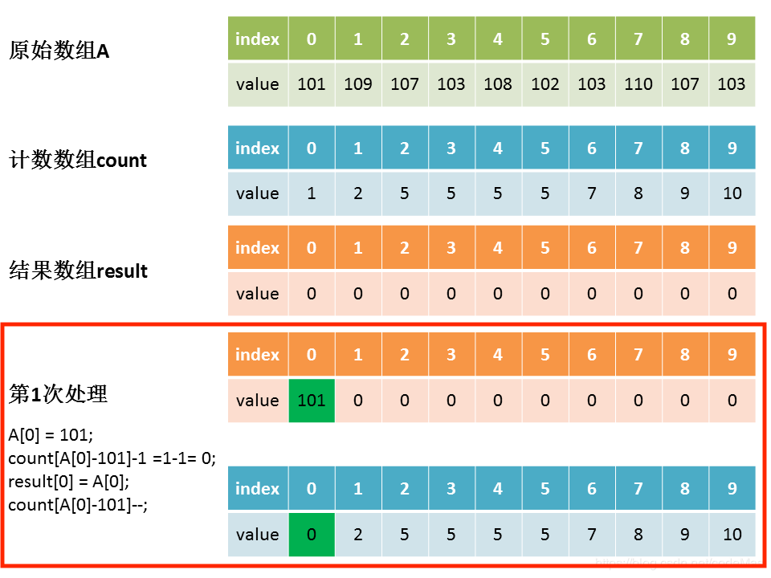
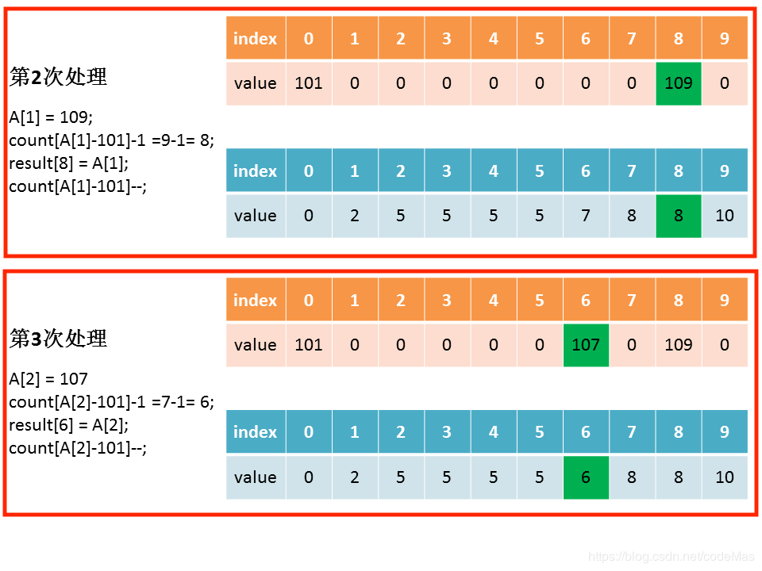
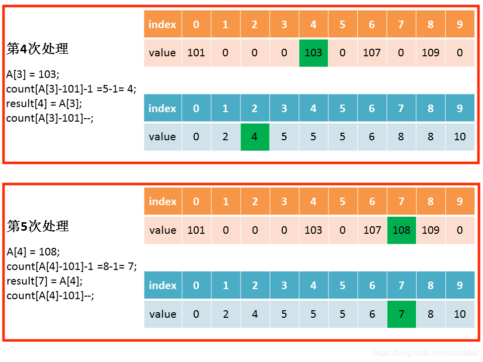
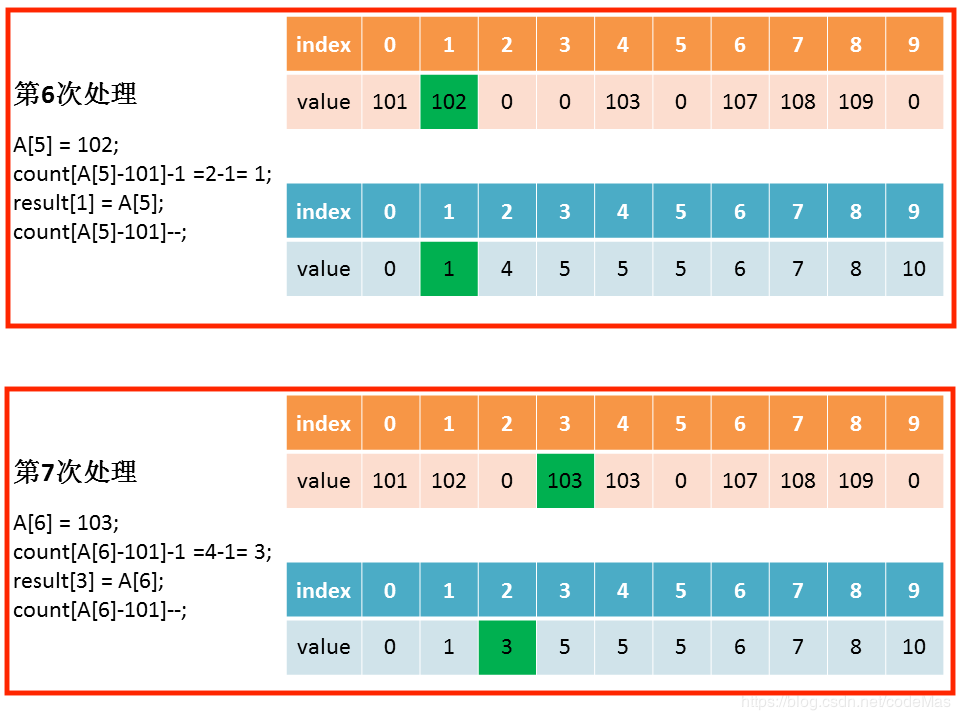
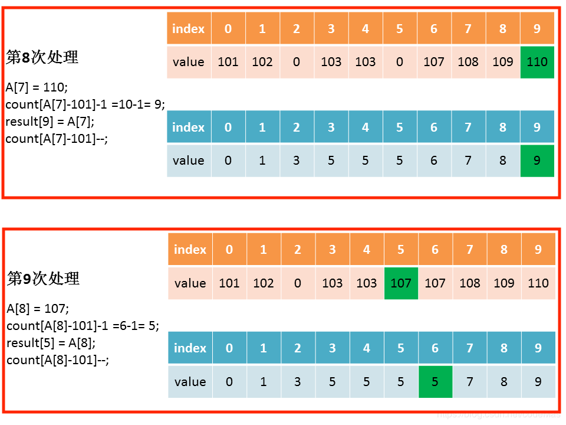
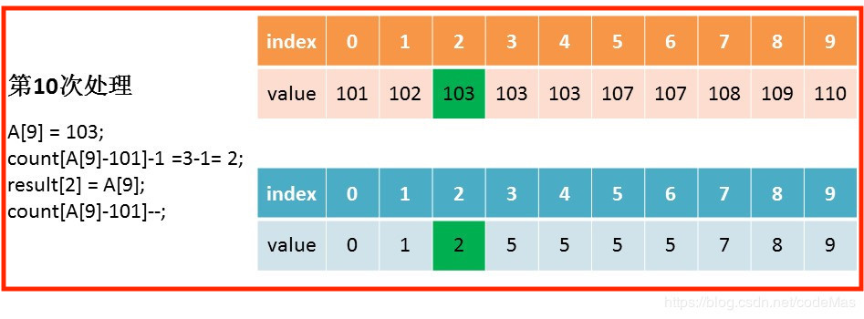

### 1.4 额外思考的问题

1.3中的做法是不稳定的排序，因为之前最先在数组中出现的元素会被移到后面，如何解决这问题呢？

有两种做法：一种是1.3构建count数组的方式，但是遍历input时，倒序遍历。另一种做法是构建count数组时，修改count每个元素的取值逻辑，让每个元素的取值不是对应位置元素的截止位置，相反是开始位置即可。

1.3中的例子，构建得到的count序列为：0,1,2,5,5,5,5,7,8,9。

## 2. 复杂度分析

**时间复杂度：**
根据前面的分析，算法的时间复杂度主要是涉及两个数组的遍历，一个是原始元素列表的遍历，另一个是count数组的遍历。

假设原始元素数组大小为N，count数组大小为K，那么复杂度为$O(N+K)$。

**空间复杂度：**

空间复杂度就是需要一个额外的存储count的数组，还有，也需要一个存储排序结果的和原始元素数组大小相同的数组，所以空间复杂度也是$O(N+K)$。

**稳定性：**
稳定性取决于怎么实现的，可以是稳定的，也可以是不稳定的。

## 3. 小结

计数排序算得上是桶排序的一种特殊形式，映射函数把值相同的元素映射到一个桶中，每个桶中只有一个大小的元素。所以，如果我们找到合适，满足这种形式的映射函数，那么就可以实现用$O(N)$复杂度的排序。

空间和时间，算法很多时候就是这两个资源之间的博弈，有时拿空间换时间，有时拿时间换空间。

## 参考

1. [一文弄懂计数排序算法！](https://www.cnblogs.com/xiaochuan94/p/11198610.html)