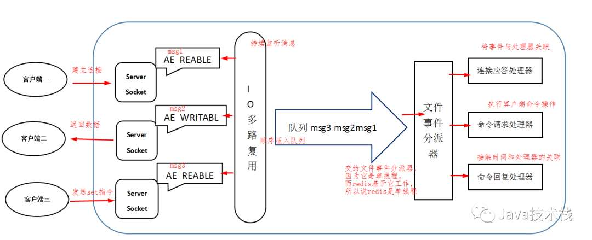

[TOC]

# Redis是单线程吗？

这个问题是源于微信公众号《Java技术栈》中的一篇文章，它引出了我一个之前就知道的疑问，之前听别人说过“Redis是单线程”，但是并未理解这句话是什么含义。这里借助那篇公众号内容，简单记录一下相关的知识点。

## 1. 知识点概括

这篇文章主要讲了如下几点内容：

1. Redis单线程，只是最核心的消息队列的处理是单线程的，或者说是核心的主线是单线程的。
2. 单线程，不是只有一个线程，整个流水线还是由多个线程处理；
3. 其他模块或任务，存在多线程的处理方式。

## 2. 单线程指的是什么

Redis的单线程指的是执行Redis命令的核心模块是单线程的，也就是发送到Redis的请求，处理过程可以理解为一个流水线，其中的某个环节单线程的。并非说Redis整个服务就是单线程工作的，Redis的其他模块都有自己的工作线程。

那么到底哪个环节是单线程的呢？

上面这个图是公众号中给出的关于Redis处理消息的流程。

Redis基于Reactor模式开发了网络事件处理器，这个处理器被称为文件事件处理器。它有四部分组成：多个套接字、IO多路复用程序、文件事件派发器、事件处理器。

其中文件事件派发器对应队列的消费是单线程的，所以Redis才叫单线程模型。

## 3. Redis的单线程与多线程

Redis的瓶颈不在CPU，而在于网络和内存。如果想要利用CPU的多核资源，可以启动多个Redis进程。

其实Redis 4.0开始就引入了多线程的概念，比如Redis通过多线程方式在后台删除对象、以及通过Redis模块实现的阻塞命令。

Redis 6.0中使用了多线程IO，就是在处理网络数据的读写、协议解析等，使用了多线程，但是核心模块还是单线程。

## 4. Redis单线程却能高并发，为什么

- redis是基于内存的，内存读写很快
- redis的是单线程的，省去了很多多线程上下文切换的时间
- redis虽然是单线程，但采用了**IO多路复用**技术，非阻塞IO，即多个网络连接复用一个线程，保证多连接的同时增加系统的吞吐量
- redis的数据结构，采用hash,读取速度比较快
