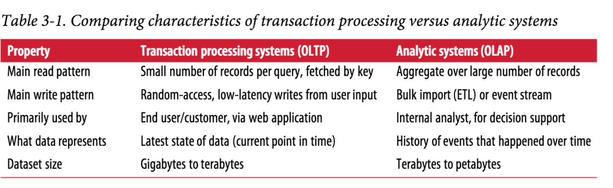
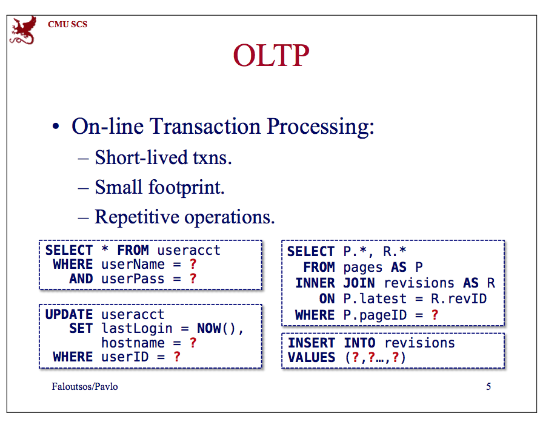
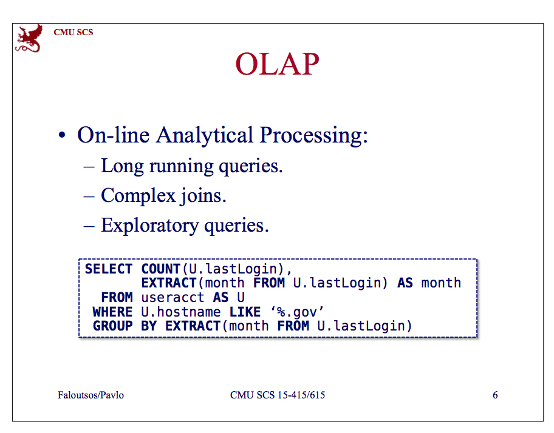
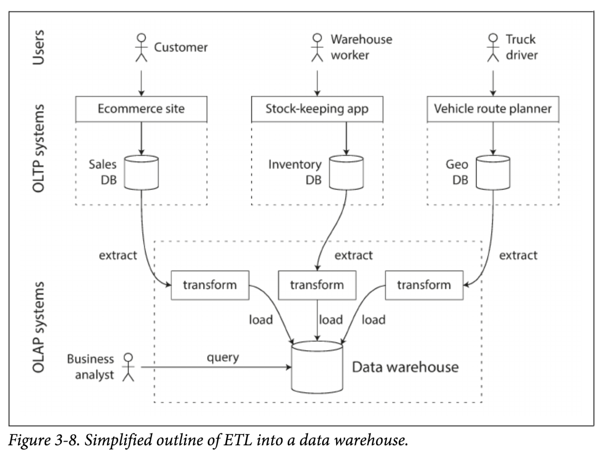
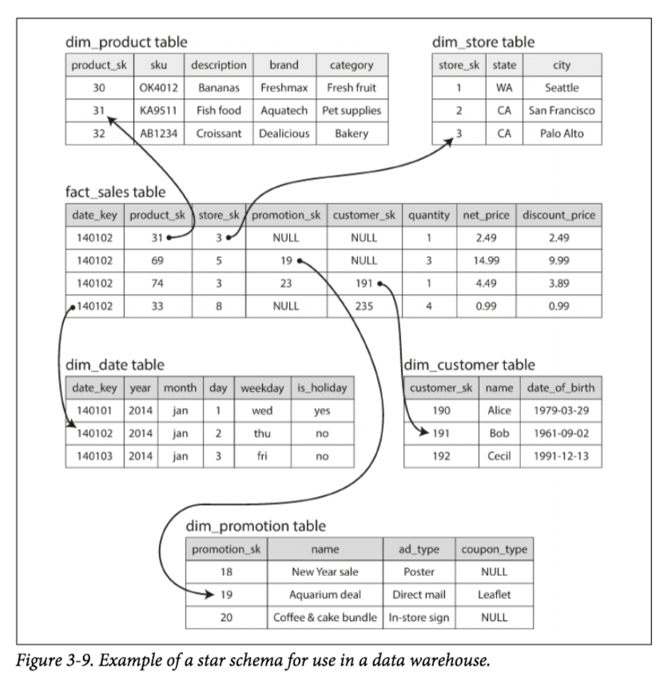
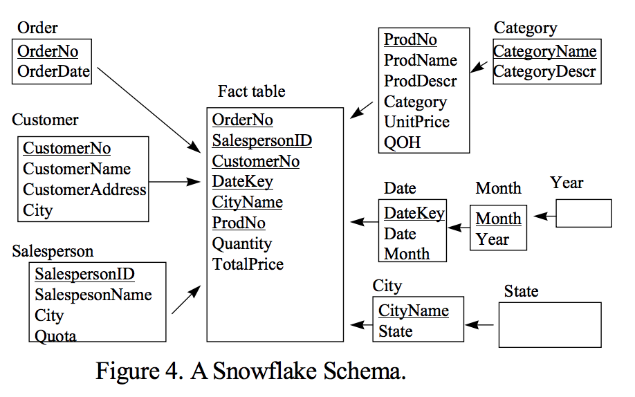
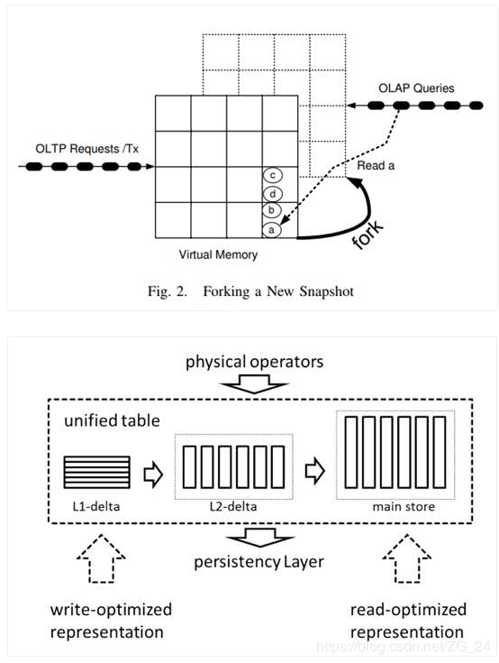

[TOC]

# OLTP & OLAP & HTAP

- OLTP是Online Transaction Processing的简称，联机事务处理；
- OLAP是OnLine Analytical Processing的简称，联机分析处理；
- HTAP是Hybrid Transactional/Analytical Processing的简称。

**Transaction**是指形成一个逻辑单元，不可分割的一组读，写操作；**Online**一般指查询延迟在秒级或毫秒级，可以实现交互式查询。

## 1. OLTP

OLTP的查询一般只会访问少量的记录，且大多时候都会利用索引。在线的面向终端用户直接使用的Web应用：金融，博客，评论，电商等系统的查询都是OLTP查询，比如最常见的基于主键的CRUD操作。

## 2. OLAP

OLAP的查询一般需要Scan大量数据，大多时候只访问部分列，聚合的需求（Sum，Count，Max，Min等）会多于明细的需求（查询原始的明细数据）。 OLAP的典型查询一般像：现在各种应用在年末会发布的大数据分析和统计应用，比如2017豆瓣读书报告，2017豆瓣读书榜单，网易云音乐2017听歌报告； OLAP在企业中的一个重要应用就是BI分析，比如2017年最畅销的手机品牌Top5;哪类人群最喜欢小米或华为手机等等。

## 3. OLTP & OLAP

《Designing-Data-Intensive-Applications》一书指出的OLTP和OLAP的主要区别如下：

在CMU-CS 15-415的课程中对OLAP和OLTP这样介绍：

在《An Overview of Data Warehousing and OLAP Technology》论文中对OLAP和OLTP这样介绍：

**OLTP的特点：**

- 专门用来做日常的，基本的操作
- 任务由短的，原子的，隔离的事务组成
- 处理的数据量在G级别
- 重视一致性和可恢复性
- 事务的吞吐量是关键性能指标
- 最小化并发冲突

**OLAP的特点：**

- 专门用来做决策支持
- 历史的，总结的，统一的数据比具体的，独立的数据更重要
- 侧重于查询
- 查询吞吐量和相应时间是关键性能指标

OLTP与OLAP对比：

通过前面对OLTP和OLAP特点的介绍，大家对OLTP和OLAP应该有了感性的认识。

最开始的时候，数据量比较小，所以数据库可以用来同时做OLTP和OLAP查询的，比如Mysql，如果数据比较小的话，Mysql的OLAP查询性能也是可以满足需求的。但是随着数据量越来越大，大概在1990年代，业界开始用单独的数据库来满足OLAP需求，并把这种专门满足OLAP需求的数据库称之为数据仓库（Data Warehousing）。这样做的原因是为了保证在线OLTP业务的稳定性，不让复杂的OLAP查询线上业务的稳定性和性能。

Data Warehousing是所有决策支持技术的集合，目标是让行政管理人员，分析人员做出更好，更快的决策；Data Warehousing是主题相关的，完整的，时间变化的，稳定的数据集合，被用来作为组织制定决策的主要依据。Data Warehousing一般是公司各个OLTP系统数据的只读Copy， 数据一般会从各个OLTP数据库中抽取（Extract）出来，进行数据清理，并转换（Transform）为对OLAP更友好的数据格式，最终导入（Load）进Data Warehousing中。 这就是所谓的Extract–Transform–Load (ETL)过程，下图是个示例。 目前业界使用最广泛的Data Warehousing应该都是基于**Hive构建**的。

Data Warehousing的数据模型主要有两类：星型模型和雪花模型。 下图是张星型模型的示例，星型模型中的表分两类： fact table和 dimension tables。fact table的每一行记录特定时间发生的一条事件，fact table中的列一般分为两类：维度和指标。 维度一般表示一条事件的who, what, where, when, how, and why，指标一般是数值型的属性，比如价格，点击量，访问量等。 所谓的维表就是维度信息的详细描述，一般维表的主键和事实表中的外键进行关联。

所谓的雪花模型，就是将维表进一步拆为为子维表。如下图所示，Year维表和Month维表就是从Date维表中进一步拆分出来的。

星型模型和雪花模型名称的来源都是根据模型的样子命名的，星型模型是多个维表围着中间的事实表，比较像星星，雪花模型是看起来比较像雪花。一般在公司业务实际中使用更多的是星型模型，因为星型模型更加简单。

前面简介了下OLTP和OLAP的特点，上面的特点决定了OLTP和OLAP在存储模型，查询计划的生成和优化上都是有很大区别。在[畅想TiDB应用场景和HTAP演进之路](https://blog.bcmeng.com/post/tidb-application-htap.html#5-tidb-htap-%E6%BC%94%E8%BF%9B%E4%B9%8B%E8%B7%AF) 一文中，我解释了为什么OLTP系统需要行存，而OLAP系统需要列存。 正因为OLTP和OLAP在技术实现上的区别较大，所以在较长时间内，现在的数据库要么只满足OLTP需求，要么只满足OLAP需求。 但是这样做有以下缺点：

- 数据需要存储多份
- 数据从OLTP系统进入OLAP系统会有延迟
- OLTP系统和OLAP系统向外保留的查询接口可能不一致
- 需要同时维护多套系统
- 用户有额外的学习成本

正因为有以上问题，所以有人提出了HTAP的概念，即一个系统同时很好的满足OLTP和OLAP的需求。 但显然HTAP系统目前还是有很多挑战的，比如OLTP需要行存，OLAP需求列存，怎么同时满足行列两种存储需求？比如如何生成对OLTP和OLAP都最优的查询计划？ 比如如何保证OLTP和OLAP的查询不相互影响，如何进行资源隔离等等。我在畅想TiDB应用场景和HTAP演进之路中简单提了如何在存储上同时满足OLTP和OLAP。

HTAP本质上和最初地一个单机数据库同时满足OLTP和OLAP一样，但问题是在大数据，分布式化的今天，一个系统要同时很好地满足OLTP和OLAP需求显然会难许多，但这些难题或许终将一个一个被解决。

## 4. HTAP

数据库系统一般可以按照负载类型分成操作型数据库（Operational Support System）和决策型数据库（Decision Support System）。操作型数据库主要用于应对日常流水类业务，主要是面向消费者类的业务；决策型数据库主要应对的是企业报表类，可视化等统计类业务，主要面向企业类的业务。

针对两类系统的数据管理和系统设计方式都有很大差异。  

1. 对OLTP的数据模型采用基本的约束E-R图模型，而OLAP的数据模型则需要采用特殊的“星型模型”，数据立方等数据仓库相关的技术。  

2. 对OLTP的数据存储通常采用行式组织，而OLAP采用列式组织。

3. OLTP的业务通常对实时要求比OLAP高很多。

4. 传统的数据库，为了同时支持两类业务。通常采用两个数据源, 分别对两套系统进行优化设计。

OLTP的数据定期会通过etl（提取，转换，加载）工具把数据同步导入OLAP系统中。这就涉及到数据源滞后的问题。 OLAP的数据滞后，导致分析出来的结果时效性不够，对决策支持类系统的要求不够。比如说，双11期间，用户购物的行为和推荐系统的推荐结果之间的时间差越短，越有可能提高销量。

HTAP是混合 OLTP 和 OLAP 业务同时处理的系统，2014年Garnter公司给出了严格的定义：混合事务/分析处理(HTAP)是一种新兴的应用体系结构，它打破了事务处理和分析之间的“墙”。它支持更多的信息和“实时业务”的决策。

**直接在单一数据源上不加区分的处理TP和AP的方案，目前还不能有效实现。**

当前的方案是进行一个折中。**采用快照的方式，分开处理OLTP和OLAP请求**。让OLAP的请求在OLTP的最新的一致性快照上执行。同时对外暴露一套接口，从而从逻辑来看是一套系统。虽然内部是分开处理OLTP和OLAP的。

这种折衷方案，重要的一点，就是保证快照是尽可能的保持“新”，快照不能太过滞后OLTP的数据。这就需要系统频繁的做快照操作。

目前两种流行的方案，**一个是采用linux的系统快照能力**，提供HTAP服务的方案，比如Hyper数据库系统。另一种是**类似hana的方案，定期生成增量数据，然后合并到AP系统**。如下图。

## 参考

1. [HTAP与OLAP&OLTP之间的关系](http://www.luyixian.cn/news_show_268989.aspx)
2. [OLTP、OLAP与HTAP](https://blog.csdn.net/ZG_24/article/details/87854982)
3. [https://blog.bcmeng.com/post/oltp-olap-htap.html](https://blog.csdn.net/tianyeshiye/article/details/89045784)
4. [OLTP VS OLAP VS HTAP](https://blog.csdn.net/tianyeshiye/article/details/89045784)
