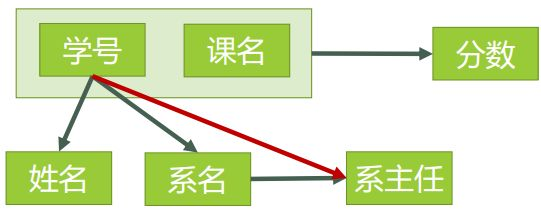
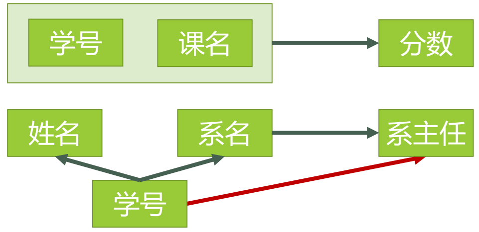
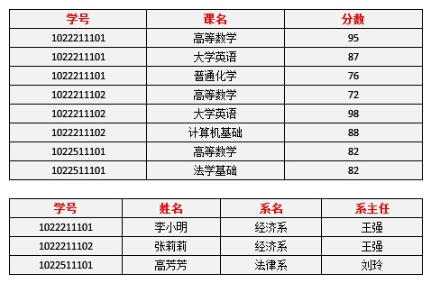
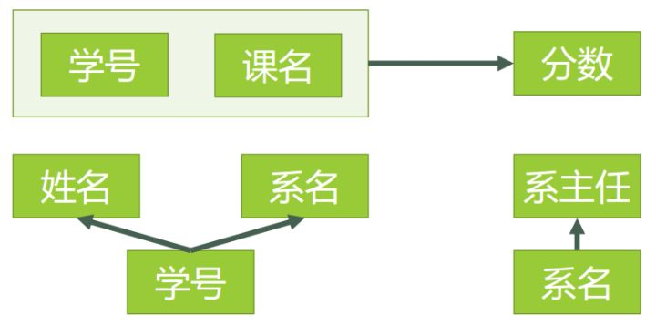
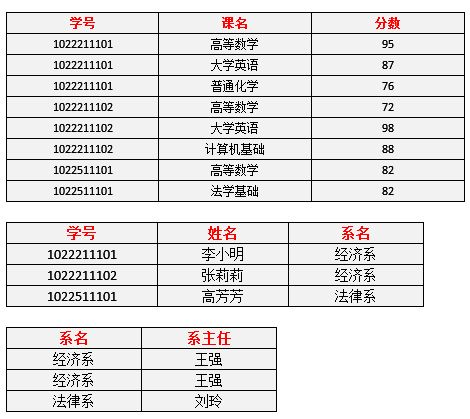

[TOC]

# 关系数据库设计

关系数据库是很多应用开发必备的一种数据存储手段，应用程序要使用关系数据库，要解决的核心问题就是表结构的设计，即“关系数据库设计”。如果业务很简单，只需要简单几张表就可以完成，每张表的数据量也不大，那么我们只是基于对关系数据库的简单认识就设计表问题也不大。纵使中间出现了表设计的不合理，我们也容易修改，我们不用仔细思考就可以解决问题。但如果业务复杂了，需要用到多个相关表格，如果不仔细设计就会影响后期表的扩展，而且表结构设计不合理，从应用建模的角度考虑，对于代码的编写也是有很大影响的，也会影响查询性能。

总结一句话就是：数据库表需要仔细设计。

这就引出了一个关键问题：设计表结构的指导原则是什么？或者说设计表结构时需要关心哪些问题？

## 1. 关系数据库设计范式

范式，Normal Form，就是标准和规范。关系数据库的设计按照从宽到严的标准可以分为多种级别的设计范式：1NF、2NF、3NF、BCNF、4NF、5NF。每一级的范式都是为了解决上一级范式中的不合理之处。

一层一层的设计范式，其实就是通过将表拆分，降低数据冗余，对数据表中的字段进行解耦。

属性能够放到一张数据表中，那么就意味着属性之间就存在了耦合，但是有时根据业务需求，我们不希望之间存在这种耦合，这时我们就需要按照不同范式，将表进行拆分。

设计模式并非强求，只是将表的设计和业务需求相匹配。

### 1.1 1NF

**定义**：符合1NF的关系表中的属性不可再分。

1NF是关系数据库的基本要求，不遵循1NF的关系表是无法创建成功的，所以使用RDBMS，那么一定会符合第一范式。这个范式应该是在不使用关系数据库时才有考虑的意义。

比如下面的表结构就是不符合1NF的。

### 1.2 2NF

我们先通过一个例子来引出2NF，说明2NF的必要性。

比如下面的表：

上面的表是符合1NF的。但是，看到上面的表的第一感觉就是它把很多关联性并不是很强的数据糅合到了一起，数据存在大量的重复。

我们分析一下这张表的设计存在的问题：

1. 数据冗余过大
   学生信息和系信息重复出现多次，本来一条数据就可以描述一个学生在哪个系，再用一条数据描述系信息即可，但是数据却大量重复。

2. 插入异常
   学校新建的系，如果没有招生，那么就无法插入数据，就无法存储系信息。

3. 删除异常
   删除了所有学生，那么系的信息也就没了。

4. 修改异常
   假如小明换到了法律系，那么为了保证数据的一致性，就需要修改三条数据。

为了克服上面的问题，我们引入2NF。

**定义**：表中的**非主属性****完全依赖**于**码**。

**通俗解释**：表中的字段必须完全依赖于主键，而不能依赖于部分主键。

#### 1.2.1 相关概念

定义中涉及到了三个关键概念。为了更严谨地说明问题，我们先介绍几个重要的概念，后面会用到。

1. **函数依赖**
  
一张表中属性(也可能是属性组，即多个属性的组合)X的值确定，必能确定属性Y的取值。那么就称Y函数依赖X。X和Y是函数关系，即$Y = f(X)$。用$X \xrightarrow{F} Y$表示。

上面的学生表中，存在如下函数依赖：

- 学号 $\xrightarrow{F}$ 姓名
- 系名 $\xrightarrow{F}$ 系主任
- 学号 $\xrightarrow{F}$ 系主任
- (学号,课程名) $\xrightarrow{F}$ 分数

函数依赖又可以衍生出：完全函数依赖、部分函数依赖、传递函数依赖。

2. **完全函数依赖**

X -> Y，但是对于X的任何一个真子集，Sub(X) -> Y都不成立，则称Y完全函数依赖X。

3. **部分函数依赖**

存在X的真子集Sub(X)，满足Sub(X) -> Y，则称Y部分函数依赖X。

4. **传递函数依赖**

Z函数依赖于Y，Y函数依赖于X，则称Z传递函数依赖于X。

5. **码**

英文对应于Key。

设K为表中的属性或者属性组，如果K之外的其他属性都完全函数依赖于K，则称K为候选码，简称码。

比如上面学生表中属性组(学号,课名)就是码。

直白的解释就是：唯一确定一条记录，同时唯一性约束又不冗余。

6. **非主属性**

包含在**任何一个码**中的属性称为**主属性**，与之对应的就是**非主属性**。

#### 1.2.2 分析方法

分析一张表的结构设计是否满足2NF的方法：

1. 找出所有的码；
2. 找出主属性；
3. 找出非主属性；
4. 查看是否存在部分函数依赖；

按照上面的步骤对学生表进行分析：

1. 找出码，只有(学号,课名)；
2. 主属性：学号和课名；
3. 非主属性：姓名、系名、系主任、分数；
4. 分析部分函数依赖：
   - 对于（学号，课名） → 姓名，有 学号 → 姓名，存在非主属性 姓名 对码（学号，课名）的部分函数依赖。
   - 对于（学号，课名） → 系名，有 学号 → 系名，存在非主属性 系名 对码（学号，课名）的部分函数依赖。
   - 对于（学号，课名） → 系主任，有 学号 → 系主任，存在非主属性  对码（学号，课名）的部分函数依赖。

函数依赖关系如下图：

按照上面的依赖关系图可以分拆为如下两个表：

分拆后的表数据如下，简称**表4**：

现在看看按照2NF设计的表是否完全解决了前面提到的问题：

1. 李小明转系到法律系只需要修改一次李小明对应的系的值即可。——有改进

2. 数据冗余是否减少了？学生的姓名、系名与系主任，不再像之前一样重复那么多次了。——有改进

3. 删除某个系中所有的学生记录该系的信息仍然全部丢失。——无改进

4. 插入一个尚无学生的新系的信息。因为学生表的码是学号，不能为空，所以此操作不被允许。——无改进

从上面的举例可以看出，仅满足2NF的要求，很多情况下依旧是不够的。我们接下来要通过介绍3NF来尝试解决这个问题。

### 1.3 3NF

**定义**：非主属性与码之间不能存在传递依赖。

**通俗解释**：非主属性只能直接依赖主键。

3NF是为了进一步消除数据的冗余，并解耦数据之间的依赖。

我们从前面的依赖关系图中可以看到，系主任与学号之间存在传递函数依赖，所以不符合3NF设计。

按照3NF对前面的数据表进行改造，得到如下满足3NF的表：

按照3NF新设计的表，进行之前的操作，问题是否得到了解决呢？

- 删除某个系中所有的学生记录
该系的信息不会丢失。——有改进
- 插入一个尚无学生的新系的信息。
因为系表与学生表目前是独立的两张表，所以不影响。——有改进
- 数据冗余更加少了。——有改进

### 1.4 BCNF

先定义一个具体问题，通过问题我们分析仅满足3NF的表设计是否就够了。

- 某公司有若干个仓库；
- 每个仓库只能有一名管理员，一名管理员只能在一个仓库中工作；
- 一个仓库中可以存放多种物品，一种物品也可以存放在不同的仓库中。每种物品在每个仓库中都有对应的数量。

我们用一张表“仓库(仓库名,管理员,物品名,数量)”来存储上面的数据。

这张表属于哪一级NF？

其中存在的函数依赖：

- 仓库名 $\xrightarrow{}$ 管理员
- 管理员 $\xrightarrow{}$ 仓库名
- (仓库名,物品名) $\xrightarrow{}$ 数量

所以，我们可以得到：

**码**：(管理员,物品名)、(仓库名,物品名)
**主属性**：仓库名、管理员、物品名
**非主属性**：数量

故不存在部分函数依赖和传递函数依赖，所以符合3NF。

那么，我们进行如下操作：

- 先新增加一个仓库，但尚未存放任何物品，是否可以为该仓库指派管理员？——不可以，因为物品名也是主属性，根据实体完整性的要求，主属性不能为空。
- 某仓库被清空后，需要删除所有与这个仓库相关的物品存放记录，会带来什么问题？——仓库本身与管理员的信息也被随之删除了。
- 如果某仓库更换了管理员，会带来什么问题？——这个仓库有几条物品存放记录，就要修改多少次管理员信息。

出现上面问题的原因：**存在着主属性对于码的部分函数依赖与传递函数依赖**。这里就是主属性【仓库名】对于码【（管理员，物品名）】的部分函数依赖。

这就引出了BCNF的定义：主属性对于码不存在部分与传递函数依赖。

解决方法就是将上面的表分拆为如下两个表：

- 仓库（仓库名，管理员）
- 库存（仓库名，物品名，数量）

## 参考

1. [如何理解关系型数据库的常见设计范式？](https://www.zhihu.com/question/24696366)
2. [数据库表结构设计方法及原则（li）](https://www.cnblogs.com/RunForLove/p/5693986.html)
