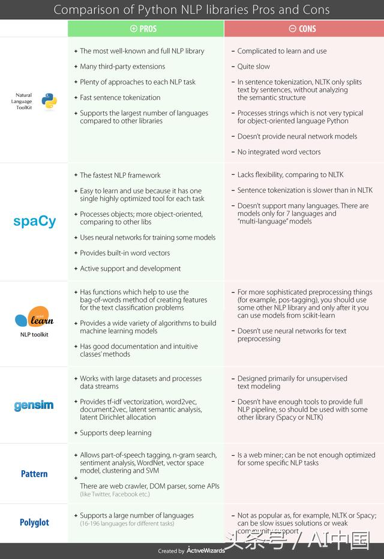

# 常用工具包

## Python语言NLP任务相关经典库

- NLTK 可以处理几乎所有的NLP任务
- Spacy NLTK的主要竞争对手，这两个库用于处理同样的任务
- Gensim 主题、向量空间模型、文档相似性工具包
- Pattern Web挖掘模块，仅支持NLP作为辅助任务

它们之间对比如下：

## Java语言中NLP组件

- [word](https://github.com/ysc/word/)
  - Java分布式中文分词组件，提供了多种基于词典的分词方法，并利用ngram模型消除歧义。
  - 能准确识别英文、数字，以及日期、时间等数量词，能识别人名、地名、组织机构名等未登录词。
  - 能通过自定义配置文件来改变组件行为，能自定义用户词库、自动检测词库变化、支持大规模分布式环境，能灵活指定多种分词算法，能使用refine功能灵活控制分词结果，还能使用词频统计、词性标注、同义标注、反义标注、拼音标注等功能。
  - 提供了10种分词算法，还提供了10种文本相似度算法。
  - 无缝和Lucene、Solr、ElasticSearch、Luke集成。

- [ansj](https://github.com/NLPchina/ansj_seg)  
  - 基于n-gram+CRF+HMM的中文分词器
  - 分钟速度达到每秒大于200万字左右（mac air下测试），准确率能达到96%
  - 包括如下功能：中文分词、中文姓名识别、用户自定义词典、关键字提取、自动摘要、关键字标记等功能

- [Stanford CoreNLP](https://github.com/stanfordnlp/CoreNLP)  
  - Java实现的一整套NLP工具集

- [HanLP](https://github.com/hankcs/HanLP)  
  - 一套实现了很多模型和算法的NLP工具包
  - 主要用于处理中文NLP任务
  - 支持NLP中的大部分功能：分词、关键词提取、自动摘要、短语提取、拼音转换、简繁转换、文本推荐、依存句法分析、文本分类、文本聚类、word2vec、语料库工具