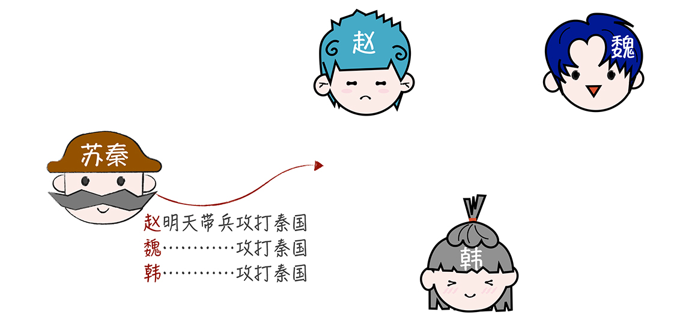

[TOC]

# ACID理论

From 极客时间，韩健。

**ACID，追求一致性。**

先简单介绍一下ACID：

- 原子性（Atomicity）
原子性是指事务是一个不可分割的工作单位，事务中的操作要么都发生，要么都不发生。

- 一致性（Consistency）
事务前后数据的完整性必须保持一致。

- 隔离性（Isolation）
事务的隔离性是多个用户并发访问数据库时，数据库为每一个用户开启的事务，不能被其他事务的操作数据所干扰，多个并发事务之间要相互隔离。

- 持久性（Durability）
持久性是指一个事务一旦被提交，它对数据库中数据的改变就是永久性的，接下来即使数据库发生故障也不应该对其有任何影响

提到 ACID，我想你并不陌生，很多同学也会觉得它容易理解，在单机上实现 ACID 也不难，比如可以通过锁、时间序列等机制保障操作的顺序执行，让系统实现 ACID 特性。但是，一说要实现分布式系统的 ACID 特性，很多同学就犯难了。那么问题来了，为什么分布式系统的 ACID 特性在实现上，比较难掌握呢？

在我看来，**ACID 理论是对事务特性的抽象和总结**，方便我们实现事务。你可以理解成：**如果实现了操作的 ACID 特性，那么就实现了事务**。而大多数人觉得比较难，是因为分布式系统涉及多个节点间的操作。加锁、时间序列等机制，只能保证单个节点上操作的 ACID 特性，无法保证节点间操作的 ACID 特性。

那么怎么做才会让实现不那么难呢？答案是你要掌握分布式事务协议，比如二阶段提交协议和 TCC（Try-Confirm-Cancel）。这也是我接下来重点和你分享的内容。

不过在带你了解二阶段提交协议和 TCC 之前，咱们先继续看看苏秦的故事，看这回苏秦又遇到了什么事儿。

最近呢，秦国按捺不住自己躁动的心，开始骚扰魏国边境，魏王头疼，向苏秦求助，苏秦认为“三晋一家亲”，建议魏王联合赵、韩一起对抗秦国。但是这三个国家实力都很弱，需要大家都同意联合，一致行动，如果有任何一方不方便行动，就取消整个计划。

根据侦查情况，明天发动反攻胜算比较大。苏秦想协调赵、魏、韩，明天一起行动。那么对苏秦来说，他面临的问题是，**如何高效协同赵、魏、韩一起行动，并且保证当有一方不方便行动时，取消整个计划**。

苏秦面对的这个新问题，就是典型的如何实现分布式事务的问题，**赵、魏、韩明天攻打秦国，这三个操作组成一个分布式事务，要么全部执行，要么全部不执行**。

了解了这个问题之后，我们看看如何通过二阶段提交协议和 TCC，来帮助苏秦解决这个难题。

## 1. 二阶段提交协议

二阶段提交协议，顾名思义，就是通过二阶段的协商来完成一个提交操作，那么具体是怎么操作的呢？

首先，苏秦发消息给赵，赵接收到消息后就扮演**协调者**（Coordinator）的身份，由赵联系魏和韩，发起二阶段提交：

赵发起二阶段提交后，先进入**请求阶段（又称投票阶段）**。 为了方便演示，我们先假设赵、魏、韩明天都能去攻打秦国：

也就是说，**第一步**，赵分别向魏、韩发送消息：“明天攻打秦国，方便吗？”

**第二步**，赵、魏、韩，分别评估明天能否去攻打秦国，如果能，就预留时间并锁定，不再安排其他军事活动。

**第三步**，赵得到全部的回复结果（包括他自己的评估结果），都是 YES。

赵收到所有回复后，进入**执行阶段（又称完成阶段）**， 也就是具体执行操作了，大致步骤如下：

首先，赵按照“要么全部执行，要么放弃”的原则，统计投票结果，因为所有的回复结果都是 YES，所以赵决定执行分布式事务，明天攻打秦国。

然后，赵通知魏、韩：“明天攻打秦国。”

接到通知之后，魏、韩执行事务，明天攻打秦国。

最后，魏、韩将执行事务的结果返回给赵。

这样一来，赵就将事务执行的结果（也就是赵、魏、韩明天一起攻打秦国），返回给苏秦，那么，这时苏秦就解决了问题，协调好了明天的作战计划。

在这里，赵采用的方法就是二阶段提交协议。在这个协议中：

- 你可以将“赵明天攻打秦国、魏明天攻打秦国、韩明天攻打秦国”，理解成一个分布式事务操作；
- 将赵、魏、韩理解为分布式系统的三个节点，其中，赵是协调者（Coordinator），将苏秦理解为业务，也就是客户端；
- 将消息理解为网络消息；
- 将“明天能否攻打秦国，预留时间”，理解为评估事务中需要操作的对象和对象状态，是否准备好，能否提交新操作。

二阶段提交可以概括为：

- **请求阶段**（commit-request phase，或称表决阶段，voting phase） ：在请求阶段，协调者将通知事务参与者准备提交或取消事务，然后进入表决过程。在表决过程中，参与者将告知协调者自己的决策：同意（事务参与者本地作业执行成功）或取消（本地作业执行故障）。协调者向参与者发起指令，参与者评估自己的状态，如果参与者评估指令可以完成，参与者会写redo或者undo日志（这也是前面提起的Write-Ahead Log的一种），然后锁定资源，执行操作，但是并不提交。

- **提交阶段**（commit phase） ：在该阶段，协调者将基于第一个阶段的投票结果进行决策：提交或取消。 当且仅当所有的参与者同意提交，事务协调者才通知所有的参与者提交事务，否则协调者将通知所有的参与者取消事务。参与者在接收到协调者发来的消息后将执行响应的操作。如果每个参与者明确返回准备成功，也就是预留资源和执行操作成功，协调者向参与者发起提交指令，参与者提交资源变更的事务，释放锁定的资源；如果任何一个参与者明确返回准备失败，也就是预留资源或者执行操作失败，协调者向参与者发起中止指令，参与者取消已经变更的事务，执行undo日志，释放锁定的资源。

需要注意的是，在第一个阶段，每个参与者投票表决事务是放弃还是提交。一旦参与者投票要求提交事务，那么就不允许放弃事务。也就是说，**在一个参与者投票要求提交事务之前，它必须保证能够执行提交协议中它自己那一部分，即使参与者出现故障或者中途被替换掉**。 这个特性，是我们需要在代码实现时保障的。

还需要你注意的是，在第二个阶段，事务的每个参与者执行最终统一的决定，提交事务或者放弃事务。这个约定，是为了实现 ACID 中的原子性。

**二阶段提交协议最早是用来实现数据库的分布式事务的，不过现在最常用的协议是 XA 协议**。这个协议是 X/Open 国际联盟基于二阶段提交协议提出的，也叫作 X/Open Distributed Transaction Processing（DTP）模型，比如 MySQL 就是通过 MySQL XA 实现了分布式事务。

但是不管是原始的二阶段提交协议，还是 XA 协议，都存在一些问题：

- **同步阻塞问题**：执行过程中，所有参与节点都是事务阻塞型的。当参与者占有公共资源时，其他第三方节点访问公共资源不得不处于阻塞状态。

- **单点故障**：由于协调者的重要性，一旦协调者发生故障。参与者会一直阻塞下去。尤其在第二阶段，协调者发生故障，那么所有的参与者还都处于锁定事务资源的状态中，而无法继续完成事务操作。（如果是协调者挂掉，可以重新选举一个协调者，但是无法解决因为协调者宕机导致的参与者处于阻塞状态的问题）

- **数据不一致**：在二阶段提交的阶段二中，当协调者向参与者发送commit请求之后，发生了局部网络异常或者在发送commit请求过程中协调者发生了故障，这回导致只有一部分参与者接受到了commit请求。而在这部分参与者接到commit请求之后就会执行commit操作。但是其他部分未接到commit请求的机器则无法执行事务提交。于是整个分布式系统便出现了数据部一致性的现象。

因为上面这两点，**我们无法根据业务特点弹性地调整锁的粒度，而这些都会影响数据库的并发性能**。当协调者出错，同时参与者也出错时，两阶段无法保证事务执行的完整性。考虑协调者再发出commit消息之后宕机，而唯一接收到这条消息的参与者同时也宕机了。那么即使协调者通过选举协议产生了新的协调者，这条事务的状态也是不确定的，没人知道事务是否被已经提交。

那用什么办法可以解决这些问题呢？答案就是 TCC。

## 2. TCC

Try — Confirm — Cancel。

TCC 是 Try（预留）、Confirm（确认）、Cancel（撤销） 3 个操作的简称，它包含了预留、确认或撤销这 2 个阶段。那么你如何使用 TCC 协议，解决苏秦面临的问题呢？

首先，我们先进入到**预留阶段**，大致的步骤如下：

第一步，苏秦分别发送消息通知赵、魏、韩，让他们预留明天的时间和相关资源。然后苏秦实现确认操作（明天攻打秦国），和撤销操作（取消明天攻打秦国）。

第二步，苏秦收到赵、魏、韩的预留答复，都是 OK。

如果预留阶段的执行都没有问题，就进入**确认阶段**，大致步骤如下：

第一步，苏秦执行确认操作，通知赵、魏、韩明天攻打秦国。

第二步，收到确认操作的响应，完成分布式事务。

如果预留阶段执行出错，比如赵的一部分军队还在赶来的路上，无法出兵，那么就进入撤销阶段，大致步骤如下：

第一步，苏秦执行撤销操作，通知赵、魏、韩取消明天攻打秦国的计划。

第二步，收到撤销操作的响应。

其实在我看来，TCC 本质上是补偿事务，**它的核心思想是针对每个操作都要注册一个与其对应的确认操作和补偿操作（也就是撤销操作）**。 它是一个业务层面的协议，你也可以将 TCC 理解为编程模型，TCC 的 3 个操作是需要在业务代码中编码实现的，为了实现一致性，确认操作和补偿操作必须是等幂的，因为这 2 个操作可能会失败重试。

另外，TCC 不依赖于数据库的事务，而是在业务中实现了分布式事务，这样能减轻数据库的压力，但对业务代码的入侵性也更强，实现的复杂度也更高。所以，我推荐在需要分布式事务能力时，优先考虑现成的事务型数据库（比如 MySQL XA），当现有的事务型数据库不能满足业务的需求时，再考虑基于 TCC 实现分布式事务。

## 3. 内容小结

本节课我主要带你了解了实现分布式系统 ACID 特性的方法，二阶段提交协议和 TCC，我希望你明确这样几个重点。

1. 二阶段提交协议，不仅仅是协议，也是一种非常经典的思想。二阶段提交在达成提交操作共识的算法中应用广泛，比如 XA 协议、TCC、Paxos、Raft 等。我希望你不仅能理解二阶段提交协议，更能理解协议背后的二阶段提交的思想，当后续需要时，能灵活地根据二阶段提交思想，设计新的事务或一致性协议。

2. 幂等性，是指同一操作对同一系统的任意多次执行，所产生的影响均与一次执行的影响相同，不会因为多次执行而产生副作用。常见的实现方法有 Token、索引等。它的本质是通过唯一标识，标记同一操作的方式，来消除多次执行的副作用。

3. Paxos、Raft 等强一致性算法，也采用了二阶段提交操作，在“提交请求阶段”，只要大多数节点确认就可以，而具有 ACID 特性的事务，则要求全部节点确认可以。所以可以将具有 ACID 特性的操作，理解为最强的一致性。

另外，我想补充一下，三阶段提交协议，虽然针对二阶段提交协议的“协调者故障，参与者长期锁定资源”的痛点，通过引入了询问阶段和超时机制，来减少资源被长时间锁定的情况，不过这会导致集群各节点在正常运行的情况下，使用更多的消息进行协商，增加系统负载和响应延迟。也正是因为这些问题，三阶段提交协议很少被使用，所以，你只要知道有这么个协议就可以了，但如果你想继续研究，可以参考《Concurrency Control and Recovery in Database Systems》来学习。

最后我想强调的是，你可以将 ACID 特性理解为 CAP 中一致性的边界，最强的一致性，也就是 CAP 的酸（Acid）。根据 CAP 理论，如果在分布式系统中实现了一致性，可用性必然受到影响。比如，如果出现一个节点故障，则整个分布式事务的执行都是失败的。实际上，绝大部分场景对一致性要求没那么高，短暂的不一致是能接受的，另外，也基于可用性和并发性能的考虑，**建议在开发实现分布式系统，如果不是必须，尽量不要实现事务，可以考虑采用最终一致性**。

## 4. 思考

既然我提了一些实现分布式事务的方法，比如二阶段提交协议、TCC 等，那么你不妨思考一下，事务型分布式系统有哪些优点，哪些缺点呢？

## 5. 知识补充：三阶段提交协议

三阶段提交协议在协调者和参与者中都引入超时机制，并且把两阶段提交协议的第一个阶段拆分成了两步：询问，然后再锁资源，最后真正提交。

1. **CanCommit阶段**

3PC 的 CanCommit 阶段其实和 2PC 的准备阶段很像。

协调者向参与者发送 commit 请求，参与者如果可以提交就返回Yes响应，否则返回No响应。参与者只需要回答是还是不是，而不需要做真正的操作。这个阶段超时导致中止。

询问阶段可以确保尽可能早的发现无法执行操作而需要中止的行为，但是它并不能发现所有的这种行为，只会减少这种情况的发生。

2. **PreCommit阶段**

Coordinator根据Cohort的反应情况来决定是否可以继续事务的PreCommit操作。

根据响应情况，有以下两种可能。

- 假如Coordinator从所有的Cohort获得的反馈都是Yes响应，那么就会进行事务的预执行：

  - 发送预提交请求。Coordinator向Cohort发送PreCommit请求，并进入Prepared阶段。

  - 事务预提交。Cohort接收到PreCommit请求后，会执行事务操作，并将undo和redo信息记录到事务日志中。

  - 响应反馈。如果Cohort成功的执行了事务操作，则返回ACK响应，同时开始等待最终指令。

- 假如有任何一个Cohort向Coordinator发送了No响应，或者等待超时之后，Coordinator都没有接到Cohort的响应，那么就中断事务：

  - 发送中断请求。Coordinator向所有Cohort发送abort请求。

  - 中断事务。Cohort收到来自Coordinator的abort请求之后（或超时之后，仍未收到Cohort的请求），执行事务的中断。

在准备阶段以后，协调者和参与者执行的任务中都增加了超时，一旦超时，协调者和参与者都继续提交事务，默认为成功，这也是根据概率统计上超时后默认成功的正确性最大。

3. **DoCommit阶段**

该阶段进行真正的事务提交，也可以分为以下两种情况:

- 执行提交

  - 发送提交请求。Coordinator接收到Cohort发送的ACK响应，那么他将从预提交状态进入到提交状态。并向所有Cohort发送doCommit请求。

  - 事务提交。Cohort接收到doCommit请求之后，执行正式的事务提交。并在完成事务提交之后释放所有事务资源。

  - 响应反馈。事务提交完之后，向Coordinator发送ACK响应。

  - 完成事务。Coordinator接收到所有Cohort的ACK响应之后，完成事务。

- 中断事务
Coordinator没有接收到Cohort发送的ACK响应（可能是接受者发送的不是ACK响应，也可能响应超时），那么就会执行中断事务。

### 5.1 总结

三阶段提交协议与两阶段提交协议相比，具有如上的优点，但是一旦发生超时，系统仍然会发生不一致，只不过这种情况很少见罢了，好处就是至少不会阻塞和永远锁定资源。

两阶段提交协议和三阶段提交协议，实际上他们能解决转账和下订单和扣库存中的分布式事务的问题，但是遇到极端情况，系统会发生阻塞或者不一致的问题，需要运营或者技术人工解决。无论两阶段还是三阶段方案中都包含多个参与者、多个阶段实现一个事务，实现复杂，性能也是一个很大的问题，因此，在互联网高并发系统中，鲜有使用两阶段提交和三阶段提交协议的场景。

阿里巴巴提出了新的TCC协议，TCC协议将一个任务拆分成Try、Confirm、Cancel，正常的流程会先执行Try，如果执行没有问题，再执行Confirm，如果执行过程中出了问题，则执行操作的逆操Cancel，从正常的流程上讲，这仍然是一个两阶段的提交协议，但是，在执行出现问题的时候，有一定的自我修复能力，如果任何一个参与者出现了问题，协调者通过执行操作的逆操作来取消之前的操作，达到最终的一致状态。

可以看出，从时序上，如果遇到极端情况下TCC会有很多问题的，例如，如果在Cancel的时候一些参与者收到指令，而一些参与者没有收到指令，整个系统仍然是不一致的，这种复杂的情况，系统首先会通过补偿的方式，尝试自动修复的，如果系统无法修复，必须由人工参与解决。

从TCC的逻辑上看，可以说TCC是简化版的三阶段提交协议，解决了两阶段提交协议的阻塞问题，但是没有解决极端情况下会出现不一致和脑裂的问题。然而，TCC通过自动化补偿手段，会把需要人工处理的不一致情况降到到最少，也是一种非常有用的解决方案，阿里在内部的一些中间件上实现了TCC模式。
